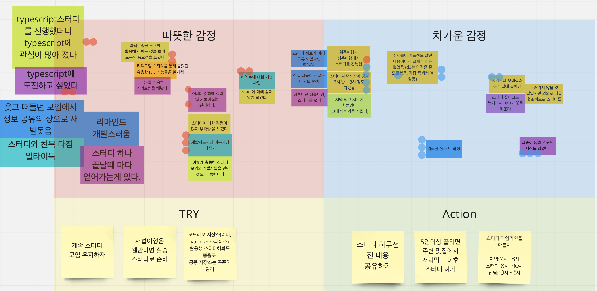
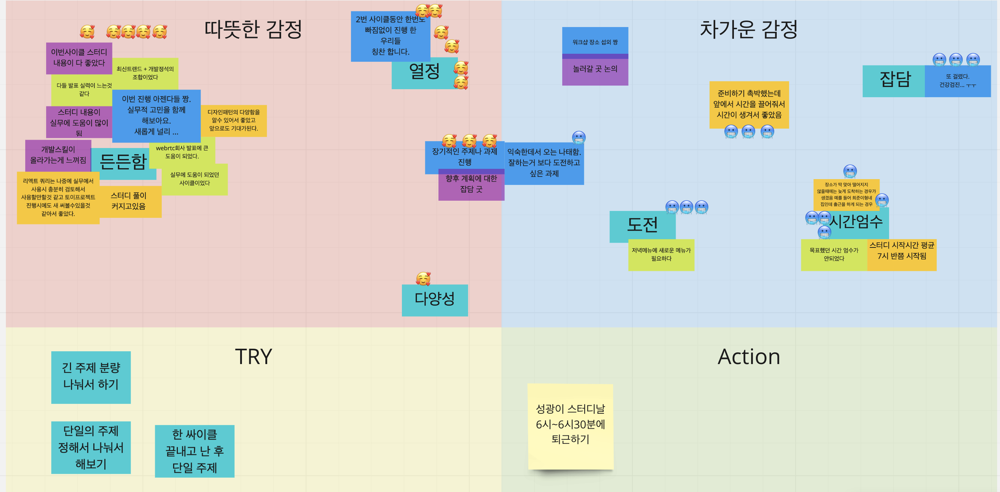

# Study

Study & Discuss Project ✏️

## Ground Rules

- cycle : 1 week (수요일)
- 자유로운 주제 혹은 관심 주제 중 부담없는 선에서 준비
- 발표자는 한주까지 연기 가능
- 적극적 토론 지향
- 스터디 하루전 전 내용 공유하기
- 5인이상 풀리면 주변 맛집에서 저녁먹고 이후 스터디 하기
- 스터디 타임라인을 만들자
  - 저녁: 7시 ~8시
  - 스터디: 8시 ~ 10시
  - 잡담: 10시 ~ 11시

## Subject Of Interest

- 클린 코드
  - Cycle.1 2021.04.07(수) - 클린코드 - 희준
- 디자인 패턴
  - [Cycle.2 2021.06.17(목) - 디자인패턴 Iterator, Adapter - 재섭](cycle-2/design-patterns)
- 리팩토링
  - [Cycle.1 2021.04.16(금) - IDE를 활용하여 리팩토링 전략 실습 - 재섭](cycle-1/study-4/study-4-refactoring.md)
- 뒤로가기
  - Cycle.2 2021.05.14(금) - 뒤로가기 상태 유지에 대한 고찰 - 성광
  - Cycle.2 2021.06.03(목) - 뒤로가기 상태 유지에 대한 고찰2 - 성광
- Typescript
  - [Cycle.1 2021.03.17(수) - Typescript 얕은 정리 - 동주](cycle-1/study-1-typescript.md)
- D3
  - [Cycle.1 2021.03.30(화) - D3 얕은 정리리 - 상훈](cycle-1/study-2-d3.md)
- React
  - [Cycle.1 2021.04.22(목) - React Tutorial - 성광](cycle-1/react-tutorial/README.md)
- React Query
  - [Cycle.2 2021.06.23(화) - React Query - 희준](cycle-2/react-async)
- WebRTC
  - [Cycle.2 2021.05.25(화) - 성광님도 한번 보면 무릎을 탁칠 WebRTC 문서를 작성해 보자 - 상훈](cycle-2/webrtc/webrtc.md)
- Vite
  - [Cycle.2 2021.06.08(화) - Vite알아보고 스캐폴딩 구성하기 - 동주](cycle-2/vite)
- Tdd
- Docker
- Aws
- GraphQL
- Functional programming
- ngrok
- Lerna
- Yarn workspace
- Yarn berry
- Github actions

## Cycle.1

펼치기

 

   
> 동주 - 상훈 - 희준 - 재섭 - 성광
- [Cycle.1 2021.03.17(수) - Typescript 얕은 정리 - 동주](cycle-1/study-1-typescript.md)
- [Cycle.1 2021.03.30(화) - D3 얕은 정리 - 상훈](cycle-1/study-2-d3.md)
- Cycle.1 2021.04.07(수) - 클린코드 - 희준
- [Cycle.1 2021.04.16(금) - IDE를 활용하여 리팩토링 전략 실습 - 재섭](cycle-1/study-4/study-4-refactoring.md)
- [Cycle.1 2021.04.22(목) - React Tutorial - 성광](cycle-1/react-tutorial/README.md)

### 회고 [Mirro보드 바로가기](https://miro.com/welcomeonboard/0p2xKh9fze1t2bho1E5rNOcK2NzPnS3ceGoorPJPCtI4RrMuxbQZvHs1kU4OsncU)

- Try

  - 계속 스터디 모임 유지하자
  - 재섭이형은 웬만하면 실습 스터디로 준비
  - 모노레포 저장소(러나, yarn워크스페이스) 활용성 스터디해봐도 좋을듯, 공용 저장소는 꾸준히 관리

- Action

  - 스터디 하루전 전 내용 공유하기
  - 5인이상 풀리면 주변 맛집에서 저녁먹고 이후 스터디 하기
  - 스터디 타임라인을 만들자
    - 저녁: 7시 ~8시
    - 스터디: 8시 ~ 10시
    - 잡담: 10시 ~ 11시

  
   

  

## Cycle.2

 
펼치기

 

   
> 성광 - 상훈 - 성광 - 동주 - 
- Cycle.2 2021.05.14(금) - 뒤로가기 상태 유지에 대한 고찰 - 성광
- [Cycle.2 2021.05.25(화) - 성광님도 한번 보면 무릎을 탁칠 WebRTC 문서를 작성해 보자 - 상훈](cycle-2/webrtc/webrtc.md)
- Cycle.2 2021.06.03(목) - 뒤로가기 상태 유지에 대한 고찰2 - 성광
- [Cycle.2 2021.06.08(화) - Vite알아보고 스캐폴딩 구성하기 - 동주](cycle-2/vite)
- [Cycle.2 2021.06.17(목) - 디자인패턴 Iterator, Adapter - 재섭](cycle-2/design-patterns)
- [Cycle.2 2021.06.23(화) - React Query - 희준](cycle-2/react-async)

   ### 회고 [Mirro보드 바로가기](   https://miro.com/welcomeonboard/T0V0UkVOMnpVY0VrNDBwamZxcjh3U1gyZVJHT09reGhZVTFvYk1xS2tzbDVGSGNCbTF1TWxqYWF2c01CZ1hwZXwzMDc0NDU3MzU3ODIzMjkyNTY2)

 

## Cycle.3

> 동주 - 진영 - 성광 - 상훈 - 희준 - 재섭
- [Cycle.3 2021.10.07(수) - 캘린더 만들고 Date Picker 기능 구현 실습 - 동주](https://github.com/dunz/date-picker)

