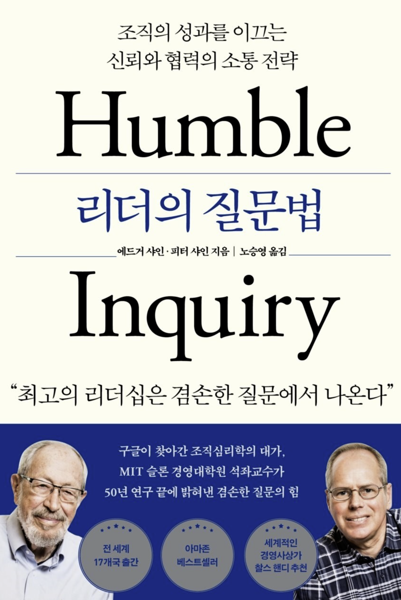

# 리더의 질문법(Humble Inquiry)

 

## 어떤 스터디 인가요?

좋은 리더란 무엇일까요? 쉽게 답하기 어려운 질문, "리더의 질문법" 책을 통해서 질문에 답을 찾아보려고 합니다.

 

## 이 스터디를 통해,

1. 겸손한 질문(Humble Inquiry)가 무엇인지 배웁니다.
1. 우리 현장에서 할 수 있는 겸손한 질문 사례를 생각해보고 CheatSheet로 정리 합니다.
1. 나의 단언적인 모습이 어떤것들이 있었는지 통찰해보고, 변화하기 위해 어떻게 할지 고민해 봅니다.

 

## 책 구매 링크

- [Yes24](https://m.yes24.com/Goods/Detail/107997384)
- [교보문고](https://product.kyobobook.co.kr/detail/S000001744936)
- [리디북스](https://ridibooks.com/books/2189000206)

 
