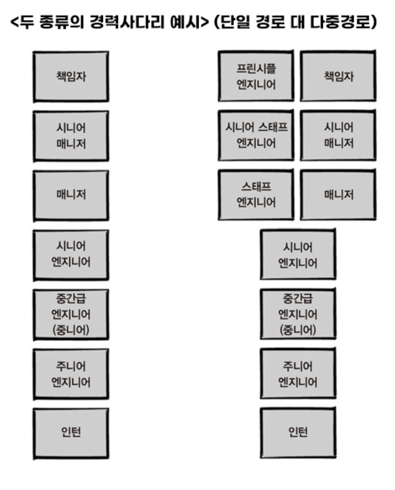
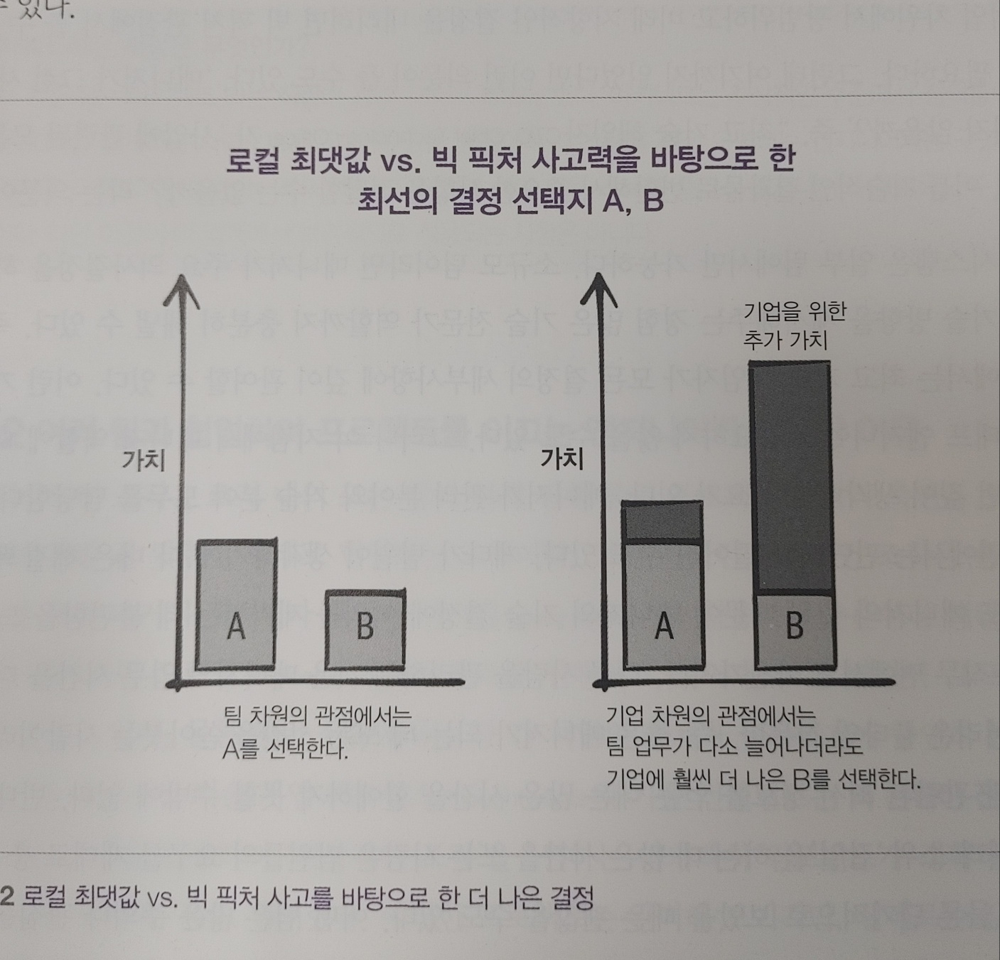
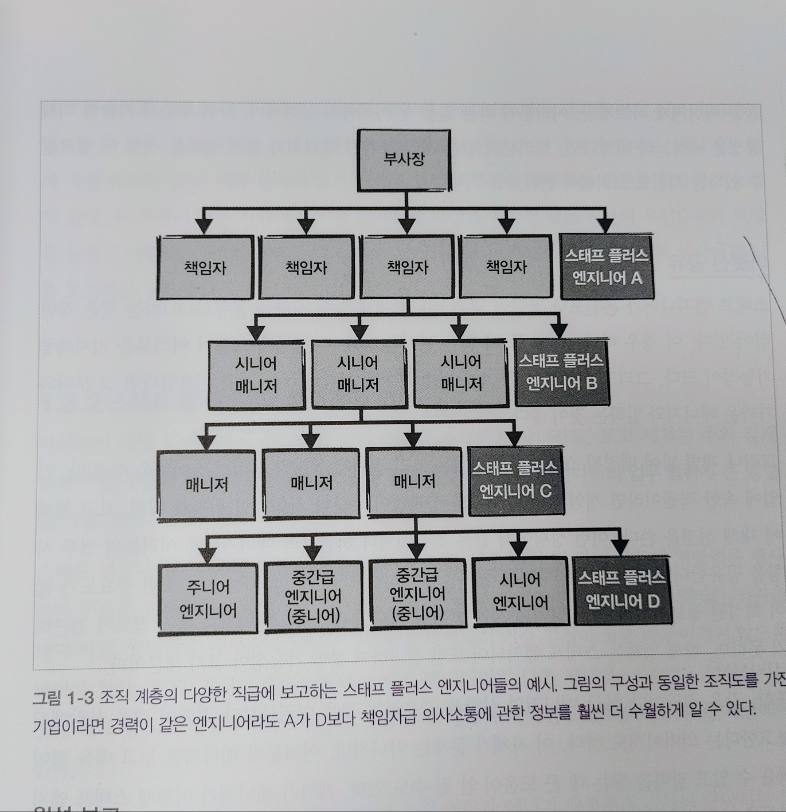

# 1. 스태프 엔지니어의 업무

## 1.1 왜 스태프 엔지니어 인가?

- 기업마다 조직마다 최고참 시니어 엔지니어에게 요구하는 자질 & 업무 다름
- 명확하게 정의된 기준 없음
- 경력 사다리

#### 직함의 중요성

1. 구성원들이 자기경력을 잘 쌓고 있는지 인지 시킬수 있음.
1. 구성원들에게 권위를 부여할 수 있음.
1. 직책별 기대치를 기업 외부에서 손쉽게 알릴 수 있음.
   - 인간은 처음 만나는 사람에게 선입견
   - 직함과 칙책은 저절로 좋은 편견을 갖도록 만듬 --> 증명하는 시간/에너지 아낌

#### 결론

- 주니어 --> 자율성을 기르는데 노력 (자립심?!)

- 시니어 --> 영향력 / 책임감을 키우기 위해 노력

- 스태프 --> 사고력 / 실행력 / 조직 레벨업 갖추기 위해 노력

  

### 1.1.1 빅 픽처 관점에서 엔지니어가 필요한 이유

- 로컬 최댓값 VS 빅 픽처 사고

 
 

- "어떤 기술에 투자하고, 어느 기능을 플랫폼화 시키고"
  - 매니저, CTO가 이런 업무는 하지 않는다.
  - 예외) 소규모팀은 가능 / 주요 의사결정 / 기술 방향성 제시
  - 매니저는 사람을 관리하느냐 업무시간을 모두 쏟아 부어도 부족함.

#### 결론

- 그래서 경험이 풍부한 엔지니어에게 올바른 기술 방향을 설정할 수 있도록 충분한 시간과 적절한 맥락 및 권한 부여
- 엔지니어도 독단적으로 기술 방향을 설정하는 것이 아니라, 기술 계획에 필요한 인력을 공급할 책임이 있는 매니저와 주요 기술과 관련된 의사결정 프로세스에 당연히 포함

  

### 1.1.2 여러 팀과 협업하며 프로젝트를 이끄는 엔지니어가 필요한 이유

- 프로젝트가 사전에 계획됨, 진행도중 의존성 발견
- 팀간 명확한 경계와 업무 분담에서 오는 아키텍처 중복 차이
- 아무것도 바꾸고 싶지 않은 팀과 협상
- 정보가 잘 전달되지 않고, 소통 프로세스가 얽히고 설켜 갈등

  --> **제한된 상황**

   

이런 **제한된 상황**에서 위험을 예측하고
심도 있는 질문으로 수준 높은 엔지니어링 유지하고
문제 발생시 원인 찾아주고 내외적 부분까지 살펴주고
프로젝트 비전을 다른 직원들에게도 설명한다.

#### 결론

- 견고한 시스템 결과물을 구성되도록 하고
- 기업의 기술환경이 적합한지 확인이 필요하고
- 기술부채를 신중한 관점에서 바라보는 사람들이 필요하기 때문에

> 기술리더와 매니저가 서로 협력할때 최고의 팀이 이루어진다.

### 1.1.3 선한 영향을 미치는 엔지니어가 필요한 이유

- 소프트웨어를 진지하게 바라볼 필요성이 있다.
  - 소프트웨어가 잘못되어 대형 인명사고 발생.

 

**선한 영향력이 필요한 이유?**

- 주변사람들에게 좋은 영향을 주어 강력한 동기를 주입하기 때문에
- 다른 사람들에게 좋은 영향
- 사회 초년생들에은 롤모델을 찾앗을때 강력한 동기를 얻는다.

 

**시니어의 선한 영향력은?**

- 코드와 설계리뷰 / 아키텍처 모범 사례
- 빠르게 일할수 있는 도구

 

**스태프의 선한 영향력 (롤모델)**

- 스스로 모범
- 테스트 코드 작성 예시
- 다른 사람의 업무를 격려 / 존중 / 질문 / 긍정적인 모습

---

## 1.2 스태프 엔지니어는 무엇인가?

공통점과 일관된 속성

 
 

### 1.2.1 스태프 엔지니어는 매니저가 아니라 리더다.

리더는? (스태프 엔지니어만의..)

- 주변 엔지니어들의 기술력을 키우는데 관여
- 매니저가 팀원의 실력과 성과를 평가 할때 의견을 중시 해야함.
- 자주 저지르는 실수를 모두가 좋아할만한 해결책 설계
- 코드리뷰를 해서 자신감과 기술력을 향상
- 교육, 여러직원의 성장, 기술의 방향성 설정
- 다른 사람들이 우리를 신뢰한다는 이유만으로 우리의 계획을 받아들이게 하는 훌륭한 리더쉽

 

그외 일반 리더와 공통점

- 다른 사람과의 협업
- 원활한 의사소통
- 프로젝트 진행 판단 능력

**내성적인 사람은 괜찮아도 무례한 사람은 안된다**

- 내성적인 사람: 강단 있는 판단력, 선한 영향력, 기술방향성 Good!

  

### 1.2.2 스태프 엔지니어는 "기술전문" 엔지니어다.

전문화된 역할 --> 실력과 직감

 

우수한 엔지니어링 (== 기본기)

- 작성한 코드와 설계가 직원에게 가이드
- 코드베이스와 아키텍처가 더 나은 방향으로
- 기술 결정을 내릴때 절충점(trade off)찾아서 이해하기 쉽게
- 세부 요소 깊게 파고 들어야 함.
- 방침, 기술문화 변화에 이견이 있을때 그것에 관해 의견을 개진

#### 결론

기본기로 문제해결 하는 것이 중요!!

  

### 1.2.3 스태프 엔지니어는 자율성을 추구한다.

- 꼭해야 하는 업무 목록은 없다. --> 우리가 찾아야 한다.

  

### 1.2.4 스태프 엔지니어는 기술 방향성을 설정한다.

- 올바른 기술 방향성을 설정
  - 아키텍처, 스토리지 시스템
  - 사용하는 도구 / 프레임 워크
- 모든것에 관여하지 않고 --> 모든 사람이 결정에 동의했는지? 이해했는지? 확인 필요

  

### 1.2.5 스태프 엔지니어는 의사소통의 달인이다.

  

### 총정리

- 스태프 엔지니어는 매니저가 아닌 리더이고,
- 탄탄한 기본기로 문제를 해결하며,
- 자율적으로 해야 할일을 찾는다.
- 올바른 기술 방향성을 설정하고 원활한 의사소통의 달인다.

---

## 1.3 스태프 엔지니어의 역할

- 스태프 엔지니어 역할은 기업마다, 조직마다 천차만별
- 앞에서는 공통 특성, 이번에는 스태프 엔지니어 별로 다르게(?)

 

### 1.3.1 조직내에서 스태프 엔지니어의 위치

**윗선 보고** (본인보다 직급이 높은 매니저에게 보고)

- 상위 수준의 영향력 있는 정보 얻음
- 책임자, 부사장 대상으로 하는 '윗선보고'는 시야를 넓혀줌
- 실력잇는 선임에게 의사결정, 회으를 이끄는 방법, 어려움 타개 프로세스 배움
- 유심히 지켜보는것 만으로도 배움
- (함께 일하는 매니저가) 여러분이 하는 일을 잘 이해하지 못하거나 하위수준 기술의사결정을 내리느냐 바쁘다면, 같은 시각을 가진 매니저와 함께 일하라.

 

**아래선 보고** (본인보다 직급이 낮은 매니저에게 보고)

- 장점

  - 좀 더 많은 관심을 받을 수 있기에 지지를 해줄 가능성이 큼

- 단점

  - 조직 전체에 영향을 미치기 어렵다
  - 매니저를 보고 배울 점이 적고, 경력을 쌓는데 큰 도움이 안될수 있음.

- 매니저와 스태프 엔지니어가 효과적인 방식에 관해 서로 다른 생각 --> 마찰

  - 로컬최댓값 VS 빅 픽처 사고

- 논쟁이 자주 일어나면 바로 매니저 상사에게 보고

 
 

### 1.3.2 스태프 엔지니어의 업무 범위 설정

- 본인의 업무 단기 및 장기 목표에 영향력을 행사
- 조직 및 기업 변화에 유의미한 의견
- 영향력을 행사하지 못하는 사람들을 대변해야 함.
- 시니어, 스태프 다음세대 구축
- 일부는 팀 업무에, 담당하는 도메인
- 책임자 팀업무/기술업무 (CTO 직할대)
- 위기 상황에서는 업무 범위 밖에 일도 한다.

 

#### 결론

- 업무 범위 설정이 자유롭다
  - 지나치게 넓게 VS 지나치게 좁게 하지 말자.

  

### 1.3.3 스태프 엔지니어 역할 정의

- 깊게? 넓게?

#### 네가지 분야

1. 핵심기술:
   - 코딩, 소송, 콘텐츠 제작, 실무자가 처리하는 모든 기술
2. 프로덕트 관리:
   - 어떤 업무를 해야 하는지 이유 파악하고, 업무를 상세히 설명하늘수 있는
3. 프로젝트 관리:
   - 목표 달성, 혼란제거, 업무추적, 장애물 파악 실요성을 따지는 기술
4. 인사관리:
   - 한 그룹사람들을 팀으로 만들고, 그들의 기술과 경력을 성장 및 멘토링

#### 👨🏻‍💻 코딩 작업은 어느정도로 수행해야 하는가?

- 매일 코딩을 하지 않을때 불안하면 폭 넓은 아키텍처를 다루면서 영향력 행사하는 역활을 맡으면 안됨
- 자주 코딩 업무에 뛰어는 것을 자제.

#### 💔 만족감이 정체된다면 어떻게 할 것인가?

- 코딩과 달리 스태프 엔지니어는 올바른 길로 가는지 피드백은 오랜기간 걸릴 수 있다.
- 주기적으로 솔직한 피드백 요청

#### 🧑‍🏭 매니저의 업무 중 일부분을 대신하고 있는가?

- 팀의 기술리더이자 팀을 관리하는 역할 모두 수행 --> 어렵기로 유명한일!!

- 몇년간 매니저 역할을 하고 이후에는 스태프 엔지니어로 전향
- 두가지 스킬을 모두 최상으로 유지?! (9장에서..)

#### 네 가지 유형 중에서 나에게 맞는 유형은 어떤 것인가?

1. 기술리드:

- 매니저와 협업해서 하나 이상의 팀을 이끈다.

2. 아키텍트:

- 핵심 분야의 기술 방향성과 퀄리티에 대한 책임이 있다.

3. 문제 해결사:

- 한 번에 하나의 문제를 헤쳐 나간다.

4. 오른팔:

- 조직에서 리더 역할을 수행한다. 리더쉽이 강조된 역할.

  

### 1.3.4 스태프 엔지니어의 주요 업무 파악

> "우리의 할인은 무엇인가?"

**중요한 업무 파악 하는 방법**

- 전략적으로 왜 중요한가? 알고 있어야함.

---

## 나의 생각

왜 스태프 엔지니어 인가?

> 스태프 엔지니어는
> **슈퍼히어로**처럼 코드와 사람을 구원하는 존재

1. 빅 픽처의 달인:
   - 나무만 보지 않고 숲을 볼 줄 아는 기술의 현자
2. 협업의 마법사:
   - 팀 간 갈등을 '아브라카다브라'로 해결
3. 선한 영향력의 전도사:
   - 주니어들의 꿈과 희망, 시니어들의 롤모델
4. 자율성의 화신:
   - 할 일을 스스로 찾아 헤매는 행복한 방랑자

현실적으로 이 모든 것을 완벽하게 해내는 슈퍼 엔지니어는 드물다.
여기서 우리가 파악해야할 메시지는

1. 지속적 성정: 끊임없이 기술과 리더쉽 스킬을 개발.
2. 균형 잡기: 코딩 실력과 soft 스킬 사이의 균형 잡기.
3. 유연성: 상황에 따라 다양한 역할을 수행할 수 있어야 함.
4. 영향력 확대: 코드 너머의 큰 그림을 보고 조직 전체에 긍정적인 영향을 미치는 것이 목표
5. 현실적 분별: 모든 영역에서 전문가일 수 없지만, 넓은 시야와 깊은 전문성의 조화를 추구

완벽한 스태프 엔지니어가 되는 것 보다, 그 방향으로 꾸준히 나아가는 것이 필요함.
