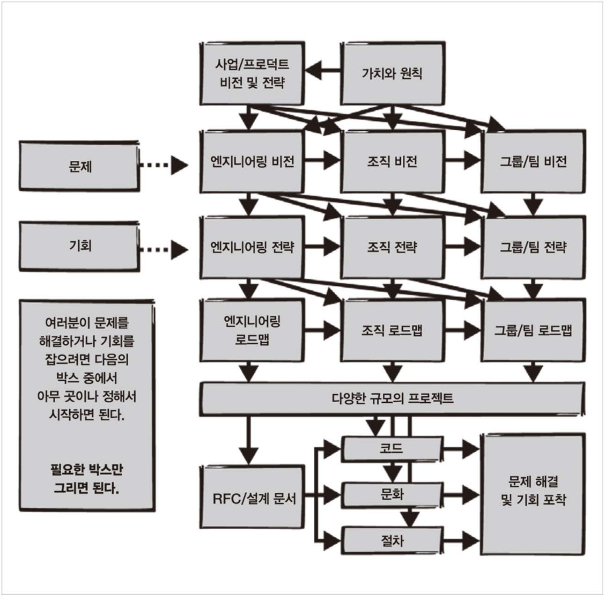

# 3. 빅 픽처 관점 수립

챕터 3에서는 '빅 픽처 관점'이 부족했던 조직의 이야기를 시작으로, 기술 리더로서 전체적인 방향을 보는 것이 얼마나 중요한지에 대해 설명한다.
필자는 과거에 속했던 조직에서 올핸즈 미팅을 앞두고 있었는데, 시스템의 문제와 관련해 다양한 의견이 충돌하는 상황을 맞닥뜨리게 된다.

동시에 세 가지 서로 다른 의견이 DM으로 날아왔다:

- 시스템 X를 개선하기 위해 팀을 충원 중이니 운영 안정성을 확보할 수 있다는 의견
- 시스템 X는 더 이상 사용되지 않을 예정이니 이를 강조하라는 의견
- 시스템 X의 개선을 위해 실무진을 구성했다는 사실을 알리고, 참여자를 모집하라는 의견

이러한 세 가지 의견이 각각 '합리적인 미래'를 제시하고 있음에도 불구하고, 왜 같은 그룹 내에서 서로 다른 방향성을 가지고 있었는지에 대한 의문이 남는다.
이는 그룹이 명확하고 공유된 '빅 픽처'를 갖고 있지 않다는 것을 의미한다.

## 3.1 삭매처 사례

'삭 매처(SockMatcher)'는 사람들이 잃어버린 양말을 찾거나 매칭하는 문제를 해결하기 위해 설립된 스타트업

- 사용자가 잃어버린 양말의 이미지를 올리면, 한쪽 양말 소유자를 찾아줌
- 빠르게 급성장해 양말뿐 아니라 장갑, 단추 등으로 확장
- 경쟁우의를 위해 시스템확장 및 재사용구축 보다는 사업적 기준으로 빠른 새로운 기능 배포를 우선순위
  - 하드코딩 된 사용자 지정로직 및 대부분의 if문으로 코드베이스 구현
- 계속된 매칭종류 추가로 마이크로서비스 구축이 필요하거나 모놀리식 시스템에 기능을 넣는 등 모두 공수가 큰 문제가 발생
- 이러한 문제해결을 위해 여러 엔지니어들이 모았지만 각자의 의견이 분분한 상황

## 3.2 비전과전략의개념

이 경우처럼 새 기능을 추가하려할 때 기존 시스템의 한계파악 후 각 팀이 스스로 결정이 필요한 상황 속 발생할수있는 단점

- 로컬 최댓값 문제: 다른 팀과 조율없이 특정 팀에만 최적화된 행동 추구
- 어떤 팀도 우려사항을 해결할 권한 동기가 없기 때문에 우려사항이 무시당할수 있음
- 올바른 결정을 내리기 위한 맥락을 놓칠수 있고, 행동을 취하는 사람들과 결과를 경험하는 사람들이 서로 다를수 있으며 시간이 지나면 분리될수 있음
- 결국 자신에게 유리한 결정을 내리고 근본적인 큰 질문을 미루게되어 문제해결을 어렵게 만듬

### 3.2.1 기술 비전의 정의
**기술비전**: 조직의 목표가 달성되고 가장 큰 문제가 해결된 후 찾아오는 조직의 이상적인 미래

- 빅필처를 볼수있는 스태프 엔지니어라면 아키텍처, 코드, 프로세스 등 더 나은 상태를 상상할 수 있는 기술비전을 제시할 수 있음
- 다만, 시니어 엔지니어들도 저마다의 기술비전을 갖고 있기에 스태프 엔지니어의 생각과 다를 수 있음
- 이를 놓쳐 나중에 갈등이 표면화 될수 있기에 기술비전은 반드시 문서화 되어야 함

### 3.2.2 기술 전략의 정의
**기술전략**: 목표달성 과정의 장애물을 헤쳐나가기 위한 행동계획

#### 진단
- 복잡한 현실을 간단 명료하게 정의
- 주변의 어지러움 속에서 특정 패턴 찾아내기
- 문제를 쉽게 이해하기 위해 비유나 정신모형 사용
- 상황의 가장 본질적 특성을 파악하여 진정으로 이해하는 작업

#### 안내 지침
- 진단을 통해 파악한 장애물을 우회하는 접근방식
- 뒤따르는 결정들을 더 쉽게 만들어줌
- "앞으로 가는 방향을 표시하는 마일스톤"으로 짧고 분명해야 함

#### 일관성 있는 행동
- 위 두가지를 수립하면 수행해야할 작업과 하지 않아야할 작업을 파악할수 있음
  - 예로 조직의 변화, 새로운 프로세스, 프로젝트에 대한 변화 등이 있을수 있고 처음 시작할때의 아이디어 목록보다 더 많은 시간을 들이기 때문에
    일부 작업을 수행하지 못할수 있음을 인지해야함
- 장점 활용
  - 예로 프로덕트 엔지니어링 팀은 도구를 다루는 스킬부족, 너무 많은 인시던트, 열악한 배포 프로세스등 많은 문제가 있지만, 시간만 있다면 해결할수 있는
    데브옵스 팀이 있을 경우 데브옵스팀에세 시간을 확보해주는것을 전략으로 삼을수 있음
- 전략은 현실적이어야 하고 현재 당면한 제약을 잘 담고 있어야 함

### 3.2.3 비전 및 전략 문서의 필요성
- 기술비전 및 전략은 조직에 명확성을 가져다 주지만 대부분 아예 쓸데 없을 수도 있다
- 문서없이 모든 사람의 동의를 얻을 수 있다면 문서는 굳이 없어도 된다
- 빅픽처 관점에서 생각하느라 시간을 소비하기보다는 현재 막혀있는 특정항목을 해결할 방법을 먼저 생각해야함
- 현재 조직에 필요한 것과 필요하지 않은것을 먼저 파악하는것이 중요하다

## 3.3 문서작성방법

## 3.4 실제문서작성

## 3.5 출시

## 3.6 삭매처사례연구

