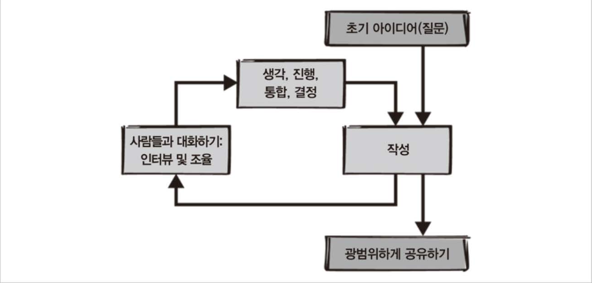
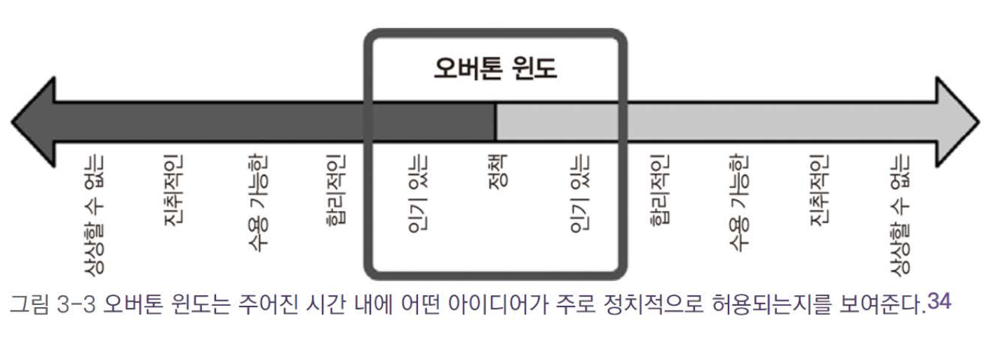

# 3. 빅 픽처 관점 수립

챕터 3에서는 '빅 픽처 관점'이 부족했던 조직의 이야기를 시작으로, 기술 리더로서 전체적인 방향을 보는 것이 얼마나 중요한지에 대해 설명한다.
필자는 과거에 속했던 조직에서 올핸즈 미팅을 앞두고 있었는데, 시스템의 문제와 관련해 다양한 의견이 충돌하는 상황을 맞닥뜨리게 된다.

동시에 세 가지 서로 다른 의견이 DM으로 날아왔다:

- 시스템 X를 개선하기 위해 팀을 충원 중이니 운영 안정성을 확보할 수 있다는 의견
- 시스템 X는 더 이상 사용되지 않을 예정이니 이를 강조하라는 의견
- 시스템 X의 개선을 위해 실무진을 구성했다는 사실을 알리고, 참여자를 모집하라는 의견

이러한 세 가지 의견이 각각 '합리적인 미래'를 제시하고 있음에도 불구하고, 왜 같은 그룹 내에서 서로 다른 방향성을 가지고 있었는지에 대한 의문이 남는다.
이는 그룹이 명확하고 공유된 '빅 픽처'를 갖고 있지 않다는 것을 의미한다.

## 3.1 삭매처 사례

'삭 매처(SockMatcher)'는 사람들이 잃어버린 양말을 찾거나 매칭하는 문제를 해결하기 위해 설립된 스타트업

- 사용자가 잃어버린 양말의 이미지를 올리면, 한쪽 양말 소유자를 찾아줌
- 빠르게 급성장해 양말뿐 아니라 장갑, 단추 등으로 확장
- 경쟁우의를 위해 시스템확장 및 재사용구축 보다는 사업적 기준으로 빠른 새로운 기능 배포를 우선순위
  - 하드코딩 된 사용자 지정로직 및 대부분의 if문으로 코드베이스 구현
- 계속된 매칭종류 추가로 마이크로서비스 구축이 필요하거나 모놀리식 시스템에 기능을 넣는 등 모두 공수가 큰 문제가 발생
- 이러한 문제해결을 위해 여러 엔지니어들이 모았지만 각자의 의견이 분분한 상황

## 3.2 비전과전략의개념

이 경우처럼 새 기능을 추가하려할 때 기존 시스템의 한계파악 후 각 팀이 스스로 결정이 필요한 상황 속 발생할수있는 단점

- 로컬 최댓값 문제: 다른 팀과 조율없이 특정 팀에만 최적화된 행동 추구
- 어떤 팀도 우려사항을 해결할 권한 동기가 없기 때문에 우려사항이 무시당할수 있음
- 올바른 결정을 내리기 위한 맥락을 놓칠수 있고, 행동을 취하는 사람들과 결과를 경험하는 사람들이 서로 다를수 있으며 시간이 지나면 분리될수 있음
- 결국 자신에게 유리한 결정을 내리고 근본적인 큰 질문을 미루게되어 문제해결을 어렵게 만듬

### 3.2.1 기술 비전의 정의
**기술비전**: 조직의 목표가 달성되고 가장 큰 문제가 해결된 후 찾아오는 조직의 이상적인 미래

- 빅필처를 볼수있는 스태프 엔지니어라면 아키텍처, 코드, 프로세스 등 더 나은 상태를 상상할 수 있는 기술비전을 제시할 수 있음
- 다만, 시니어 엔지니어들도 저마다의 기술비전을 갖고 있기에 스태프 엔지니어의 생각과 다를 수 있음
- 이를 놓쳐 나중에 갈등이 표면화 될수 있기에 기술비전은 반드시 문서화 되어야 함

### 3.2.2 기술 전략의 정의
**기술전략**: 목표달성 과정의 장애물을 헤쳐나가기 위한 행동계획

#### 진단
- 복잡한 현실을 간단 명료하게 정의
- 주변의 어지러움 속에서 특정 패턴 찾아내기
- 문제를 쉽게 이해하기 위해 비유나 정신모형 사용
- 상황의 가장 본질적 특성을 파악하여 진정으로 이해하는 작업

#### 안내 지침
- 진단을 통해 파악한 장애물을 우회하는 접근방식
- 뒤따르는 결정들을 더 쉽게 만들어줌
- "앞으로 가는 방향을 표시하는 마일스톤"으로 짧고 분명해야 함

#### 일관성 있는 행동
- 위 두가지를 수립하면 수행해야할 작업과 하지 않아야할 작업을 파악할수 있음
  - 예로 조직의 변화, 새로운 프로세스, 프로젝트에 대한 변화 등이 있을수 있고 처음 시작할때의 아이디어 목록보다 더 많은 시간을 들이기 때문에
    일부 작업을 수행하지 못할수 있음을 인지해야함
- 장점 활용
  - 예로 프로덕트 엔지니어링 팀은 도구를 다루는 스킬부족, 너무 많은 인시던트, 열악한 배포 프로세스등 많은 문제가 있지만, 시간만 있다면 해결할수 있는
    데브옵스 팀이 있을 경우 데브옵스팀에세 시간을 확보해주는것을 전략으로 삼을수 있음
- 전략은 현실적이어야 하고 현재 당면한 제약을 잘 담고 있어야 함

### 3.2.3 비전 및 전략 문서의 필요성
- 기술비전 및 전략은 조직에 명확성을 가져다 주지만 대부분 아예 쓸데 없을 수도 있다
- 문서없이 모든 사람의 동의를 얻을 수 있다면 문서는 굳이 없어도 된다
- 빅픽처 관점에서 생각하느라 시간을 소비하기보다는 현재 막혀있는 특정항목을 해결할 방법을 먼저 생각해야함
- 현재 조직에 필요한 것과 필요하지 않은것을 먼저 파악하는것이 중요하다

## 3.3 문서작성방법

비전과 전략은 다른 개념이지만, 사람을 모으고 의사결정을 내리고 조직을 이끌고 목표에 관해 이야기를 해야한다는 공통점이 있음

### 3.3.1 지루한 아이디어 받아들이기
- 카미유 푸르니에: 좋은 엔지니어링 전략은 대부분 지루하고 혁신적이지 않음
- 엔지니어링 전략은 새로운 것을 창조하는 대신, 기존의 것들을 조합해서 만들어짐
- 멋진 해결책보다도, 모든 가능한 해결책을 따져보고 동의를 얻어내는 과정이 중요
- 최종적으로 틀릴 수도 있는 결정을 내리는 용기가 조직에 필요함

### 3.3.2 이미 진행 중인 탐험에 참여하기
- 공통 주도 방법
  - 문서의 작성자와 본인이 각자 설득력 있는 방법으로 리드할 수 있게 일을 분할할 것을 제안
- 따라가는 방법
  - 계획에 따름: 그들보다 경험이 부족하다면 가능한 일을 잘 할 수 있도록 도와줌
- 한발 물러서는방법
  - 본인이 없이도 성공할지 파악 후 그것을 지지하며 다른일을 찾는 것
  - 자신이 제안한 기술 방향이 선택되면 **승리**했다고 여기게 될 경우 다른 사람들에게 위협적인 느낌을 줄 수 있음
  - 구글 로버트 코니그즈버그: "내 머리에서 나왔다고 해서 다 좋은 아이디어는 아니라는 사실을 잊지 마라"

### 3.3.3 후원자 찾기
- 후원자가 프로젝트에 참여하도록 설득하기 위해 '엘리베이터 피치' 연습하기
  - 엘리베이터 피치란? 엘리베이터를 타고 올라가는 시간만큼 짧은 시간(약 30~50초)내에 중요한 이야기를 간단하게 요약하여 설명하는 것
- 후원자는 조직의 시간과 인력을 어디에 투자할 것인지 결정할 수 있는 권한이 있어야 함(부서책임자나 부사장)
- 후원이 계속 이어지는지 수시로 체크

### 3.3.4 핵심 그룹 선택하기
- 문서 작성을 지원하는 소규모 핵심그룹과 일반적인 동맹 및 지지자로 구성된 광범위한 그룹을 모집하는것을 목표
- 핵심 그룹
  - 문서 작성을 지원하는 소규모 그룹. 2~4명 정도가 이상적이며, 관리가 쉬운 수준으로 유지해야 
  - 그룹과 함께 일하면 책임감을 갖고 추진력을 유지하기 쉬움
  - 핵심 그룹의 동의를 얻으면 잠재적인 의견 불일치를 조기에 해결 가능
  - 프로젝트 리더인지 동등한 구성원 중 하나인지 처음부터 명확히 해야 함
  - 각자의 역할을 명확히 하고, 그룹이 자신의 아이디어를 공유할 수 있도록 독려
  - 리더 역할을 맡고 싶은 사람이 있다면 기회를 제공하고 후원하여 추진력을 높임
- 동맹 그룹
  - 동맹 그룹을 꾸준히 인터뷰하고, 정보 공유 및 의견 청취
  - 작성 중인 문서의 진행 상황을 동맹 그룹과 공유하고, 초안에 대한 의견을 받을 것
  - 동맹 그룹의 영향력을 통해 조직 전체의 지식을 반영하여 더 나은 결과 도출

### 3.3.5 범위 정하기
- 해결하려는 문제의 조직 전체에 미치는 영향을 고려
- 문제를 해결할수있는 스킬역량과 영향력의 범위를 명확하게 인지
  - ex) 네트워크를 대폭 변경하려면 네트워크팀의 멤버를 핵심 그룹에 포함
- 제약을 무시하거나 회피하지 말고 해결하는 것이 중요
- 정기적으로 비전을 재검토하여 조직에 적합한지 확인하고, 변경 사항을 명확히 기록.

### 3.3.6 실현 가능성 확인하기
- 본인이 해결할수 있는 문제인지 확인하고 도와줄 코치나 멘토를 찾을것
- 스스로 해겷하지 못하는 문제라고 결정 내렸을 경우
  - 문제를 모른척하고 잘되기를 빌면서 그냥 진행하기
  - 나에게 부족한 스킬을 가진 사람을 모집해서 협력 및 리드 요청
  - 업무 범위를 줄이고 고정 제약 조건을 추가하여 다른 형태로 변화된 문제를 다시 풀기
  - 기업에 필요없는 문제라고 결정짓고 다른일 하기
  - 기업에 꼭 필요한 문제라고 결정짓고 이직 준비하기

### 3.3.7 공식화하기
전략 작성전 고려해야할 체크리스트   
모두 체크할수 없다면 비전이나 전략작성을 게속하지 말아야 함
- 우리에게 필요한 것이다
- 해결하려고 시도했던 적이 없다
- 기존에는 이부분에 대해서 노력하지 않았다
- 조직의 후원이 있다
- 우리가 만드는 비전과 전략에 모두가 동의한다
- 해결 가능한 문제점이다
- 이 모든 점에 대해 나는 거짓말을 하고 있지 않다

비전이나 전략은 가능한 공식화해서 공개하는 것이 좋다

## 3.4 실제문서작성

### 3.4.1 작성 프로세스
- 초기 질문 단계
  - 이미 존재하는 문서는 무엇인가?
    - 이미 존재할 경우 이미 설정된 제약조건도 상속받아야 하며 기존 계획의 성공을 뒷받침하기위해 일어나야하는 기술적 변화까지 포함되어 있어야 함
  - 바뀌어야 하는 것은 무엇인가?
    - 빅픽처 관점에서 생각
    - 개선해야 할 것을 생각하고 총 배포 시간 목표를 타이트하게 설정
  - 어떤 것이 좋은 것인가?
    - 제대로 작동하도록 기본적인 사항들까지 잘 챙겨야 한다
  - 정말 중요한 것은 무엇인가?
    - 중요하지 않은 것에 시간 낭비하지 말자
  - 현재의 내가 했으면 하는 것과 미래의 내가 바라는 것은 무엇인가?
    - 가능하면 미래의 자신을 위해 노력하자
- 작성 단계
  - 리더가 논의점의 초안을 작성하도록 하는 방법(선택지1)
    - 리더가 초안을 작성하는 것은 문서가 일관된 논조를 유지하고 다른 사람들에게 우려사항을 알리는데 매우 유용
    - 작성 전에 그룹별로 많은 시간을 할애하여 편향성 완화
  - 여러 초안을 집계하는 방법(선택지2)
    - 핵심 그룹의 각 대표자가 각각 초안 작성 후 누군가 최종 편집
- 인터뷰 단계
  - 선입견을 제쳐두고 최대한 많은 사람과 대화
  - 인터뷰 대상자가 이것이 자신이 하는 일의 일부라고 느끼게끔 노력
- 생각하는 시간 단계
  - 충분히 생각할 시간을 갖고 처리
  - 생각의 변화를 열린 마음으로 받아들임
  - 스스로에게 반복적으로 왜?라는 질문으로 동기를 확인

### 3.4.2 의사결정
- 절충점 탐색
  - 우선순위를 미리 따져봄으로써 받아들일수 있는 불이익 결정
  - 원하는 결과의 두 가지 긍정적인 속성을 비교(모든 해결책에는 이점이 있음)
  - 더 가치 있는것을 선택하여 절충점을 명확하게 함
- 대략적인 의견 일치
  - 모두가 만족할 만한 선택지가 아예 없다면 완전한 합의를 목표하지 말자
  - 조직 내 의견 차이가 있다면 "A를 선택하는데 모두 동의합니까?" 보다는 "A없이 살아갈 수 없겠습니까?"로 질문
  - 한사람의 주장을 조율하기 위해 온종일 논의하는 것보다 앞으로 나아가는 것이 훨씬 더 중요
  - 대부분 사람이 동의했을때 동전던지기 or 누군가 최종결정 or 후원자에게 최종결정 요청
- 결정을 내리지 않는 선택지
  - 선택지 A, B 뿐만 아니라 아무 결정을 내리지 않는 C도 있다
  - 하지만 결정을 내리지 않고 열어두면 장기적으로 너무 넓은 범위의 선택지만 열어두는 꼴이어서 다른 결정들의 잠재 위험성도 커짐
  - 결정에 필요한 추가정보 필요시 무엇을 기다리는지 스스로에게 자문
  - 모든 결정이 항상 최선일 필요는 없고 적당히 좋은 결정을 내리면 된다는 사실을 기억
  - 오랜기간 결정을 못내린다면 기한 정하기
  - 때로는 결정을 연기하는 것이 최선의 선택일 수도 있음
- 결정 공유
  - 고려했던 절충안과 최종 결정에 도달한 방법까지 포함해서 문서화
  - 왜 이 결정을 옳은 길이라고 결론지었는지 설명
  - 불행히도 비전과 전략을 짤때는 누군가를 기분 나쁘게 만드는일을 피할 수 없음
  - 현실을 고려하지 못하고 너무 이상적인 결정을 내렷을 탓이 큼
  - 공감대를 형성하고 가능한 다른 사람의 문제를 해결해줄수 있는 수준의 결정을 내려야함

### 3.4.3. 의견 일치 및 유지
- 합리적인 수준 탐색
  - 비용이 많이 들거나 너무 급진적이거나 극단적, 혹은 신뢰하는 사람들조차 수용하기 어려운 미래지향적인 아이디어 등 조직이 수용할 수 있는 수준을 제대로 파악 필요
  - 오버톤윈도: 주류 인구가 수용할 수 있는 범위

- 네마와시
  - 다른 사람들에게 정보공유 후 결정이 내려지기 전에 어느정도 합의에 이르도록 **'기초를 다져놓는 것'**
    - 깃허브의 기술고문은 기업 전체에 문서공유준비를 마쳤을때 이미 상사에게서 완벽한 동의를 얻은 상태였음
  - 문서를 작성하는 것은 해당 업무에 추진력과 활력을 심어주고 더 많은 청중이 세부사항을 명확히 파악하고 결정에 동의하는데 큰 도움
- 이야기 다듬기
  - 모든 사람이 잘 알지 못하는 비전이나 전략은 자신에게도 가치가 없다
  - 쉽게 이해, 공감할수 있고 편안한 이야기인지 확인

### 3.4.4 최종 초안 작성
- 문서를 쉽게 읽을수 있거나 핵심 내용을 잘 공유할 방법을 생각
- 요점을 분명히!
- 같은 도메인의 엔지니어에게만 공유하는게 아니라면 되도록 전문용어는 지양

## 3.5 출시

### 3.5.1 문서 공식화
- 조직의 문서는 신뢰: 네와마시를 사용해서 중요한 사람들의 의견을 일치시켰다면 그들의 이름을 지지자로 추가 및 올핸즈로 계획 후 발표 초대
- 공식적으로 보이는 내부 웹사이트에 문서를 게재. 이때 의견 추가기능을 제거하고 연락처를 남김

### 3.5.2 문서 최신화
- 사업방향이나 기술맥락변화에 따라 끊임없는 업데이트

## 3.6 삭매처사례연구
### 3.6.1 접근 방법
- 프로젝트 대규모 재설계를 위한 합의 실패 원인 분석
  - "문제는 MSA가 없다" or "데이터 스토리지 공유만 하면 된다"와 같이 대부분 사람들은 특정 해결책을 염두에 두고 있고 그것이 채택되기만 원함
  - 모든 사람이 기술 문제에만 집중, 조직이 앞으로 나아갈 길을 모색하는 방법에 대한 계획은 없음
  - 후원자를 확보해서 제안하는 방향이 기술적으로 좋은 해결책일뿐 아니라 조직에서 실행 가능한 수준의 방향이라는것을 확실히 주장
- 후원자 탐색
  - 모놀리식 시스템 재설계의 실패경험이 있는 조디
  - 식품저장용기 출시를 제떄에 하고싶은 제시
  - 문제없이 프로덕트 출시를 돕는것을 동의함으로써 제시의 후원을 받을수 있음
- 다른 엔지니어 추가
  - 과거 실패경험이 있느 피에르에게는 이전 계획 일부 사용을 요청함으로써 협조적인 자세를 얻어냄
  - 제네바에겐 이전 실무단이 존재한다고 하며 동의를 얻음
  - 이러하듯 각각 조직애 맞게 동의를 얻는 과정
- 명확한 범위 설정
  - "핵심 모놀리식 아키텍처를 발전시킵면서 식품 저장용기 출시까지 지원하기 위한 상위수준의 1년 기술 전략 수립하기"
 
### 3.6.2 작성
스스로 어떤 문제를 해결하고 있는지 확실히 아는것이 중요

- 진단
  - 엔지니어링 리더 및 실무자와 대화하면서 무엇이 중요한지 파악
  - 인지하고 있지만 우선순위가 아니어서 초점을 두고 있지 않은 문제 목록을 공유
- 안내 지침
  - 적은 양의 업무로 큰 영향을 미칠수 있는 곳을 살펴봄
- 조치
  - 단계별 롤아웃 및 빠른 롤백을 허용하는 긴으 플래그 지정 시스템을 추가
  - 결제팀에 엔지니어 두 명, 개인화팀에 엔지니어 한 명 추가
  - 새로운 매칭 항목을 쉽고 안전하게 셀프서비스로 추가할 수 있도록 청구 및 개인화 하위 시스템 수정
  - 청구 및 개인화팀이 식품저장용기 프로덕트를 시스템에 호환하도록 한 다음 그들을 새로운 셀프서비스 접근방식의 시범 고객으로 지정

### 3.6.3 출시
- 이 계획이 모든 사람의 지지를 받지 못할수는 있음
- 그러나 긍정적인 목소리가 크고 대부분의 사람은 공식적이고 합의된 방향에 힘을 얻음

## 3.7 마치며
- 기술비전은 미래상태, 기술전략은 그 상태를 달성하기 위한 행동계획
- 문서를 만드는 핵심그룹은 작은 규모이지만 더 넓은 그룹으로부터 정보, 의견, 지지를 얻어야 함
- 문서를 만들기전 계획하고 임원을 후원자로 둘 필요가 있음
- 문서의 유형과 작업 범위에 대해 신중하게 합의
- 대화, 아이디어 다듬기, 결정, 글쓰기, 수정 등의 프로세스를 여러번 반복
- 비전이나 전략은 말로 잘 설명할수록 더 좋아짐

