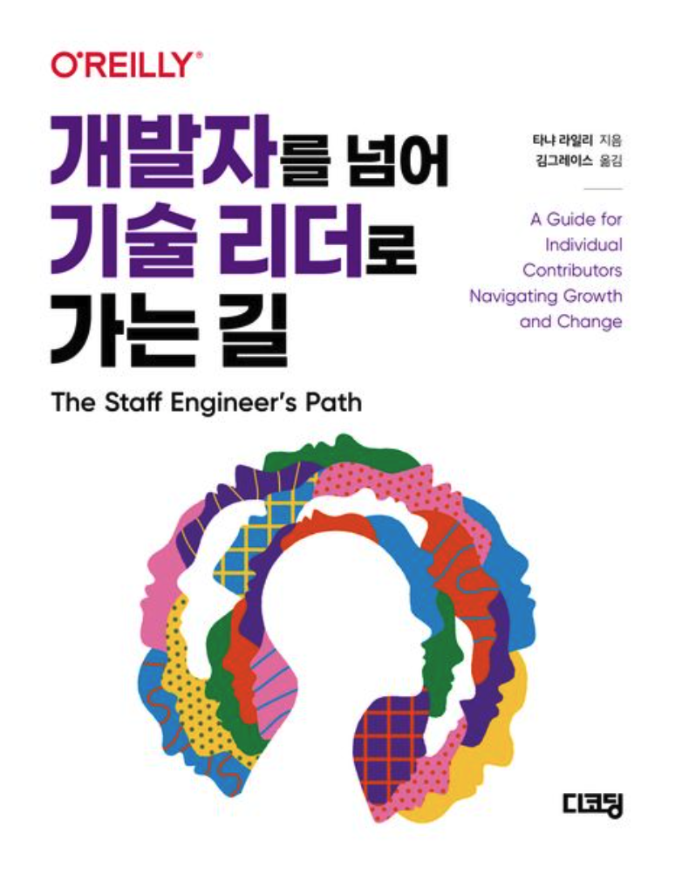
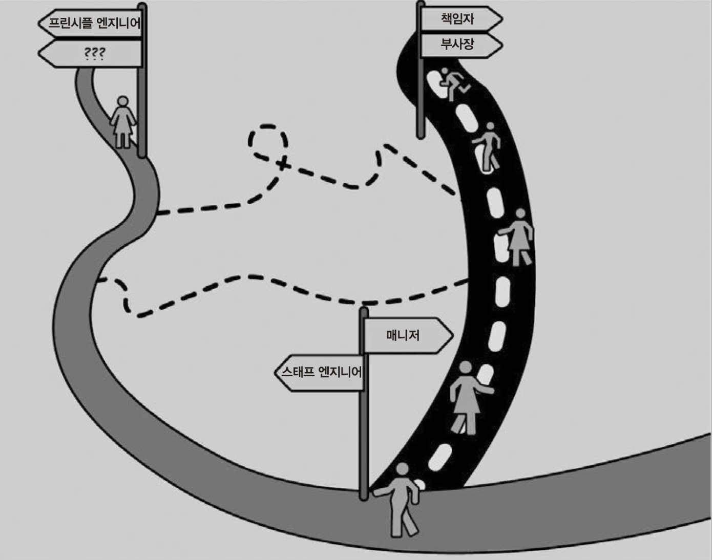
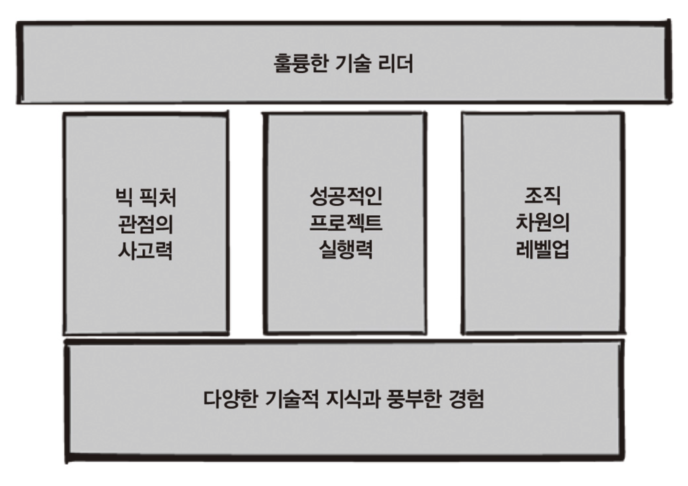

# 개발자를 넘어 기술 리더로 가는길

## 한페이지 요약

- 대상 독자

  - 개발 직군에서 매니저와 같은 수준에 위치한 스태프 엔지니어가 무엇인 궁금하신 분들
  - 관리쪽이 아니라 기술쪽 테크 트리를 어떻게 하면 효과적으로 탈 수 있을지 필요한 중급 이상 개발자

- 특징
  - 전문 개발 기술 뿐만 아니라 다양한 역량에 대한 페이지 안배가 좋다.
    - "와 이런걸 어떻게 다 하지?" 라는 생각이 들지만,
  - 이 책은 전문 기술서는 아니지만, 확실히 기술을 이해한 사람들이 읽어야 제대로 이해가 될 것이다.
    - 확실히 기술을 이해하는 사람이 읽어야 한다고 생각함.
    - 최소 중급 이상 개발자가 읽어야 무엇을 의미하는지? 리더급에서 읽으면 확실히 와닿는 부분이 많을 것.

  

## 이책의 목차

> 어떻게 하면 기술 분야에서 오랫동안 살아남을 수 있을까?

1. 빅 픽처 관점의 사고력
   - CHATER 1. 스태프 엔지니어의 업무
   - CHATER 2. 스태프 엔지니어의 세 가지 지도
   - CHATER 3. 픽 퍽처 관점 수립
2. 성공적인 프로젝트 실행력
   - CHATER 4. 업무 시간 한계
   - CHATER 5. 대규모 프로젝트 진행
   - CHATER 6. 프로젝트 중단(?)
3. 조직 차원의 레벨업
   - CHATER 7. 롤모델 역할
   - CHATER 8. 선한 영향력 전파
   - CHATER 9. 경력 사다리 설계

 
 

## 이책이 흥미로운 점

### 스태프 엔지니어의 정체는?

- 매니저가 아니라 리더
- '기술 전문' 엔지니어
- 자율성을 추구
- 기술 방향성을 설정
- 의사 소통의 달인

### 훌륭한 기술 리더가 되기 위해서 무엇에 집중해야 하는가?

- 빅픽처: 기업차원에 광범위하고 미래 지향적인 결정을 내리기 위해서 빅픽처 관점에서 볼 수 있는 사람이 필요함.

  - 매니저는 소규모 팀에서만 가능.
  - CTO는 모든 세부 결정에 관여하기 어렵다는 문제가 있음.

- 실행력: 제한된 시간 내에 대규모 프로젝트를 부트스트래핑해서 진행하고 경우에 따라서는 중단할 수 있는 사람이 필요함.

- 조직 차원의 레벨업: 스태프 엔지니어는 롤모델이며, 선한 영향력을 행사해야 함.
  - 우수한 엔지니어링의 표준은 프로젝트에서 가장 존경 받는 엔지니어들이 스스로 모범을 보여야 함.

## CTO, 아키텍트와는 또 다른 스태프 엔지니어의 세계가 궁금하신 분들에게 추천!

- 이 책을 읽는 두가지 유형 독자

  - 처음부터 저는 관리자 경로를 밟는 것보다는 최대한 기술적인 경로를 밟고 싶어요.
  - 사실상 경영진의 일부에 속하는 CTO가 아닌 기술 분야의 장인(?)이 되고 싶어요.

- 최소한 기술 리더급을 대상으로 작성했지만
  - 위에 있는 어르신(?)들이 어떤 고민을 하고 어떤 생각을 하는지 엿볼 수 있음.
  - 기술 리더부터 기술 직군의 마지막 단계에 이르는 여정을 담고 있기에 중급 개발자들도 읽으면 도움이 되는 내용이 많음.

## 결론

### 기술 테크 트리의 마지막 퍼즐을 맞추는 책

- 달콤한 장밋빛 청사진을 그리지 않음. --> 좀 고통스러울수 있음.
- 은총알이나 약을 파는 책은 아님. --> 책을 읽고 나서 어떻게 해야 할지 오히려 더 혼란스러운 느낌이 들수 있지만, 역설적으로 책속에 답을 찾을 수 있음.
- 아쉬운 점: 반복이 많음. 맥락과 달리 정확하지 않은 내용이 중간중간 보임 (번역 오류?!, 문화차이?!)

## 레퍼런스

- https://product.kyobobook.co.kr/detail/S000202010365
- https://www.decoding.co.kr/product/%EA%B0%9C%EB%B0%9C%EC%9E%90%EB%A5%BC%EB%84%98%EC%96%B4%EA%B8%B0%EC%88%A0%EB%A6%AC%EB%8D%94%EB%A1%9C%EA%B0%80%EB%8A%94%EA%B8%B8/
