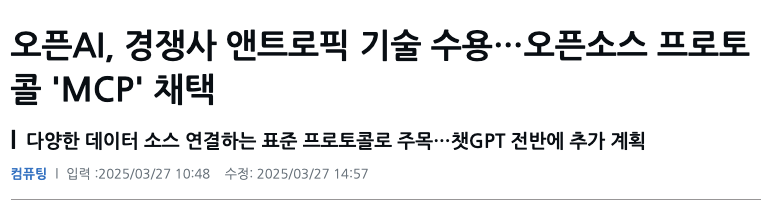

# Model Protocol Context (MCP)

### 유튜브

- https://youtu.be/fkqXQOjj8cA?si=D4-pWKOWCsn8WhQA
- https://youtu.be/Qdu6Sv-NpeU?si=jaZ6bd7LTDeE1HfB

### MCP Server

- https://github.com/modelcontextprotocol/

- https://github.com/appcypher/awesome-mcp-servers

- https://smithery.ai/

### 그외

- https://www.star-history.com/blog/mcp-server

## MCP 현재?

  

## Model Context Protocol(MCP) 란?

> LLM이 컨텍스트를 잘 이해하고 필요한 액션을 잘 수행할 수 있도록 도와주는 프로토콜

- 호스트: AI 활용 하는 서비스 (Claud Desktop, Cursor, n8n)

- 클라이언트: Host는 클리라언트를 내포하고 있음. Server와 Host간의 커뮤니케이션 도움 역할

- 서버: 중요한 개념. 다양한 서비스를 표준화된 방식으로 활용할 수 있게 도와줌. 연결하고 싶은 서비스 마다 서버를 설치.
