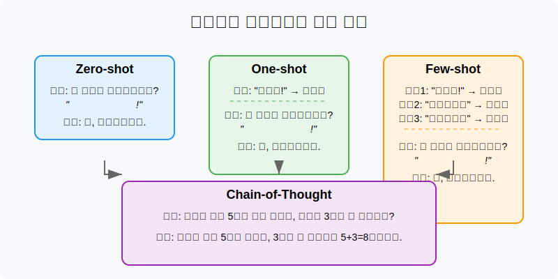
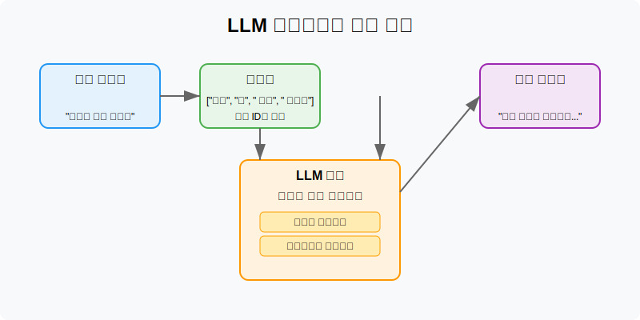
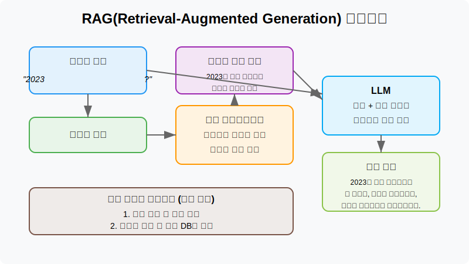

# 생성형 AI 개발 관련 핵심 용어 가이드

## 프롬프트 엔지니어링 관련 용어

### 프롬프트 엔지니어링(Prompt Engineering)
AI 모델에게 효과적인 명령어를 설계하는 기술과 방법론입니다. 모델의 출력을 개선하기 위해 입력 텍스트(프롬프트)를 최적화하는 과정을 포함합니다.

**핵심 특징:**
- 명확한 지시사항 제공
- 적절한 예시 포함
- 원하는 출력 형식 지정
- 단계별 사고 유도



### 제로샷 학습(Zero-shot Learning)
모델이 특정 작업에 대한 사전 예시나 훈련 없이도 새로운 작업을 수행할 수 있는 능력입니다.

**예시 프롬프트:**
```
다음 텍스트가 긍정적인지 부정적인지 분류하세요: "오늘 날씨가 정말 좋네요!"
```

### 원샷 학습(One-shot Learning)
단 하나의 예시만으로 새로운 작업을 수행하는 기법입니다.

**예시 프롬프트:**
```
다음 텍스트가 긍정적인지 부정적인지 분류하세요:
예시: "이 영화는 정말 재미있었어요!" - 긍정적
분류할 텍스트: "이 책은 너무 지루해요."
```

### 퓨샷 학습(Few-shot Learning)
소수의 예시(일반적으로 2-5개)를 제공하여 모델이 패턴을 파악하고 새로운 작업을 수행하도록 하는 기법입니다.

**예시 프롬프트:**
```
다음 텍스트가 긍정적인지 부정적인지 분류하세요:
예시1: "이 영화는 정말 재미있었어요!" - 긍정적
예시2: "서비스가 너무 느려요." - 부정적
예시3: "직원들이 매우 친절했습니다." - 긍정적
분류할 텍스트: "음식이 너무 짜요."
```

### 체인오브솟(Chain-of-Thought)
모델이 복잡한 문제를 해결할 때 단계별 추론 과정을 명시적으로 표현하도록 유도하는 프롬프트 기법입니다.

**예시 프롬프트:**
```
다음 수학 문제를 단계별로 풀어보세요:
"철수는 사과 5개를 갖고 있었습니다. 영희가 3개를 더 주었고, 그 후 철수는 2개를 동생에게 주었습니다. 철수에게 남은 사과는 몇 개인가요?"
```

### 프롬프트 템플릿(Prompt Template)
재사용 가능한 프롬프트 구조로, 특정 변수만 변경하여 다양한 상황에 적용할 수 있습니다.

**예시 템플릿:**
```
당신은 {전문분야} 전문가입니다. {주제}에 대해 초보자가 이해할 수 있도록 설명해주세요.
```

### 컨텍스트 윈도우(Context Window)
AI가 한 번에 처리할 수 있는 입력 텍스트의 최대 길이로, 토큰 수로 측정됩니다.

**주요 모델별 컨텍스트 윈도우(2024년 기준):**
- GPT-4 Turbo: 128,000 토큰
- Claude 3 Opus: 200,000 토큰
- Gemini 1.0 Pro: 32,000 토큰

## 모델 관련 용어

### 파운데이션 모델(Foundation Model)
대규모 데이터로 사전 학습된 기초 모델로, 다양한 하위 작업에 적용할 수 있습니다.

**주요 특징:**
- 대규모 매개변수
- 자기지도학습(Self-supervised learning) 방식
- 다양한 작업에 적응 가능

### LLM(Large Language Model)
수십억 개 이상의 매개변수를 가진 대규모 언어 모델로, 텍스트 생성, 이해, 번역 등 다양한 자연어 처리 작업을 수행할 수 있습니다.

**주요 LLM 종류:**
- GPT 시리즈 (OpenAI)
- Claude 시리즈 (Anthropic)
- Gemini (Google)
- Llama (Meta)



### 파인튜닝(Fine-tuning)
사전 학습된 모델을 특정 작업이나 도메인에 맞게 추가로 학습시키는 과정입니다.

**파인튜닝 방법:**
1. 특정 작업에 대한 데이터셋 준비
2. 사전 학습된 모델 로드
3. 새로운 데이터로 추가 학습
4. 하이퍼파라미터 조정 및 최적화

### 임베딩(Embedding)
텍스트나 다른 형태의 데이터를 벡터 공간으로 변환한 수치 표현입니다. 비슷한 의미를 가진 텍스트는 벡터 공간에서 서로 가까이 위치합니다.

**활용 사례:**
- 의미 기반 검색
- 텍스트 군집화
- 추천 시스템
- 유사도 분석

### 토큰(Token)
모델이 처리하는 텍스트의 기본 단위로, 단어, 부분 단어, 문자 등이 될 수 있습니다.

**토큰화 예시:**
```
"안녕하세요" → ["안녕", "하세", "요"]
"Hello world" → ["Hello", " world"]
```

### 할루시네이션(Hallucination)
AI가 사실이 아니거나 입력 데이터에 없는 정보를 생성하는 현상입니다.

**할루시네이션 유형:**
- 사실적 할루시네이션: 실제 세계와 일치하지 않는 정보 생성
- 내부적 할루시네이션: 자신의 이전 출력과 모순되는 정보 생성

### RAG(Retrieval-Augmented Generation)
외부 데이터 소스에서 관련 정보를 검색하여 생성 과정을 보강하는 기술입니다.

**RAG 작동 방식:**
1. 사용자 쿼리 임베딩 변환
2. 벡터 데이터베이스에서 관련 문서 검색
3. 검색된 문서를 컨텍스트로 추가
4. 보강된 컨텍스트를 기반으로 응답 생성



## 개발 관련 용어

### AI 에이전트(AI Agent)
특정 작업을 자율적으로 수행하는 AI 시스템으로, 사용자의 목표를 달성하기 위해 여러 도구를 활용할 수 있습니다.

**AI 에이전트 구성요소:**
- 목표 설정 메커니즘
- 도구 사용 능력
- 자기 모니터링
- 메모리 및 상태 관리

### LangChain
LLM 애플리케이션 개발을 위한 프레임워크로, 다양한 모델, 도구, 데이터 소스를 연결할 수 있는 컴포넌트를 제공합니다.

**주요 구성요소:**
- 프롬프트 템플릿
- 메모리 컴포넌트
- 체인 및 에이전트
- 외부 도구 통합

### 벡터 데이터베이스(Vector Database)
임베딩 데이터를 저장하고 효율적으로 검색할 수 있는 데이터베이스입니다.

**주요 벡터 데이터베이스:**
- Pinecone
- Milvus
- Weaviate
- Qdrant
- Chroma

### 함수 호출(Function Calling)
AI가 특정 함수나 API를 호출하여 외부 작업을 수행하고 결과를 대화에 통합할 수 있는 기능입니다.

**활용 사례:**
- 날씨 정보 조회
- 일정 관리
- 데이터베이스 쿼리
- 외부 서비스 통합

### 멀티모달(Multimodal)
텍스트, 이미지, 오디오, 비디오 등 여러 형태의 데이터를 처리하고 이해할 수 있는 능력입니다.

**멀티모달 활용 사례:**
- 이미지 기반 질의응답
- 음성 인식 및 생성
- 비디오 설명 생성
- 크로스모달 검색

### API(Application Programming Interface)
생성형 AI 서비스에 접근하기 위한 인터페이스로, 개발자가 자신의 애플리케이션에 AI 기능을 통합할 수 있게 합니다.

**주요 생성형 AI API:**
- OpenAI API
- Anthropic Claude API
- Google Gemini API
- Cohere API

## 평가 및 최적화 용어

### RLHF(Reinforcement Learning from Human Feedback)
인간 피드백을 통해 모델을 개선하는 강화학습 기법입니다.

**RLHF 단계:**
1. 지도학습으로 기본 모델 학습
2. 인간 평가자로부터 출력 품질에 대한 피드백 수집
3. 보상 모델 훈련
4. 보상 모델을 사용한 강화학습 적용

### 프롬프트 인젝션(Prompt Injection)
의도하지 않은 명령어를 모델에 주입하여 원래 지시사항을 무시하고 다른 행동을 유도하는 공격 기법입니다.

**방어 전략:**
- 입력 검증 및 필터링
- 모델 응답 후처리
- 지시사항 강화
- 입력 길이 제한

### 파라미터(Parameter)
모델의 학습 가능한 변수들로, 신경망의 가중치와 편향을 포함합니다.

**모델별 파라미터 수(2024년 기준):**
- GPT-4: 1조 개 이상 (추정)
- Claude 3 Opus: 수천억 개 (추정)
- Llama 3: 700억 개

### 추론 최적화(Inference Optimization)
모델 실행 속도와 효율성을 개선하는 기술로, 하드웨어 가속, 양자화, 가지치기 등이 포함됩니다.

**주요 최적화 기법:**
- 양자화(Quantization): 정밀도 감소를 통한 모델 크기 축소
- 지식 증류(Knowledge Distillation): 더 작은 모델로 지식 전달
- 가지치기(Pruning): 중요도가 낮은 가중치 제거
- 캐싱: 자주 사용되는 계산 결과 저장
