# Mermaid 완벽 가이드

## 목차
- [Mermaid 소개](#mermaid-소개)
- [기본 문법](#기본-문법)
- [다이어그램 유형](#다이어그램-유형)
  - [흐름도(Flowchart)](#흐름도flowchart)
  - [시퀀스 다이어그램](#시퀀스-다이어그램)
  - [클래스 다이어그램](#클래스-다이어그램)
  - [상태 다이어그램](#상태-다이어그램)
  - [엔티티 관계 다이어그램](#엔티티-관계-다이어그램)
  - [간트 차트](#간트-차트)
  - [파이 차트](#파이-차트)
  - [사용자 여정 다이어그램](#사용자-여정-다이어그램)
  - [Git 그래프](#git-그래프)
  - [마인드맵](#마인드맵)
  - [타임라인](#타임라인)
  - [C4 다이어그램](#c4-다이어그램)
- [스타일링 및 테마](#스타일링-및-테마)
- [고급 기능](#고급-기능)
- [생성형 AI와 통합](#생성형-ai와-통합)
- [팁과 모범 사례](#팁과-모범-사례)

## Mermaid 소개

Mermaid는 마크다운 기반의 다이어그램 및 차트 생성 도구로, 텍스트로 다이어그램을 정의하면 시각적 표현으로 변환해준다. GitHub, GitLab, Notion 등 다양한 마크다운 지원 플랫폼에 내장되어 있어 별도의 설치 없이 사용할 수 있다.

### Mermaid의 장점
- 마크다운 친화적: 문서에 바로 포함 가능
- 코드 기반 다이어그램: 버전 관리 용이
- 다양한 다이어그램 지원
- 웹 기반 시각화: 별도 도구 필요 없음
- 지속적인 업데이트와 활발한 커뮤니티

## 기본 문법

모든 Mermaid 다이어그램은 다음 기본 구조를 따른다:

````
```mermaid
다이어그램타입
  // 다이어그램 내용
```
````

예를 들어, 간단한 흐름도는 다음과 같이 정의한다:

````

````

### 주석

Mermaid에서 주석은 `%%` 기호로 시작한다:

```
%% 이것은 주석입니다
```

## 다이어그램 유형

### 흐름도(Flowchart)

흐름도는 프로세스나 알고리즘의 흐름을 표현한다.

#### 기본 예제
````
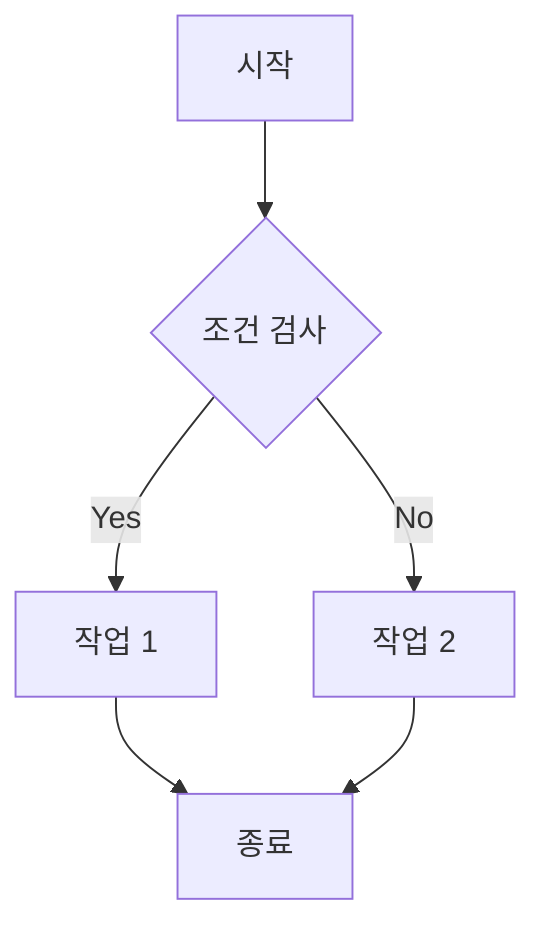
````

#### 방향 설정
```
TB/TD: 위에서 아래로(top to bottom/top-down)
BT: 아래에서 위로(bottom to top)
RL: 오른쪽에서 왼쪽으로(right to left)
LR: 왼쪽에서 오른쪽으로(left to right)
```

#### 노드 형태
```
A[사각형]
B(둥근 사각형)
C([둥근 모서리])
D[[서브루틴]]
E[(데이터베이스)]
F((원))
G>비대칭]
H{다이아몬드}
I{{육각형}}
J[/평행사변형/]
K[\평행사변형\]
L[/사다리꼴\]
M[\사다리꼴/]
```

#### 연결선 스타일
```
A --> B : 화살표
A --- B : 선
A -.- B : 점선
A === B : 굵은 선
A -.-> B : 점선 화살표
A ==> B : 굵은 화살표
A --o B : 원 종료
A --x B : X 종료
A o--o B : 양쪽 원
```

#### 연결선 텍스트
```
A -->|텍스트| B
A -- 텍스트 --> B
```

#### 서브그래프
```
subgraph 제목
  노드1 --> 노드2
end
```

### 시퀀스 다이어그램

시퀀스 다이어그램은 객체 간의 상호작용을 시간 순서대로 표현한다.

#### 기본 예제
````
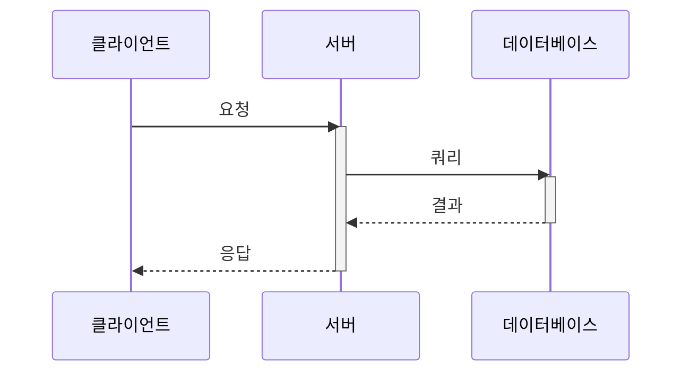
````

#### 참가자 정의
```
participant 참가자명
actor 액터명
```

#### 메시지 유형
```
->  : 실선 화살표(비동기)
->> : 실선 화살표(동기)
-->  : 점선 화살표(비동기)
-->> : 점선 화살표(응답)
-x  : X로 끝나는 화살표(실패)
```

#### 활성화 및 비활성화
```
activate 참가자
deactivate 참가자
```

또는 메시지와 함께 자동 활성화:
```
참가자1->>+참가자2: 활성화와 함께 메시지
참가자2-->>-참가자1: 비활성화와 함께 응답
```

#### 노트
```
Note left of 참가자: 왼쪽 노트
Note right of 참가자: 오른쪽 노트
Note over 참가자1,참가자2: 여러 참가자에 걸친 노트
```

#### 분기와 반복
```
alt 조건
  // 메시지
else 다른 조건
  // 메시지
end

loop 반복 조건
  // 메시지
end

opt 선택적 조건
  // 메시지
end

par 병렬 처리
  // 메시지
and
  // 메시지
end
```

### 클래스 다이어그램

클래스 다이어그램은 시스템의 클래스, 속성, 메서드 및 관계를 표현한다.

#### TypeScript 기반 클래스 다이어그램 예제
````
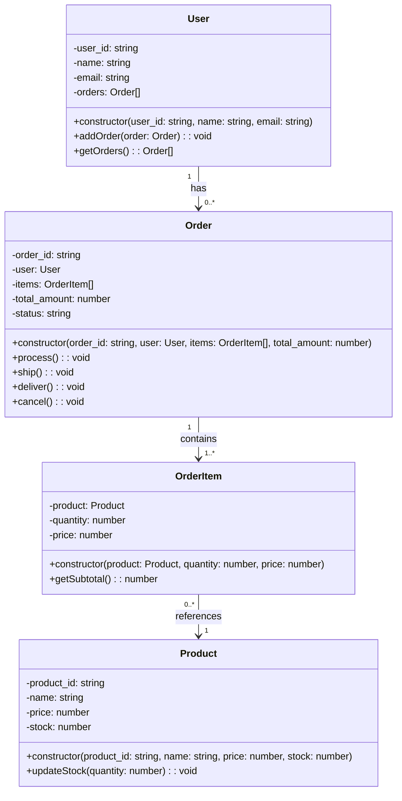
````

#### 접근 제한자
```
+ : 공개(public)
- : 비공개(private)
# : 보호(protected)
~ : 패키지(package/default)
```

#### 관계 유형
```
<|-- : 상속
*-- : 컴포지션
o-- : 집합
--> : 연관
..> : 의존
<--> : 양방향 연관
-- : 연결선
```

#### 관계 레이블과 기수성
```
클래스A "1" -- "n" 클래스B : 관계레이블
```

#### 제네릭 클래스
```
class 클래스명~타입매개변수~ {
  속성들
}
```

### 상태 다이어그램

상태 다이어그램은 객체의 상태 변화와 이벤트를 표현한다.

#### 기본 예제
````
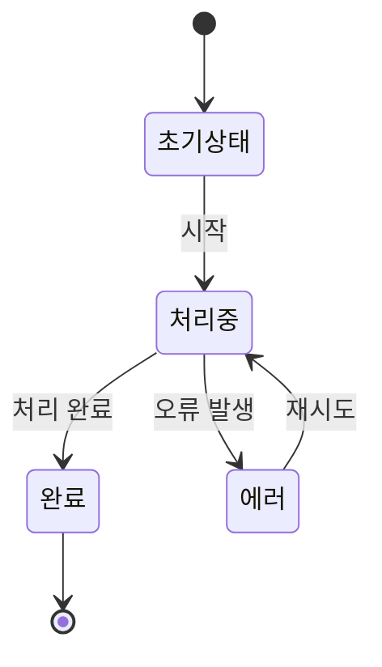
````

#### 상태 정의
```
state "상태 이름" as 상태ID
```

#### 복합 상태
```
state 상위상태 {
  [*] --> 하위상태1
  하위상태1 --> 하위상태2
  하위상태2 --> [*]
}
```

#### 노트
```
note right of 상태: 노트 내용
note left of 상태: 노트 내용
```

#### 분기와 조건
```
state 조건 <<choice>>
상태1 --> 조건
조건 --> 상태2: [조건A]
조건 --> 상태3: [조건B]
```

#### 병렬 상태
```
state 병렬상태 {
  [*] --> 병렬1
  --
  [*] --> 병렬2
}
```

### 엔티티 관계 다이어그램

ER 다이어그램은 데이터베이스의 구조를 표현한다.

#### 기본 예제
````
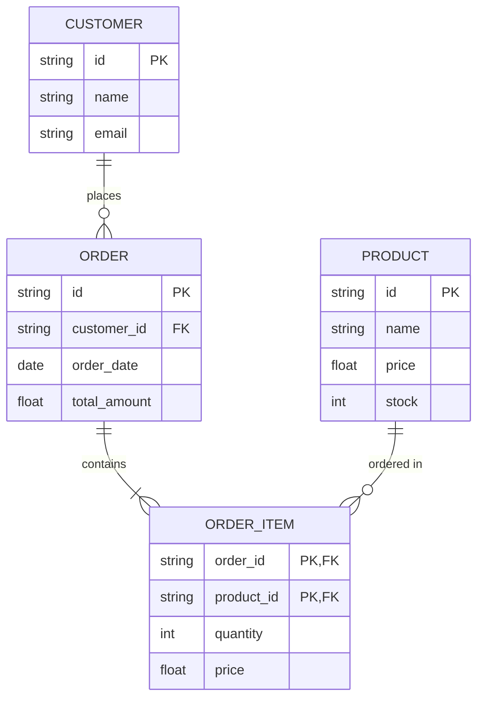
````

#### 엔티티 정의
```
엔티티명 {
  자료형 속성명 PK/FK
  자료형 속성명
}
```

#### 관계 표현
```
|o--o| : 일대일 (선택적)
||--|| : 일대일 (필수적)
|o--|| : 일대일 (한쪽은 선택적)
||--o{ : 일대다 (다쪽은 선택적)
||--|{ : 일대다 (필수적)
}|--|| : 다대일
}o--o{ : 다대다
```

#### 관계 레이블
```
엔티티A 관계 엔티티B : "레이블"
```

### 간트 차트

간트 차트는 프로젝트 일정을 표현한다.

#### 기본 예제
````
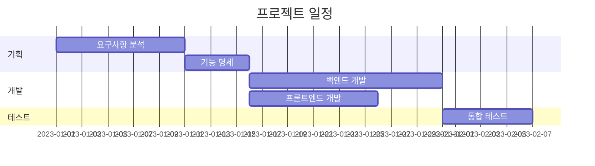
````

#### 날짜 형식
```
dateFormat YYYY-MM-DD
```

#### 세션 구분
```
section 세션명
```

#### 작업 정의
```
작업명 :ID, 시작일, 기간
작업명 :ID, after ID, 기간
```

#### 마일스톤
```
마일스톤 :milestone, 날짜, 0d
```

#### 상태 표시
```
작업명 :ID, 시작일, 기간, 상태(active, done, crit, ...)
```

### 파이 차트

파이 차트는 전체에 대한 부분의 비율을 표현한다.

#### 기본 예제
````
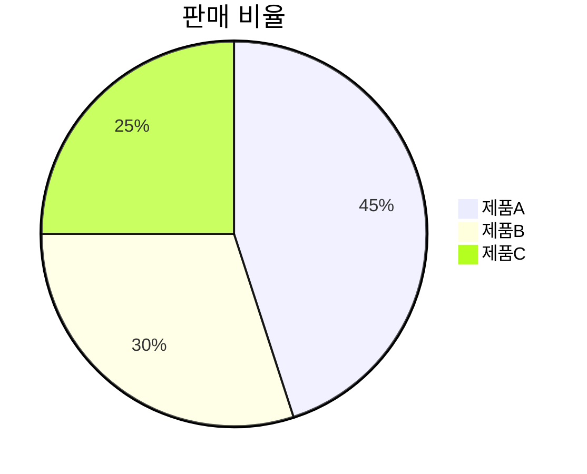
````

#### 레이블과 값
```
"레이블" : 값
```

### 사용자 여정 다이어그램

사용자 여정 다이어그램은 사용자의 경험을 단계별로 시각화한다.

#### 기본 예제
````
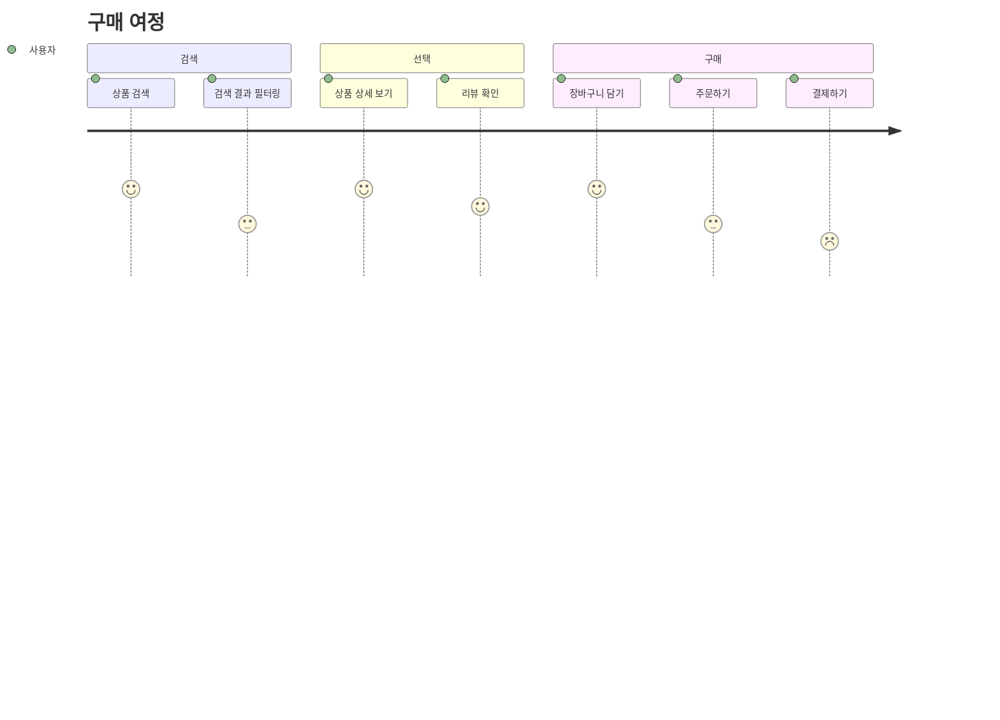
````

#### 섹션 정의
```
section 섹션명
```

#### 단계 정의
```
단계명: 만족도(1-5): 액터명
```

### Git 그래프

Git 그래프는 Git 작업 흐름을 시각화한다.

#### 기본 예제
````
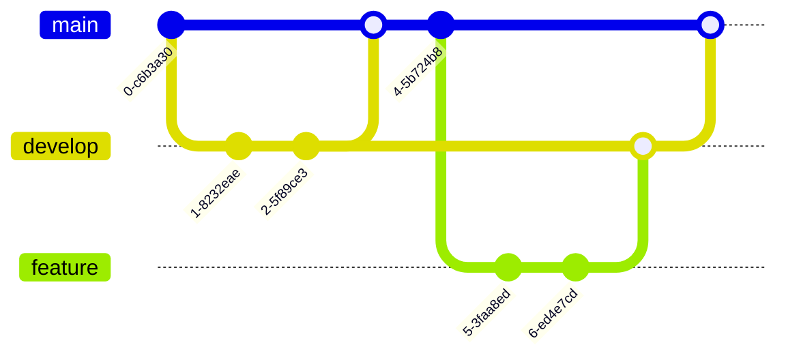
````

#### 브랜치 및 커밋
```
branch 브랜치명
checkout 브랜치명
commit
commit id: "커밋ID"
commit tag: "태그명"
```

#### 머지
```
merge 브랜치명
```

#### 체리픽
```
cherry-pick 커밋ID
```

### 마인드맵

마인드맵은 아이디어나 개념 간의 관계를 시각적으로 표현한다.

#### 기본 예제
````
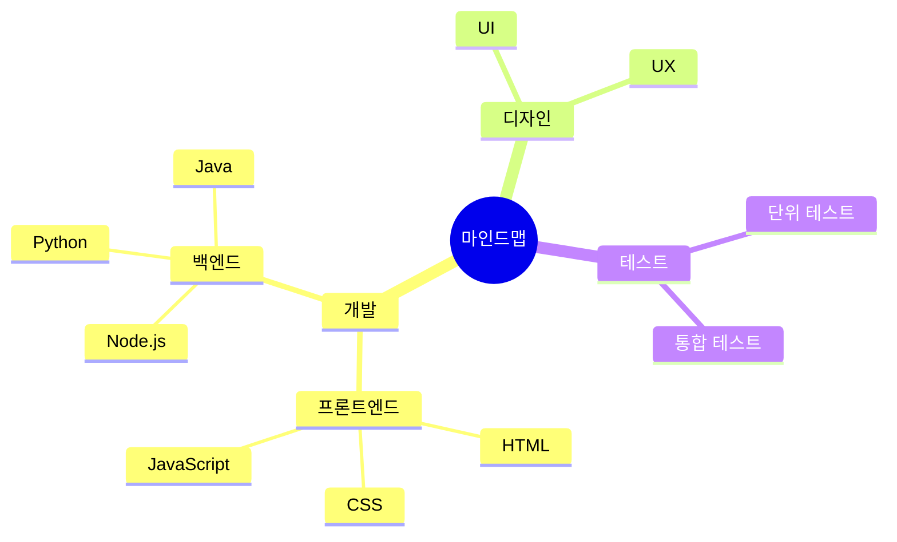
````

#### 노드 형태
```
루트((텍스트))
일반[텍스트]
강조(텍스트)
```

### 타임라인

타임라인은 시간 순서에 따른 이벤트를 시각화한다.

#### 기본 예제
````
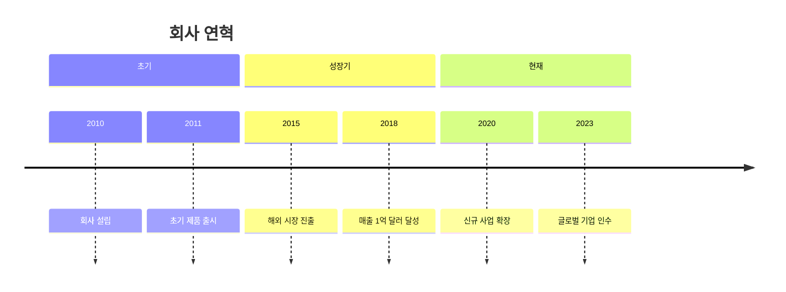
````

#### 섹션 정의
```
section 섹션명
```

#### 이벤트 정의
```
날짜 : 이벤트 설명
```

### C4 다이어그램

C4 다이어그램은 소프트웨어 아키텍처를 표현한다.

#### 기본 예제
````
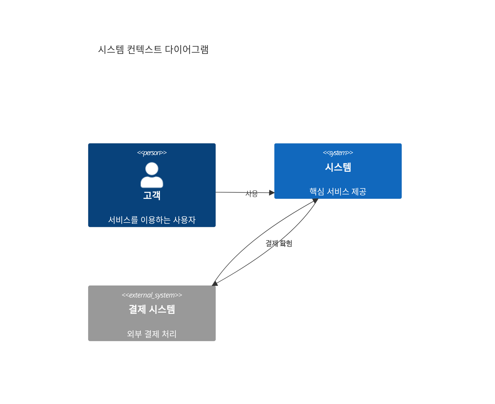
````

#### 요소 정의
```
Person(ID, "이름", "설명")
System(ID, "이름", "설명")
System_Ext(ID, "이름", "설명")
Container(ID, "이름", "기술", "설명")
Component(ID, "이름", "기술", "설명")
```

#### 관계 정의
```
Rel(시작ID, 종료ID, "레이블")
Rel_Back(시작ID, 종료ID, "레이블")
Rel_Neighbor(시작ID, 종료ID, "레이블")
```

## 스타일링 및 테마

### 기본 스타일링

Mermaid에서는 각 다이어그램 유형별로 스타일을 적용할 수 있다.

#### 클래스 스타일링
````
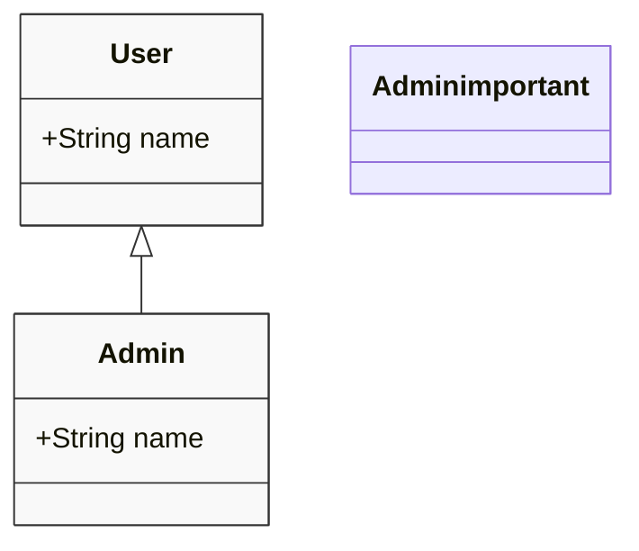
````

#### 흐름도 스타일링
````
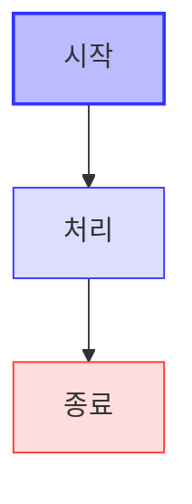
````

### 테마 설정

Mermaid는 기본적으로 몇 가지 내장 테마를 제공한다.
- default
- forest
- dark
- neutral
- base

라이브 에디터에서는 다음과 같이 테마를 설정할 수 있다:
````
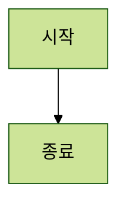
````

## 고급 기능

### 상호작용

Mermaid에서는 클릭 이벤트를 추가할 수 있다.

#### 링크 추가
````
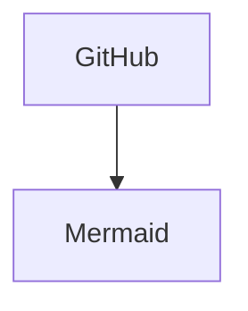
````

#### 콜백 함수
````
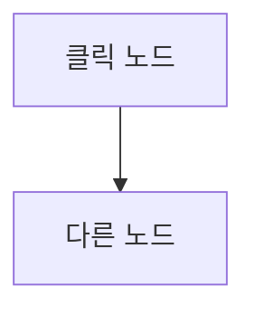

<script>
  function showAlert() {
    alert('노드가 클릭되었습니다');
  }
</script>
````

### 다이어그램 방향 설정

흐름도에서 전체 그래프의 방향을 설정할 수 있다:

````
```mermaid
flowchart TB
  %% 위에서 아래로
```
````

````
```mermaid
flowchart LR
  %% 왼쪽에서 오른쪽으로
```
````

### 서브그래프 스타일링

흐름도에서 서브그래프의 스타일을 설정할 수 있다:

````
```mermaid
flowchart TD
  subgraph 백엔드
    B1[API 서버]
    B2[데이터베이스]
  end
  
  subgraph 프론트엔드
    F1[웹 클라이언트]
    F2[모바일 앱]
  end
  
  F1 --> B1
  F2 --> B1
  B1 --> B2
  
  %% 서브그래프 스타일링
  style 백엔드 fill:#f9f9f9,stroke:#333,stroke-width:2px
  style 프론트엔드 fill:#ddf,stroke:#33f,stroke-width:2px
```
````

## 생성형 AI와 통합

생성형 AI를 활용해 Mermaid 다이어그램을 생성하고 개선하는 방법을 알아보자.

### TypeScript 코드에서 다이어그램 생성

#### TypeScript 코드:
```typescript
class User {
  private user_id: string;
  private name: string;
  private email: string;
  private orders: Order[] = [];

  constructor(user_id: string, name: string, email: string) {
    this.user_id = user_id;
    this.name = name;
    this.email = email;
  }

  public addOrder(order: Order): void {
    this.orders.push(order);
  }

  public getOrders(): Order[] {
    return this.orders;
  }
}

class Order {
  private order_id: string;
  private user: User;
  private items: OrderItem[];
  private total_amount: number;
  private status: string = "CREATED";

  constructor(order_id: string, user: User, items: OrderItem[], total_amount: number) {
    this.order_id = order_id;
    this.user = user;
    this.items = items;
    this.total_amount = total_amount;
  }

  public process(): void {
    this.status = "PROCESSING";
  }

  public ship(): void {
    this.status = "SHIPPED";
  }

  public deliver(): void {
    this.status = "DELIVERED";
  }

  public cancel(): void {
    this.status = "CANCELLED";
  }
}

class OrderItem {
  private product: Product;
  private quantity: number;
  private price: number;

  constructor(product: Product, quantity: number, price: number) {
    this.product = product;
    this.quantity = quantity;
    this.price = price;
  }

  public getSubtotal(): number {
    return this.quantity * this.price;
  }
}

class Product {
  private product_id: string;
  private name: string;
  private price: number;
  private stock: number;

  constructor(product_id: string, name: string, price: number, stock: number) {
    this.product_id = product_id;
    this.name = name;
    this.price = price;
    this.stock = stock;
  }

  public updateStock(quantity: number): void {
    this.stock += quantity;
  }
}
```

#### 생성된 Mermaid 다이어그램:
````
```mermaid
classDiagram
  class User {
    -user_id: string
    -name: string
    -email: string
    -orders: Order[]
    +constructor(user_id: string, name: string, email: string)
    +addOrder(order: Order): void
    +getOrders(): Order[]
  }

  class Order {
    -order_id: string
    -user: User
    -items: OrderItem[]
    -total_amount: number
    -status: string
    +constructor(order_id: string, user: User, items: OrderItem[], total_amount: number)
    +process(): void
    +ship(): void
    +deliver(): void
    +cancel(): void
  }

  class OrderItem {
    -product: Product
    -quantity: number
    -price: number
    +constructor(product: Product, quantity: number, price: number)
    +getSubtotal(): number
  }

  class Product {
    -product_id: string
    -name: string
    -price: number
    -stock: number
    +constructor(product_id: string, name: string, price: number, stock: number)
    +updateStock(quantity: number): void
  }

  User "1" --> "0..*" Order: has
  Order "1" --> "1..*" OrderItem: contains
  OrderItem "0..*" --> "1" Product: references
```
````

### 자연어에서 다이어그램 생성

#### 예제 1: 시스템 아키텍처 설명
입력:
```
"마이크로서비스 아키텍처로 구성된 이커머스 시스템의 다이어그램을 생성해주세요. 시스템은 사용자 서비스, 상품 서비스, 주문 서비스, 결제 서비스로 구성되어 있으며, API 게이트웨이를 통해 클라이언트와 통신합니다."
```

AI 생성 결과:
````
```mermaid
flowchart TB
  subgraph 클라이언트
    A[웹 클라이언트]
    B[모바일 앱]
  end
  
  subgraph 백엔드
    C[API 게이트웨이]
    
    subgraph 마이크로서비스
      D[사용자 서비스]
      E[상품 서비스]
      F[주문 서비스]
      G[결제 서비스]
    end
    
    subgraph 데이터베이스
      H[(사용자 DB)]
      I[(상품 DB)]
      J[(주문 DB)]
      K[(결제 DB)]
    end
  end
  
  A --> C
  B --> C
  
  C --> D
  C --> E
  C --> F
  C --> G
  
  D --> H
  E --> I
  F --> J
  G --> K
  
  F --> G
  F --> E
  
  style C fill:#f9f,stroke:#333,stroke-width:2px
  style 마이크로서비스 fill:#bbf,stroke:#33f,stroke-width:1px
  style 데이터베이스 fill:#dfd,stroke:#3f3,stroke-width:1px
```
````

#### 예제 2: 주문 처리 흐름
입력:
```
"이커머스 사이트의 주문 처리 과정을 시퀀스 다이어그램으로 표현해주세요. 고객이 주문을 하면 주문 서비스가 재고를 확인하고, 결제 서비스에서 결제를 처리한 후, 배송 서비스에 배송 요청을 하는 과정을 포함합니다."
```

AI
생성 결과:
````
```mermaid
sequenceDiagram
  actor 고객
  participant 주문서비스
  participant 상품서비스
  participant 결제서비스
  participant 배송서비스
  
  고객->>주문서비스: 주문 요청
  activate 주문서비스
  주문서비스->>상품서비스: 재고 확인
  activate 상품서비스
  상품서비스-->>주문서비스: 재고 확인 결과
  deactivate 상품서비스
  
  alt 재고 있음
    주문서비스->>결제서비스: 결제 요청
    activate 결제서비스
    결제서비스-->>주문서비스: 결제 승인
    deactivate 결제서비스
    
    주문서비스->>상품서비스: 재고 감소
    activate 상품서비스
    상품서비스-->>주문서비스: 업데이트 완료
    deactivate 상품서비스
    
    주문서비스->>배송서비스: 배송 요청
    activate 배송서비스
    배송서비스-->>주문서비스: 배송 접수 확인
    deactivate 배송서비스
    
    주문서비스-->>고객: 주문 완료
  else 재고 없음
    주문서비스-->>고객: 재고 부족 알림
  end
  deactivate 주문서비스
```
````

### 다이어그램 개선 및 리팩토링

생성형 AI는 기존 다이어그램을 분석하고 개선하는 데 도움을 준다.

#### 개선 전 다이어그램:
````
```mermaid
flowchart LR
  A[사용자] --> B[서버]
  B --> C[데이터베이스]
```
````

#### 개선 요청:
```
"이 시스템에 로드 밸런서, 캐싱 레이어, 마이크로서비스 아키텍처를 적용하여 개선해주세요."
```

#### 개선 후 다이어그램:
````
```mermaid
flowchart LR
  subgraph 클라이언트
    A[웹 브라우저]
    B[모바일 앱]
  end
  
  C[CDN]
  D[로드 밸런서]
  
  subgraph 백엔드
    E[API 게이트웨이]
    
    subgraph 서비스
      F[사용자 서비스]
      G[상품 서비스]
      H[주문 서비스]
      I[결제 서비스]
    end
    
    J[캐시 레이어]
    
    subgraph 데이터베이스
      K[(사용자 DB)]
      L[(상품 DB)]
      M[(주문 DB)]
      N[(결제 DB)]
    end
  end
  
  A --> C
  B --> C
  C --> D
  D --> E
  
  E --> F
  E --> G
  E --> H
  E --> I
  
  F --> J
  G --> J
  H --> J
  I --> J
  
  J --> K
  J --> L
  J --> M
  J --> N
  
  F --> K
  G --> L
  H --> M
  I --> N
  
  H <--> I
  G <--> H
  
  %% 스타일링
  classDef client fill:#ddf,stroke:#33f,stroke-width:1px
  classDef service fill:#dfd,stroke:#3f3,stroke-width:1px
  classDef database fill:#fdd,stroke:#f33,stroke-width:1px
  
  class A,B client
  class F,G,H,I service
  class K,L,M,N database
  style E fill:#f9f,stroke:#333,stroke-width:2px
  style J fill:#ffd,stroke:#dd3,stroke-width:2px
```
````

### 상태 변화 다이어그램 생성

#### 요청:
```
"주문의 상태 변화를 나타내는 상태 다이어그램을 만들어주세요. 상태는 생성됨, 결제완료, 배송준비, 배송중, 배송완료, 취소됨으로 구성되며, 각 상태 간 전환 조건도 표시해주세요."
```

#### AI 생성 결과:
````
```mermaid
stateDiagram-v2
  [*] --> 생성됨: 주문 접수
  
  생성됨 --> 결제완료: 결제 승인
  생성됨 --> 취소됨: 사용자 취소
  
  결제완료 --> 배송준비: 결제 확인 후
  결제완료 --> 취소됨: 결제 실패/환불 요청
  
  배송준비 --> 배송중: 발송 처리
  배송준비 --> 취소됨: 재고 부족/관리자 취소
  
  배송중 --> 배송완료: 배송 확인
  배송중 --> 취소됨: 배송 실패
  
  배송완료 --> [*]
  취소됨 --> [*]
  
  note right of 생성됨: 주문이 생성되었지만 아직 결제 안됨
  note right of 결제완료: 결제가 완료되었지만 배송 준비는 안됨
  note right of 배송중: 배송업체에 인계 완료
```
````

## 인터페이스와 제네릭을 포함한 다이어그램

TypeScript의 인터페이스와 제네릭을 Mermaid로 표현할 수 있다.

### 인터페이스 예제
````
```mermaid
classDiagram
  class IRepository~T~ {
    <<interface>>
    +findAll() T[]
    +findById(id: string) T
    +create(entity: T) void
    +update(id: string, entity: T) void
    +delete(id: string) void
  }
  
  class UserRepository {
    +findAll() User[]
    +findById(id: string) User
    +create(entity: User) void
    +update(id: string, entity: User) void
    +delete(id: string) void
  }
  
  class ProductRepository {
    +findAll() Product[]
    +findById(id: string) Product
    +create(entity: Product) void
    +update(id: string, entity: Product) void
    +delete(id: string) void
  }
  
  IRepository <|.. UserRepository: implements IRepository~User~
  IRepository <|.. ProductRepository: implements IRepository~Product~
```
````

### 타입과 인터페이스 예제
````
```mermaid
classDiagram
  class User {
    -id: string
    -name: string
    -email: string
    -role: UserRole
    +constructor(id: string, name: string, email: string, role: UserRole)
    +getProfile() UserProfile
  }
  
  class UserProfile {
    <<type>>
    +id: string
    +displayName: string
    +avatar?: string
  }
  
  class UserRole {
    <<enum>>
    ADMIN
    USER
    GUEST
  }
  
  User --> UserProfile: returns
  User --> UserRole: has
```
````

## 팁과 모범 사례

### 다이어그램 복잡도 관리
1. **서브그래프 활용**: 복잡한 시스템은 서브그래프로 그룹화
2. **컬러와 스타일**: 중요한 요소를 시각적으로 구분
3. **방향 설정**: 적절한 흐름 방향 선택(TB, LR 등)
4. **링크 간소화**: 복잡한 링크는 최소화하고 명확하게 표현

### 일관성 유지
1. **명명 규칙**: 일관된 이름 지정 규칙 사용
2. **스타일 일관성**: 동일한 유형의 요소에 일관된 스타일 적용
3. **노드 형태**: 역할에 맞는 노드 형태 일관되게 사용

### 가독성 향상
1. **적절한 공간**: 다이어그램에 충분한 공간 확보
2. **간결한 텍스트**: 설명은 짧고 명확하게 작성
3. **노트 활용**: 복잡한 개념은 노트로 설명

### 협업 및 문서화
1. **마크다운 통합**: 문서에 직접 포함하여 맥락 제공
2. **버전 관리**: 다이어그램 코드를 버전 관리 시스템으로 관리
3. **주석 추가**: 복잡한 부분은 주석으로 설명

### 생성형 AI 활용 최적화
1. **명확한 지시**: AI에게 다이어그램의 목적과 필요한 세부 사항을 구체적으로 설명
2. **반복적 개선**: 생성된 다이어그램을 점진적으로 개선
3. **요구사항 세분화**: 복잡한 다이어그램은 더 작은 부분으로 나누어 생성
4. **프롬프트 템플릿 활용**: 효과적인 프롬프트 패턴 재사용
