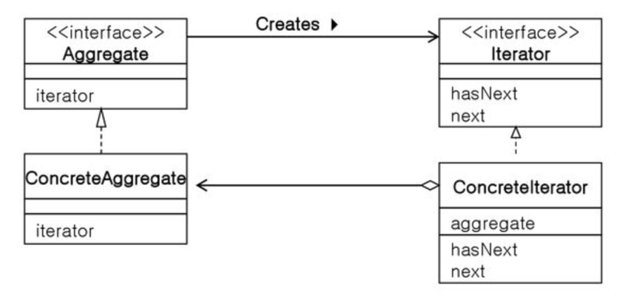

# Software design pattern

>프로그램을 개발할 때 예전과 같은 작업을 반복하고 있다는 느낌이 들 때가 있다.  
>경험이 쌓일수록 이러한 자신만의 '패턴'이 머리 속에 축적되고, 그 '패턴'을 다음 개발에 적용할 수 있게 된다.
>
>Erich Gamma, Richard Helm, Ralph Johnson, John Vlissides 4명은 개발자의 '경험'이나 '내적인 축적'을
>**디자인 패턴** 이라는 형태로 정리 했다.
>이 4명을 the Gang of Four 또는 GoF라고 부른다.
>GoF는 자주 사용되는 23개의 디자인 패턴에 '이름'을 붙이고 '카탈로그'로 정리해서 '오브젝트(객체) 지향에 있어서
>재이용을 위한 디자인 패턴' 이라는 책을 서술했다.
>
>많은 모듈이 상호 관련되어 동작할 때 인터페이스가 중요하는건 모두 알고 있다.  
>특히 많은 개발자가 공동으로 작업할 경우에는 인간의 인터페이스가 중요하다.  
>그 인터페이스의 기본이 되는 것은 '언어' 이다.  
>특히 코드에 대한 상세한 논의가 아니라 프로그램의 커다란 구조에 대해서 논의할 경우에는 언어나 도식이 중요하다.  
>어떤 개발자가 주장하고 있는 개선안은 나의 개선안과 같은가, 다른가?  
>큰 틀에서는 같지만 세부적인 차이점은 없는가? 무한한 시간과 인내력이 있다면 논의를 반복해서 의문에 대한 답을 얻을 수 있을지도 모른다.
>그러나 디자인 패턴의 용어를 빌리면, 보다 용이하게 서로의 아이디어를 비교하고 논의할 수 있다.  


디자인 패턴은 개발자들에게 유익하고 풍부한 어휘를 부여하고 상호간의 의사 소통을 쉽게 해 준다.  
디자인 패턴은 우리가 매일 쓰고 있는 프로그램을 새로운 시점에서 다시 생각하고, 재사용을 쉽게 하고, 기능확장이 쉬운 소프트웨어를 만들기 위한 유익한 기법이다.

## Curriculum : GoF가 정리한 23개의 디자인 패턴
>**Part 1 디자인 패턴과 친해지기**  
>Chapter 01 Iterator - 순서대로 지정해서 처리하기  
>Chapter 02 Adapter - 바꿔서 재이용하기  
>
>**Part 2 하위 클래스에게 위임하기**  
>Chapter 03 Template Method - 하위 클래스에서 구체적으로 처리하기  
>Chapter 04 Factory Method - 하위 클래스에서 인스턴스 만들기    
>
>**Part 3 인스턴스 만들기**  
>Chapter 05 Singleton - 인스턴스를 한 개만 만들기  
>Chapter 06 Prototype - 복사해서 인스턴스 만들기  
>Chapter 07 Builder - 복잡한 인스턴스 조립하기  
>Chapter 08 Abstarct Factory - 관련 부품을 조합해서 제품 만들기  
>
>**Part 4 분리해서 생각하기**  
>Chapter 09 Bridge - 기능 계층과 구현 계층 분리하기  
>Chapter 10 Strategy - 알고리즘을 모두 바꾸기  
>
>**Part 5 동일시하기**  
>Chapter 11 Composite - 그릇과 내용물을 동일시하기  
>Chapter 12 Decorator - 장식과 내용물을 동일시하기  
>
>**Part 6 구조를 돌아다니기**  
>Chapter 13 Visitor - 데이터 구조를 돌아다니면서 처리하기  
>Chapter 14 Chain of Responsibility - 책임 떠넘기기  
>
>**Part 7 단순화하기**  
>Chapter 15 Facade - 단순한 창구  
>Chapter 16 Mediator - 중개인을 통해서 처리하기  
>
>**Part 8 상태를 관리하기**  
>Chapter 17 Observer - 상태의 변화를 알려주기  
>Chapter 18 Memento - 상태를 저장하기  
>Chapter 19 State - 상태를 클래스로 표현하기  
>
>**Part 9 낭비 없애기**  
>Chapter 20 Flyweight - 동일한 것을 공유해서 낭비 없애기  
>Chapter 21 Proxy - 필요해지면 만들기  
>
>**Part 10 클래스로 표현하기**  
>Chapter 22 Command - 명령을 클래스로 하기  
>Chapter 23 Interpreter - 문법규칙을 클래스로 표현하기  

## 들어가기에 앞서...
### UML
시스템을 시각화하거나 시스템의 사양이나 설계를 문서화하기 위한 표현 방법  
본 학습에서는 클래스나 인스턴스의 관계를 표현하기 위해 아주 일부의 UML을 기반으로 설명 하겠다.

### 클래스다이어그램
UML의 클래스 다이어그램은 클래스나 인스턴스, 인터페이스 등의 정적인 관계를 표현  
시간에 따라 변하지 않는 시스템의 정적인 면을 보여주는 대표적인 UML 구조 다이어그램
- 목적: 시스템을 구성하는 클래스들 사이의 관계를 표현한다.

#### 클래스 계층관계


#### 인터페이스와 구현
  
인터페이스도 추상클래스와 마찬가지로 이텔릭채를 기본으로 한다.  
단지, 상단에 << interface >> 만이 추가된다.  
인터페이스 클래스에 선언된 메소드는 당연히 추상메소드 이므로 이텔릭채로 표현한다.

>**Stereo Type (스테레오 타입)**  
>스테레오 타입이란 UML에서 제공하는 기본 요소 외에 추가적인 확장요소를 나타내는 것으로 쌍 꺾쇠와 비슷하게 생긴 길러멧(guillemet, « ») 사이에 적습니다.   
>이 길러멧이란 기호는 쌍 꺾쇠와는 좀 다른 것으로 폰트 크기보다 작습니다.  
>종이나 화이트보드에 그릴 때는 상관없지만 공식적인 문서라면 이 기호를 구분해서 사용하는 것이 좋을 것 같습니다.


여기에선 Pable 이라는 인터페이스가 있고 PClass 라는 클래스가
Pable 인터페이스를 구현하고 있다 ( implements )  

인터페이스 관계에서의 화살표 방향은 상속방향과 일치하게 하위클래스에서 상위클래스로 향하고 있고,
화살표 모양은 세모(△) 가 붙은 점선으로 표시한다.

#### 집약
UML 연관 관계의 특별 경우로 전체와 부분의 관계 를 명확하게 명시하고자할 때 사용한다.


**집약 관계(aggregation)**  
- 한 객체가 다른 객체를 포함하는 것  
    * ‘부분’을 나타내는 객체를 다른 객체와 공유할 수 있다.  
- ‘전체’를 가리키는 클래스 방향에 빈 마름모로 표시  
- 전체 객체의 라이프타임과 부분 객체의 라이프 타임은 독립적이다.  
    * 전체 객체가 메모리에서 사라진다 해도 부분 객체는 사라지지 않는다.  
* 예시  
생성자에서 참조값을 인자로 받아 필드를 세팅한다.
```java
public class Computer {
    private MainBoard mb;
    private CPU c;
    // 생성자
    public Computer(MainBoard mb, CPU c) {
        this.mb = mb;
        this.c = c;
    }
}
```

**합성 관계(composition)**
- 부분 객체가 전체 객체에 속하는 관계
    * ‘부분’을 나타내는 객체를 다른 객체와 공유할 수 없다.
- ‘전체’를 가리키는 클래스 방향에 채워진 마름모로 표시
- 전체 객체의 라이프타임과 부분 객체의 라이프 타임은 의존적이다.
    * 전체 객체가 없어지면 부분 객체도 없어진다.
* 예시  
생성자에서 필드에 대한 객체를 생성한다.
```java
public class Computer {
    private MainBoard mb;
    private CPU c;
    // 생성자
    public Computer() {
        this.mb = new MainBoard();
        this.c = new CPU();
    }
}
```

## 디자인 패턴을 배우기 전에
### 디자인 패턴은 클래스 라이브러리가 아니다.
디자인 패턴은 클래스 라이브러리보다 더 일반적인 개념이다.   
클래스 라이브러리는 부품이 되는 프로그램을 의미하지만 디자인 패턴은 부품이 어떻게 조립되어 있고, 각각의 부품이 어떻게 관련해서 큰 기능을 발휘하는지를 표현한 것이다.

예를 들어, 어느 특정한 연극에서 백설공주를 누가 연기했는지, 왕자는 누가 연기했는지는 백설공주 이야기의 줄거리를 말할 때 필수사항이 아니다.  
배우에 대한 구체적인 설명보다는 백설공주와 왕자 사이의 '관계'를 설명하는 것이 중요할 것이다.  
특정한 배우가 연기한 특정한 연극만이 '백설공주'가 아니다.  
중요한 점은 어떤 종류의 등장인물이 나와서 서로가 어떤 역할을 연기하는가 이다.  

디자인패턴도 마찬가지다. 'Abstract Factory 패턴이란 무엇인가?' 라는 질문에 대답할 때 구체적인 프로그램의 예를 읽는 것도 이해하는데 도움이 되겠지만,
특정 프로그램 Abstract Factory 패턴이라고 할수는 없다.   
중요한 점은 어떤 종류의 클래스와 인터페이스가 등장해서, 서로 어떤 관계에 있는가 하는 것이다.

### 클래스 라이브러리 안에서 디자인 패턴이 사용되고 있다.
우리가 사용하는 다양한 라이브러리 안에는 디자인 패턴이 많이 활용되고 있다.   
디자인 패턴을 이해하고 있으면 라이브러리의 역할을 이해하는데 도움이 될 것이다.

### 프로그램을 완성품으로 보지 않는다.
디자인 패턴의 목표 중 하나는 프로그램의 재이용을 가능하게 하는 것이다.  
즉, 프로그램을 어떻게 '부품'으로써 재이용할 수 있는가를 생각하는 것이다.  
따라서 프로그램의 예를 '완성품'으로 보지말고 앞으로 '기능을 확장해 가는 것', '변경할 수 있는 것'으로 보기 바란다.
- 어떤 기능이 확장될 가능성이 있는가?
- 확장기능을 수행할 때 수정이 필요한 클래스는 무엇인가?
- 수정이 불필요한 클래스는 무엇인가?
이와 같은 관점에서 디자인 패턴을 보면 깊이있게 이해할 수 있을 것이다.

### 다이어그램은 보는 것이 아니라 읽는 것이다.
디자인 패턴을 설명할 때 다이어그램을 많이 사용한다.  
다이어그램의 의미는 얼핏 보고 한 번에 파악할 수가 없다. 꼼꼼하게 '읽고 확인'할 필요가 있다.

### 스스로 예제를 만들자
단순히 예제 프로그램을 읽기만 하지 말고 스스로 예제를 만들고 자신이 직접 설계하거나 프로그램을 작성할 때, 배운 디자인 패턴을 적용해 보는 것이 중요하다.

### 역할을 이해하자! 백설공주의 역할은 누구인가?
디자인 패턴은 드라마와 같다.  많은 클래스나 인터페이스라는 등장인물이 나오고, 서로 연관을 맺으면서 드라마를 만들어 간다.  
한 사람씩 역할이 주어지고, 각자는 자신의 역할에 따라서 행동해야 한다.  
주인공은 주인공다운 행동을 하고, 악역은 주인공에게 대항을 하며 연극은 클라이맥스를 향해 진행된다.

디자인 패턴도 클래스나 인터페이스에 각자의 역할을 이해하지 못하면, 드라마 전체의 패턴을 이해 할 수 없으며, 제대로 된 형식으로 만들 수 없다.
무심코 주연을 악역으로 만들 수도 있다.   
또한 희극을 비극으로, 다큐를 픽션으로 만들 수도 있다.

## 환경 구성
```shell
$ npx create-react-app design-pattern-example --template typescript
```
>https://create-react-app.dev/docs/adding-typescript
 

## Part 1 디자인 패턴과 친해지기
가볍게 디자인 패턴 이해 해 보기. 
### Chapter 01 Iterator - 순서대로 지정해서 처리하기
배열의 모든요소를 표시하기 위해서는 다음과 같이 for문을 사용한다.
```typescript
for (let i= 0; i < arr.length; i++) {
    console.log(arr[i]);
}
```
for문의 i++에서 i를 하나씩 증가시키면, 현재 주목하고 있는 배열의 요소를 차례대로 처리해 간다.  
이와 같이 i를 하나씩 증가시키면 배열 arr의 요소 전체를 처음부터 차례대로 검색하게 된다.  
여기에서 사용되고 있는 변수 i의 기능을 추상화해서 일반화한 것을 디자인 패턴에서는 **Iterator 패턴**이라고 한다.  

Iterator 패턴은 무엇인가 많이 모여있는 것들을 순서대로 순회하면서 검색하는 처리를 실행하기 위한 것이다.

- 일반적인 여러 요소를 가지고 있는 객체를 순회 할 때, 보통 for문을 사용함.
- 그러나 배열 등 개수가 정해져 있는 객체를 순회할 때는 전체 길이를 넘어가는지 신경써줘야 함.
- 이러한 인덱스 사용의 위험성을 줄이기 위해서, for문 등의 반복문에서 i의 역할을 하는 객체를 만들어 순회를 추상화하고 일반화 시켜주는 패턴을 Iterator Pattern 이라고 함.

#### 예제 프로그램
서가 (BookShelf) 안에 책(Book)을 넣고, 그 책의 이름을 차례대로 표시하는 프로그램 이다.


서가(BookShelf) 객체에 책(Book)들이 있는 예제.
- BookShelf는 한 객체를 여러개 가질 수 있는 Aggregate 인터페이스를 구현
- Aggregate 인터페이스는 field로 Iterator를 가지고 있음.
- Iterator는 인터페이스로, 해당 인터페이스를 구현하면 hasNext() 메서드와 next() 메서드를 구현해야 함.
- hasNext()는 Aggregate 구현체의 구성요소를 더 순회할 수 있는지에 대해서 boolean 값을 반환함.
- next()는 Aggregate 구현체가 가지고 있는 다음 요소를 반환하는 메서드.


#### 정리
* Iterator의 역할
  - 요소를 차례로 순회하는 인터페이스를 결정하는 역할을 함.
  - 다음요소가 존재하는지 아는 hasNext() 메서드와 다음요소를 반환하는 next() 메서드를 가짐.
* Aggregate의 역할
  - Iterator를 가지며, Iterator 구현체를 생성하는 역할을 함.
* ConcreteIterator의 역할
  - Iterator를 실제로 구현하는 구현체의 역할을 함. (BookShelfIterator)
  - ConcreteAggregate에 의해 생성됨.    
* ConcreteAggregate의 역할
  - Aggregate를 실제로 구현하는 구현체의 역할을 함. (BookShelf)
  - ConcreteIterator를 생성하며, 포함하고 있다.


#### Hint
왜 Iterator패턴 같은 조금은 번거로운 패턴을 사용할까? 배열이라면 for문을 이용해서 빙글빙글 돌리면 좋을텐데, 
왜 집합체의 외부에 Iterator역할 같은 것을 만들어야 하나?

가장 큰 이유는 Iterator를 사용함으로써 구현과 분리해서 하나씩 셀 수 있기 때문입니다.
```typescript
while (it.hasNext()) {
  const book: Book = it.next() as Book;
  console.log(book.name);
}
```
여기서 사용되고 있는 것은 hasNext, next라는 Iterator의 메소드뿐, BookShelf의 구현에서 사용되고 있는 메소드는 호출되고 있지 않다.
위 코드의 while 루프는 BookShelf의 구현에는 의존하지 않는다.

BookShelf가 Array가 아닌 Map이나 또는 우리가 만든 콜렉션 객체를 사용하더라고 while 구분의 변경은 전혀 없다.


추상클래스나 인터페이스의 사용법을 잘 모르는 사람은 Aggregate 인터페이스나 Iterator 인터페이스를 사용하지 않고, 갑자기 ConcreteAggregate 역할이나 ConcteteIterator 역할을
사용해서 프로그래밍을 하기 쉰다. (모든 문제를 구체적인 클래스만으로 해결 했는데 )

그러나 구체적인 클래스만 사용하면 클래스 간의 결합이 강해져서, 부품으로 재 이용하는 일이 어렵다.   

>- 관련 패턴  
> Visitor 패턴, Composite 패턴, Factory Method 패턴

### Chapter 02 Adapter - 바꿔서 재이용하기
이미 제공되어 있는 코드를 다시 사용하기 위해서 필요로 하는 것 사이의 간격을 줄여주는 패턴
* Wrapper Pattern 이라고도 함
* Adapter Pattern의 종류는 두 가지가 있음
  - 클래스에 의한 Adapter Pattern(상속 이용)
  - 인스턴스에 의한 Adapter Pattern(위임 이용)


클래스에 의한 Adapter 패턴을 사용한 예제 프로그램 (상속)


클래스에 의한 Adapter 패턴을 사용한 예제 프로그램 (위임)


#### 정리
* Target의 역할
  - 필요로 하는 메소드를 제공하는 역할
* Client의 역할
  - Target 역할의 메소드를 사용해서 일을 하는 역할
  - 예제에서는 Main 클래스
* Adaptee의 역할
  - 이미 준비되어 있는 메소드를 제공하는 역할
* Adapter의 역할
  - Adaptee의 메소드를 사용하되, Target에서 정의한 API의 형태로 사용할 수 있게 해주는 역할
  - 상속 또는 위임으로 구현할 수 있음


#### Hint
- 기존의 클래스 코드를 직접 수정 하지 않고 내가 사용하는데 필요한 클래스를 중간에 끼워서 사용하기 때문에, 기존 코드의 신뢰성을 보장받을 수 있음.
- 수정해야 하는 코드의 범위가 줄어들기 때문에 더 많은 버그가 나올 확률이 줄어든다.
- 기존 버전과 새로운 버전을 공존시키고 보수를 간단하게 하는데 사용. (API versioning 등)
- 새로운 버전만 보수를 하려할 때, 새로운 버전을 Adaptee 역할로 하고 기존 버전을 Target 역할로 하고 이를 연결하는 Adapter 역할로 버전의 호환성을 유지하며 보수 가능.

>- 관련 패턴
> Bridge 패턴, Decorator 패턴