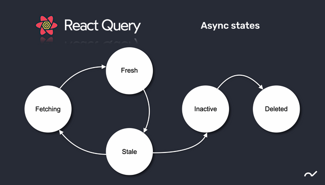

#React Query

##개요
####React 에서 비동기를 쉽게 다루게 해주는 라이브러리이자 동시에 서버 상태를 관리해 주는 라이브러리

##필요성
####캐싱
####서버 데이터 중복 호출 제거
####만료된 데이터를 백그라운드에서 제거
####데이터가 만료 시점
####만료된 데이터는 업데이트
####페이지네이션, 레이지 로딩 데이터의 성능 최적화
####서버 상태의 메모리 관리 및 가비지 콜렉션
####쿼리 결과의 구조 공유를 통한 메모이제이션

##왜 React Query 인가?
####글로벌 상태 관리 라이브러리없이 서버에서 데이터를 주고 받을 수 있음
####상태 관리 라이브러리에서 요구하는 boilerplate 코드를 제거함으로써 코드의 가독성을 높일 수 있음
####Redux 등 여기저기 선언적으로 표현된 코드대신 실제 컴포넌트 안에 훅 형태로 사용하기 때문에 굳이 서버 상태를 글로벌 상태 관리 저장소에 저장할 필요가 없으며 코드가 선형적으로 표현됨으로 직관적이고 단조로운 형태를 유지할 수 있어 가독성 측면에서 유리

###Redux
```
import { filter, map, mergeMap } from 'rxjs/operators';
import { ajax } from 'rxjs/ajax';

// redux-observable 예제
// SAMPLE_DATA_REQUEST 타입의 액션을 받아서 API 호출 후 리스펀스를 담은 액션으로 맵핑하는 epic
const sampleAsyncEpic = (action$) => {
	return action$.pipe(
		filter(action => action.type === 'SAMPLE_DATA_REQUEST'),
		mergeMap(action => 
			ajax.getJSON(`https://api.server.com/samples`).pipe(
		    map(response => ({ type: 'SAMPLE_DATA_RESPONSE', response }))
		  )
		)	
	)
}
```

###React-query
```
import { useQuery } from 'react-query';

function Example() {
  const { isLoading, error, data, isFetching } = useQuery('repoData', () =>
    fetch(
      'https://api.github.com/repos/tannerlinsley/react-query'
    ).then((res) => res.json())
  );

  if (isLoading) return 'Loading...';

  if (error) return 'An error has occurred: ' + error.message;

  return (
    <div>{JSON.stringify(data)}<div>
  );
}
```

##React Query 기본 적인 사용 방법

###Lifecycle

####fetching: 요청 중인 쿼리
####fresh: 만료되지 않은 쿼리, 인스턴스의 데이터가 최신화된 데이터라고 간주하며 refetching 대상
####stale: 만료된 쿼리, 인스턴스를 데이터가 최신화 되지 않았다고 간주하며 refetching 대상
####inactive: 사용하지 않는 쿼리, 인스턴스를 observe하는 컴포넌트가 없는 상태로 일정 시간이 지나면 가비지 컬렉터가 캐시에서 제거
####delete: 가비지 컬렉터에 의해 캐시에서 제거된 쿼리

```
import { QueryClient, QueryClientProvider } from 'react-query'

const queryClient = new QueryClient() // 인스턴스 생성

function App() {
  return <QueryClientProvider client={queryClient}>...</QueryClientProvider>
}
```

###useQuery
####서버에서 데이터를 가져오고 캐싱을 하는데 사용하는 기본이며 가장 많이 사용하게 되는 훅
```
const { data, isLoading } = useQuery(queryKey, queryFunction, options)
```
####queryFunction :  서버에서 데이터를 요청하고 Promise를 리턴하는 함수를 전달. 즉 axios.get(...), fetch(...) 등을 리턴하는 함수.
####queryKey : 문자열과 배열 추가 가능, 쿼리 키가 가지는 유연함으로 쉬운 캐싱 처리 가능. 쿼리 키가 다르면 캐싱도 별도로 관리
```
// 다른 키로 취급한다. 
useQuery(['todo', 1], ...)
useQuery(['todo', 2], ...)
```

```
// 객체 필드의 값이 달라도 다른 키로 취급한다
useQuery(['todo', { preview: true }], ...)
useQuery(['todo', { preview: false }], ...)
```

```
// 객체 필드의 순서가 달라도 내용이 같으면 같은 키로 취급한다
useQuery(['todo', { preview: true, status: 'done' }], ...)
useQuery(['todo', { status: 'done', preview: true }], ...)
```

###리턴 데이터
#### data : 쿼리 함수가 리턴한 Promise에서 resolve된 데이터
#### isLoading : 저장된 캐시가 없는 상태에서 데이터를 요청 중일때 true
### isFetching : 캐시가 있거나 없거나 데이터가 요청 중일때 true

###Option
####cachedTime : inactive 상태에서 cachedTime만큼의 시간이 지나면 GC됨 (default: 1000 * 60 * 5)
####staleTime : fresh 상태에서 stale 상태가 되는데 걸리는 시간, fresh 상태 지속시간 (default: 0)
####enabled : false이면 fetch를 안함 (default: true)
####onSuccess : 쿼리 함수가 성공적으로 데이터를 가져왔을 때 호출되는 함수.
####onError : 쿼리 함수에서 오류가 발생했을 때
####onSettled : 쿼리 함수의 성공, 실패 두 경우 모두 실행된다.
####keepPreviousData : 쿼리 키(ex.페이지 번호)가 변경되어서 새로운 데이터를 요청하는 동안에도 마지막 data값을 유지
####initialData: 캐시된 데이터가 없을 때 표시할 초기값. placeholder로 전달한 데이터와 달리 캐싱이 된다. 브라우저 로컬 스토리지에 저장해 둔 값으로 데이터를 초기화할 때 사용할 수 있음
####refetchOnWindowFocus: 윈도우가 다시 포커스되었을 때 데이터를 호출할 것인지 여부 (default: true)
####select: fetcher가 리턴한 데이터를 가공
####retry: fetch 실패시 재시도 횟수 (default: 3)
####retryDelay: 실패시 재시도 할 때까지 기다리는 시간

###QueryClientProvider
####캐시를 관리하기 위해 QueryClient 인스턴스를 사용
####useQuery 훅 안에서 QueryClient를 컴포넌트 르리 안에서 추가 필요

###UseMutation
####데이터 생성/수정/삭제에 사용하는 훅
```
const mutation = useMutation(newTodo => axios.post('/todos', newTodo))

const handleSubmit = useCallback(
  (newTodo) => {
    mutation.mutate(newTodo)
  },
  [mutation],
)
```
####기본적인 옵션은 useQuery와 같고 추가적으로 onMutate 콜백 사용 가능 
####useMutation을 사용한다면 onSuccess 콜백을 사용해도 되지만, 코드 가독성을 위해 mutateAsync 함수를 사용 가능
```
const mutation = useMutation(newTodo => axios.post('/todos', newTodo))

const handleSubmit = useCallback(
  async (newTodo) => {
    await mutation.mutateAsync(newTodo)
		setAnotherState() 
		dispatch(createAnotherAction())
  },
  [mutation],
)
```

###invalidation(쿼리 뮤효화)
#### 쿼리 데이터가 stale 상태로 바뀌기를 기다릴 수 없을 경우, staleTime 이 지나기 전에 직접 쿠리를 무효화하여 데이터를 새로 가져 올 수 있음
```
const queryClient = useQueryClient();

// 캐시에 있는 모든 쿼리를 무효화한다.
queryClient.invalidateQueries()

// todo로 시작하는 모든 쿼리를 무효화한다. ex) ['todos', 1], ['todos', 2], ...
queryClient.invalidateQueries('todos')

// ['todos', 1] 키를 가진 쿼리를 무효화한다.
queryClient.invalidateQueries(['todos', 1])
```

#### predicate 옵션을 사용하면 무효화할 쿼리를 더 자세하게 설정 가능
```
// 쿼리 키 배열의 두번째 객체의 version 필드의 값이 10 이상인 쿼리만 무효화한다.
queryClient.invalidateQueries({
  predicate: query =>
	   query.queryKey[0] === 'todos' && query.queryKey[1]?.version >= 10,
})

// 위의 코드로 무효화된다.
const todoListQuery = useQuery(['todos', { version: 20 }], fetchTodoList)

// 위의 코드로 무효화되지 않는다.
const todoListQuery = useQuery(['todos', { version: 5 }], fetchTodoList)
```


