# 성광님도 한번 보면 무릎을 탁칠 WebRTC 문서를 작성해 보자

### Why WebRTC

##### Web Real-Time Communication 

말그대로 웹을 통해서 실시간 커뮤니케이션을 하기 위해 생겨난 놈이다.

우리는 원격지의 사람과 소통할때 서로의 얼굴을 보며, 서로의 목소리를 들으며, 때론 채팅을 하고, 문서를 전달 하기를 원한다.

이 모든 것을 WebRTC가 해결해 준다

(두 사람이 영상통화를 한다는 개념으로 설명하기 위해 *성광님이 상훈님에게 영상통화를 하는 연출로 진행해 보겠다.*)

#### webRTC 3총사(대표 API)

1. getUserMedia(mediaStream)

   우선 얼굴과 목소리를 교환하려면 브라우져가 성광님의 얼굴과 목소리를 가져가야 한다.

   

     
펼치기

     

       
     

   

   이를 위한 api이며 해당 api를 통해 생성되는 mediaStream에 성광님의 음성과 오디오가 담기게 된다.

   https://webrtc.github.io/samples/src/content/getusermedia/gum/

   

2. RTCPeerConnection

   성광님과 동훈님이 영상과 목소리를 주고 받으려면 서로 어디에 있고 어떤 규약으로 정보를 주고 받을지 알아야 한다.

   해당 api에서 자신의 주소와 환경을 알거나 상대방의 주소와 환경을 저장 할 수 있다.

   이 광활한 world wide web에서 서로를 찾아 connection을 맺을 수 있을지가 궁금할 수가 있다.

   아래 소개팅 예시로 좀 더 개념을 잡아 보겠다. 우선 영상통화 샘플을 살펴 보자.

   https://webrtc.github.io/samples/src/content/peerconnection/pc1/

   https://appr.tc/r/820642262

   

3. RTCDataChannel

   음성 및 영상이 아닌 json/text, file등을 주고 받는 채널을 추상화한 api

### Blind date 

>ICE : Interactive Connectivity Establishment(대화형 연결 설정) : 두단말 통신 할 수 있는 최적의 경로를 찾아주는 프레임워크
>
>SDP(Sesson Description Protocol): 본인의 코덱 통신상태등의 정보를 가지고 있다.
>
>Turn / Stun: 본인의 공인 ip를 알수 있는 서버

1. 각자 본인의 전화번호(ICE candidate) 및 프로필(sdp) 확인

2. 주선자(signaling server)에게 전화번호와 프로필을 전달

   

     
펼치기

     
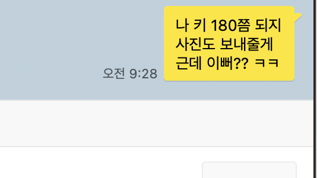
     

   

   
   
3. 주선자는 서로의 전화번호와 프로필을 전달

   

     
펼치기

     
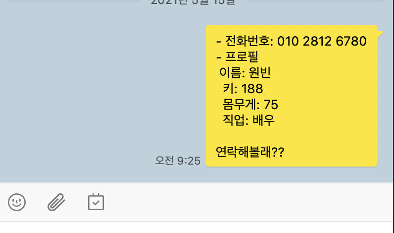
     

   

4. 서로 오케이(connection)를 하면 만남이 성사

   

     
펼치기

     
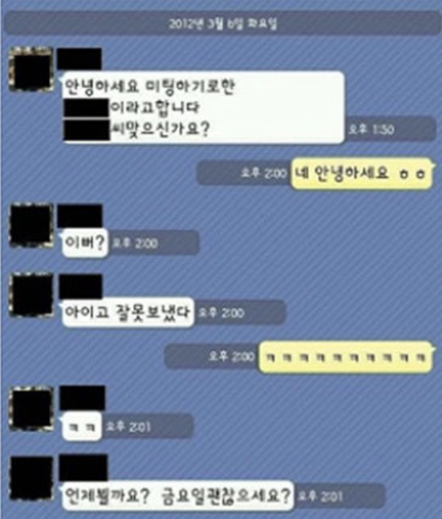
     

   

5. 자유롭게 대화

- 통신 도식화

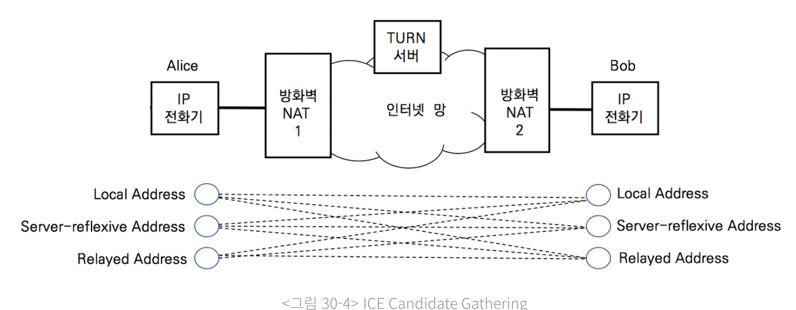

p2p통신을 하기 위해서는 공인 ip가 필요한데 공인ip를 획득하는 단계로 turn서버를 이용한다고 한다

https://brunch.co.kr/@linecard/156

#### 실제 연결 단계

1. getUserMedia로 본인의 영상 및 오디오 획특
2. RTCPeerConnection로 본인의 network정보 및 sdp전문 획득
3. signaling server에게 network정보와 sdp전문 전달
4. Signaling server에서 연결된 유저들에게 network 정보와 sdp전문 전달
5. 받은 network 정보와 sdp전문을 RTCPeerConnection를 통하여 로컬에 셋팅
6. 연결 성공하면 onaddStream 이벤트를 통해 상대 stream을 받아 video나 audio객체로 play

### I USED

제가 음성통화 기능을 구현하면서 사용했던 api들

https://github.com/yangSangHoon/webrtc-typescript

### Can i use

#### pc

대부분의 최신 브라우져 지원

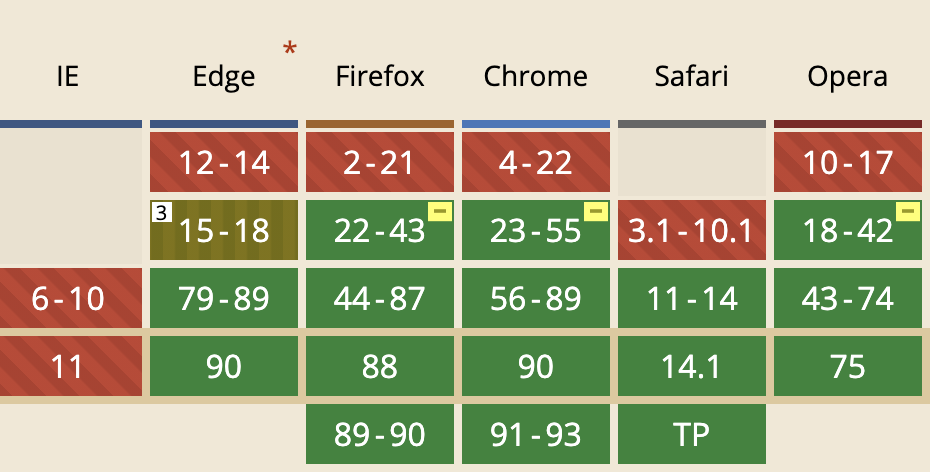

#### mobile

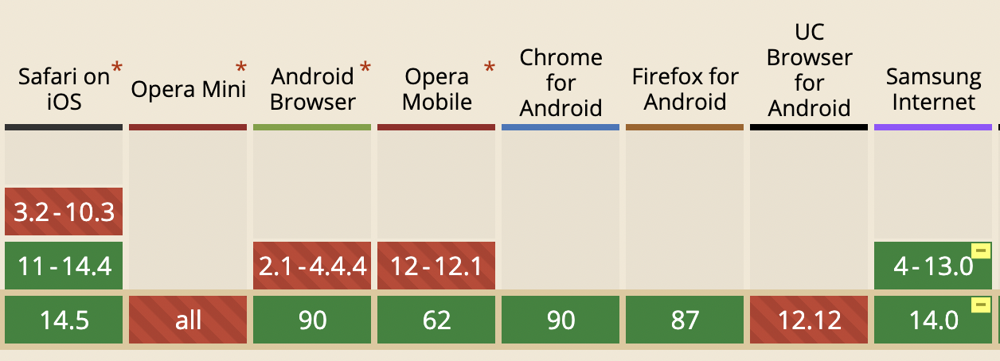

실제 모바일에서는 문제가 많다고 한다

자세한 내용은 아래 링크 참고

https://bloggeek.me/webrtc-browser-support/

### It's not perfect, but it will be perfect

web으로 실시간(0.5초 미만) stream통신 가능

소규모 화상채팅 가능

chrome의 경우 동시 허용 peer 500회, 권장 50회

높은 해상도 지원 불가

https://bloggeek.me/webrtc-browser-support/

현재 webrtc 1.0이며 계속 변화중이며 deprecated된 함수들이 많아 지고 있어 다음 버전에 대한 논의가 많다.

여러 업체들은 인원수 제한등에 대해 다양한 차체 해결 방법을 찾고 있다.

### How zoom use WebRTC?

#### User webSocket

초기 줌은 webrtc프로토콜을 사용하지 않고 websocket을 통하여 미디어를 스트리밍 한다.

미디어 전달 과정을 알아 보자

앞서 이야기한 webrtc3대장 중 getUserMedia로 미디어 스트리밍을 얻은후 webAssembly 인코딩 후 webSocket을 통해  전달 한다

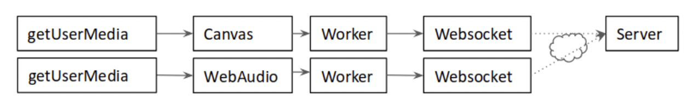

반대로 webSocket에서 수신한 미디어 데이타는 webAssemply에서 디코딩을 거쳐 canvas에 그려지거나 webAudio에서 음성이 재생되는 과정이다

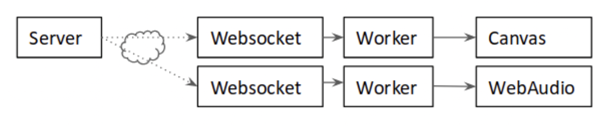

#### To webRtc media channel

> [TCP](https://webrtcglossary.com/tcp/) (**T**ransmission **C**ontrol **P**rotocol): TCP와 IP를 함께 사용하는데, IP가 데이터의 배달을 처리한다면 TCP는 *패킷을 추적 및 관리, 높은 신뢰성을 보장하나 그로인해 속도가 느릴수 밖에 없는 구조
>
> [SCTP](https://webrtcglossary.com/sctp/)(Stream Control Transmission Protocol): [UDP](https://webrtcglossary.com/udp/) 와 [TCP](https://webrtcglossary.com/tcp/) 의 하이브리드

Websocket은 TCP기반의 통신이기 때문에 패킷 손실시 성능과 미디어 품질이 떨어지는 단점이 있다 

*(실시간 작업이 느릴때 재전송하기 때문)*

 WebRtc의 dataChannel을 사용하여 미디어 전달하도록 변경하였다

 *(WebRtc dataChannel을 SCTP사용, 음성 및 영상의 경우 신뢰 보장보다 속도를 우선한 선택)*

아래 샐칠된 부분이 zoom이 선택한 미디어 스트림 전달을 위해 선택한 기술 스팩이다

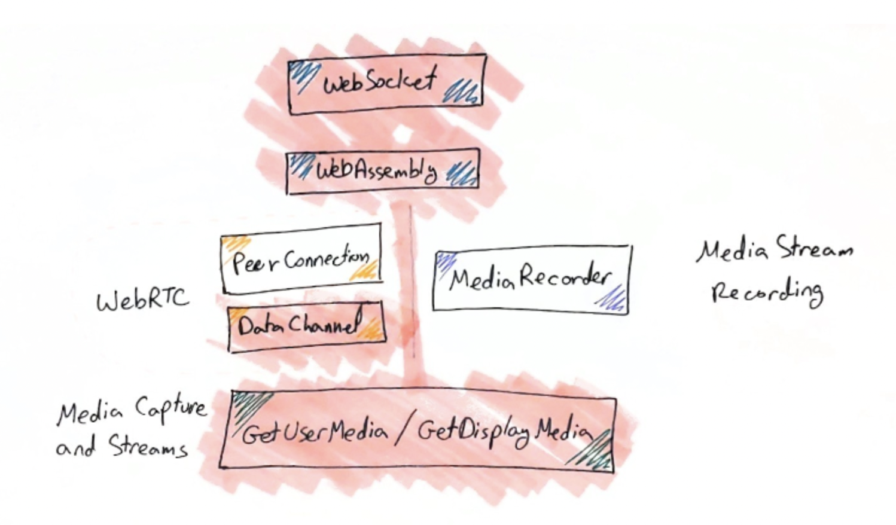

아래는 zoom으로 가족들과 영상통화를 하면서 크롬개발자 도구로 어떤 socket이 물려있는지 캡쳐한 화면이다

DataChannel쪽 socket으로 예상해본다 (진정한 뇌피셜!)

미디어 데이타 이외의 실시간 동기화 되어야하는 데이타 (접속한 유저, 유저의 마이크등의 상태등)

webAssembly쪽

(경고!) 해당 정보는 아래경로에서 참고한 자료로 많이 축약되고 오해의 소지가 있을 수 있으니 zoom이 websocket과 webrtc를 사용하는 자세한 히스토리를 알고 싶으면 아래 링크를 참고하길 바라는 바이다( _ _)

https://webrtchacks.com/zoom-avoids-using-webrtc/

https://bloggeek.me/when-will-zoom-use-webrtc/

### How Stove use WebRTC?

스마일게이트 회장님이 코로나시대를 발맞추어 원격통신의 중요성을 인지 하시고 스토브에 명령을 내리셨다.

우리 게임을 사용하는 유저들이 편하게 게임하면서 음성통신으로 소통을 할 수 있는 창을 만들라!*(디스코드가 이미 있다)*

개발자들은 신기술 적용의 기회에 기대가 컸으나 그후 그들은 ...

(개발자) : 그럼 한채널에 몇명 까지 접속이 되면 될까요?

(회사): 몇명? 제한을 왜 두어 무제한으로 해!

(개발자): 아 ...

그렇다. 스토브 회장님의 클라스는 남다르다. (국내 부자 순위 5위를넘나드는 분이기에??)

앞서 살펴본 바와 같이 webRtc는 p2p 실시간 영상통신이기 때문에 인원수(peer) 제한은 필수 이다.

우선 우리는 협의를 통해 채널당 50명 정도를 도전으로 진행해 보았다 (채널 * 50 = ???)

(zoom의 슈퍼 개발자분들은 해결하셨지만...;)

##### 스토브도 해보자!

1차

Ant media서버 사용

> AWS에서 구매할 수 있는 webRtc를 사용 할 수 있는 서버이다.

서버가 설명보다 트레픽을 못버텨 포기

2차

[mumble](https://www.mumble.info/)프로토콜사용

> Window client에서 대규모 채팅 프로그래밍에 사용되는 유명한 프레임워크로 알고 있다, 웹용은 아니다

web에서 사용할 수 없음으로 중간에 webrtc -> mumble로 변경해주는 proxy서버 구축

1. 브라우져에서 webRtc 프로토콜을 proxy서버에 전달 
2. proxy서버에서 mumble프로토콜로 변환 mumble서버로 전달
3. mumble서버에서 모든 유저의 음성을 하나로 합쳐 proxy서버로 전달 
4. proxy서버에서 접속된 모든 브라우져로 webRTC프로코톨 전달
5. 하나로 합쳐진 미디어 스트림을 받아 하나의 audio만 play

서버에서 인코딩, 디코딩등을 하고 하나의 스트림을 만들어 클라이언트에 전달는 구조로 서버잡업이 중요한 설계

2차 버전도 많은 서버비용등 문제가 많아 zoom같이 webAssembly를 도입하는 방향으로 다시 진행중으로 알고 있다.

이제 성장하는 웹을 이용한 실시간 원격 통신이기 때문에 여러 회사에서 도전과 시행 착오와 발전을 계속 하고 있을 것으로 예상한다.

*추신) 스토브와 회장님의 이야기는 재미요소를 위해 다소 부정적으로 기입한 부분이니 오해가 없기를 바랍니다. ㅠㅠ*

*새로운 도전과 많은 경험을 해준 스마일게이트에 감사합니다( _ _)*

### With need a skill

- WebAssembly
- Web worker
- Turn / Stun
- https://github.com/webrtcHacks/adapter(브라우져마다 다른 미디어 기능에 대한 대응 라이브러리)

### codec

#### 음성코덱

- Opus codec

  - 특징

  - sdp 전문안에 opus 코덱을 컨트롤 하는 부분이 있음

    >- 기존: a=fmtp:111 minptime=10;useinbandfec=1 
    >
    >+ 수정: a=fmtp:111 maxplaybackrate=16000; sprop-maxcapturerate=16000; maxaveragebitrate=20000; stereo=0;

- 코덱별 Delay 비교

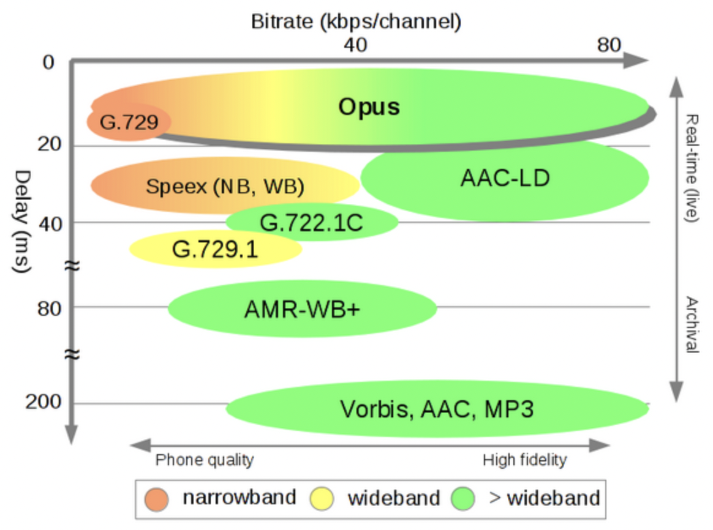

- 코덱별 Quality비교

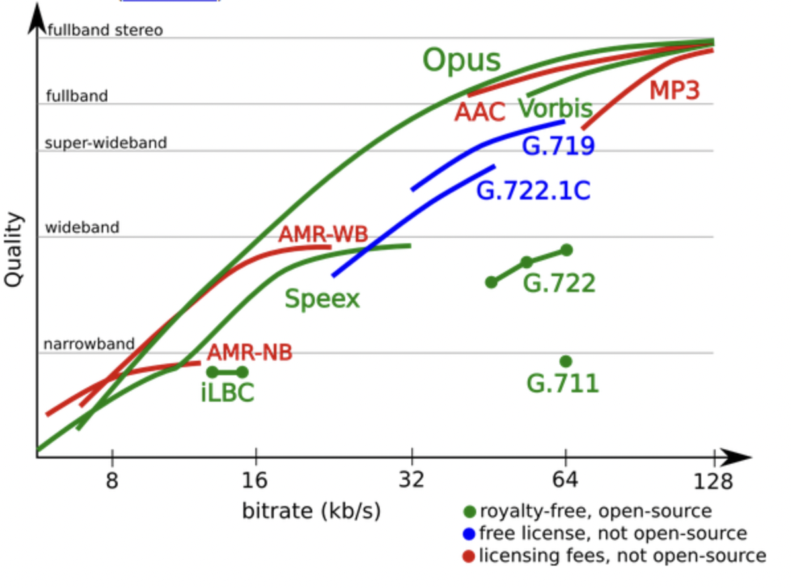

#### 비디오 코덱

VP8, AVC/h264

사실 비디오 연동을 안해봐서 많은 정보가 없다.(지치기도 해서...) 아래 링크 참고 부탁드립니다 ㅎㅎ;

https://developer.mozilla.org/en-US/docs/Web/Media/Formats/WebRTC_codecs

### Useful Tools

webrtc 디버깅툴 : [chrome : // webrtc-internals](chrome://webrtc-internals/) 

패킷 분석 툴: [WireShark](https://jeong-pro.tistory.com/155)

