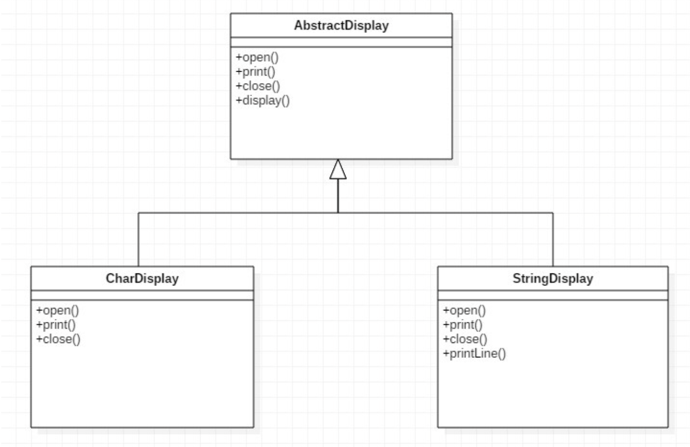
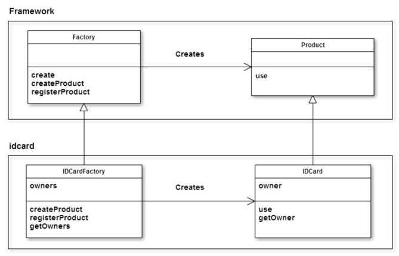
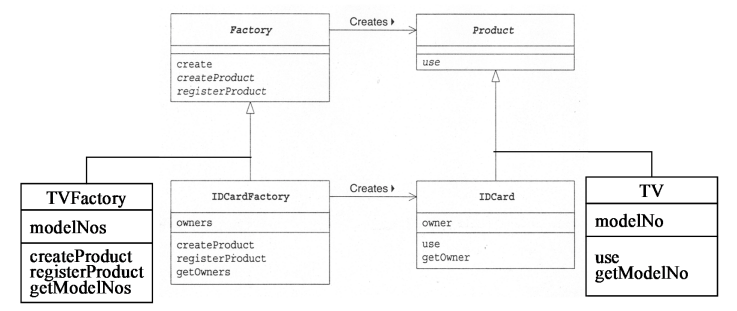
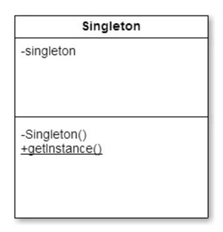

# Software design pattern

>프로그램을 개발할 때 예전과 같은 작업을 반복하고 있다는 느낌이 들 때가 있다.  
>경험이 쌓일수록 이러한 자신만의 '패턴'이 머리 속에 축적되고, 그 '패턴'을 다음 개발에 적용할 수 있게 된다.
>
>Erich Gamma, Richard Helm, Ralph Johnson, John Vlissides 4명은 개발자의 '경험'이나 '내적인 축적'을
>**디자인 패턴** 이라는 형태로 정리 했다.
>이 4명을 the Gang of Four 또는 GoF라고 부른다.
>GoF는 자주 사용되는 23개의 디자인 패턴에 '이름'을 붙이고 '카탈로그'로 정리해서 '오브젝트(객체) 지향에 있어서
>재이용을 위한 디자인 패턴' 이라는 책을 서술했다.
>
>많은 모듈이 상호 관련되어 동작할 때 인터페이스가 중요하는건 모두 알고 있다.  
>특히 많은 개발자가 공동으로 작업할 경우에는 인간의 인터페이스가 중요하다.  
>그 인터페이스의 기본이 되는 것은 '언어' 이다.  
>특히 코드에 대한 상세한 논의가 아니라 프로그램의 커다란 구조에 대해서 논의할 경우에는 언어나 도식이 중요하다.  
>어떤 개발자가 주장하고 있는 개선안은 나의 개선안과 같은가, 다른가?  
>큰 틀에서는 같지만 세부적인 차이점은 없는가? 무한한 시간과 인내력이 있다면 논의를 반복해서 의문에 대한 답을 얻을 수 있을지도 모른다.
>그러나 디자인 패턴의 용어를 빌리면, 보다 용이하게 서로의 아이디어를 비교하고 논의할 수 있다.  


디자인 패턴은 개발자들에게 유익하고 풍부한 어휘를 부여하고 상호간의 의사 소통을 쉽게 해 준다.  
디자인 패턴은 우리가 매일 쓰고 있는 프로그램을 새로운 시점에서 다시 생각하고, 재사용을 쉽게 하고, 기능확장이 쉬운 소프트웨어를 만들기 위한 유익한 기법이다.

## Curriculum : GoF가 정리한 23개의 디자인 패턴
>**Part 1 디자인 패턴과 친해지기**  
>Chapter 01 Iterator - 순서대로 지정해서 처리하기  
>Chapter 02 Adapter - 바꿔서 재이용하기  
>
>**Part 2 하위 클래스에게 위임하기**  
>Chapter 03 Template Method - 하위 클래스에서 구체적으로 처리하기  
>Chapter 04 Factory Method - 하위 클래스에서 인스턴스 만들기    
>
>**Part 3 인스턴스 만들기**  
>Chapter 05 Singleton - 인스턴스를 한 개만 만들기  
>Chapter 06 Prototype - 복사해서 인스턴스 만들기  
>Chapter 07 Builder - 복잡한 인스턴스 조립하기  
>Chapter 08 Abstarct Factory - 관련 부품을 조합해서 제품 만들기  
>
>**Part 4 분리해서 생각하기**  
>Chapter 09 Bridge - 기능 계층과 구현 계층 분리하기  
>Chapter 10 Strategy - 알고리즘을 모두 바꾸기  
>
>**Part 5 동일시하기**  
>Chapter 11 Composite - 그릇과 내용물을 동일시하기  
>Chapter 12 Decorator - 장식과 내용물을 동일시하기  
>
>**Part 6 구조를 돌아다니기**  
>Chapter 13 Visitor - 데이터 구조를 돌아다니면서 처리하기  
>Chapter 14 Chain of Responsibility - 책임 떠넘기기  
>
>**Part 7 단순화하기**  
>Chapter 15 Facade - 단순한 창구  
>Chapter 16 Mediator - 중개인을 통해서 처리하기  
>
>**Part 8 상태를 관리하기**  
>Chapter 17 Observer - 상태의 변화를 알려주기  
>Chapter 18 Memento - 상태를 저장하기  
>Chapter 19 State - 상태를 클래스로 표현하기  
>
>**Part 9 낭비 없애기**  
>Chapter 20 Flyweight - 동일한 것을 공유해서 낭비 없애기  
>Chapter 21 Proxy - 필요해지면 만들기  
>
>**Part 10 클래스로 표현하기**  
>Chapter 22 Command - 명령을 클래스로 하기  
>Chapter 23 Interpreter - 문법규칙을 클래스로 표현하기  

 
```shell
npm init -y

-- 타입스크립트를 추가
npm install typescript --save-dev
-- node.d.ts를 추가 
npm install @types/node --save-dev

-- tsconfig.json
npx tsc --init --rootDir src --outDir lib --esModuleInterop --resolveJsonModule --lib es6,dom --module commonjs

npm install ts-node --save-dev

npm install nodemon --save-dev    

```

## Part 2 하위 클래스에게 위임하기 
### Chapter 03 Template Method - 하위 클래스에서 구체적으로 처리하기
Template Method 패턴에서는 처리의 골격을 상위 클래스에서 기술하고 구체적인 내용은 하위 클래스에서 수행  
- 상위 클래스에서 뼈대를 결정
- 하위 클래스에서 구체적인 내용을 결정

#### Example 문자나 문자열을 5회 반복해서 표시하기
<pre>

<< HHHHH >>

+-------------+
|Hello, world.|
|Hello, world.|
|Hello, world.|
|Hello, world.|
|Hello, world.|
+-------------+
</pre>


- AbstractDisplay : 메소드 display만 구현되고 있는 추상 클래스
- CharDisplay : 메소드 open, print, close를 구현하고 있는 클래스
- StringDisplay : 메소드 open, print, close를 구현하고 있는 클래스

#### 정리
```AbstractClass의 역할```  
AbstractClass는 템플릿 메소드를 구현합니다.   
또한 그 템플릿 메소드에서 사용하고 있는 추상 메소드를 선언합니다.  
이 추상 메소드는 하위 클래스인 ConcreteClass 역할에 의해 구현 됩니다.

```ConcreteClass```   
AbstractClass 역할에서 정의되어 있는 추상 메소드를 구체적으로 구현 합니다.  
여기에서 구현한 메소드는 AbstractClass역의 템플릿 메소드에서 호출 됩니다.

```Template Method 패턴을 사용하면 어떤 이점이 있을까요?```  
상위 클래스의 템플릿 메소드에서 알고리즘이 기술되어 있으므로, 하위 클래스측에서는 알고리즘을 일일이 기술할 필요가 없습니다.   
예를 들어 Template Method 패턴을 사용하지 않고, 에디터의 복사 & 붙여넣기 기능을 사용해서 복수의 ConcreteClass 역할을 만들었다고 가정합니다.

ConcreteClass1, ConcreteClass2, ConcreteClass3... 은 모두 비슷하지만 다른 클래스가 됩니다.   
작성한 후에는 괜찮지만 나중에 ConcreteClass1에 버그가 발견되면 대체 어떻게 될까요? 1개의 버그를 수정하기 위해 모든 ConcreteClass를 수정해야 됩니다. 그런 점에서 Template Method 패턴으로 프로그래밍을 하면 템플릿 메소드에 오류가 발견되더라도 템플릿 메소드만 수정하면 됩니다.

#### Hint
- 어느 레벨에서 처리를 분배할지, 어떤 처리를 상위 클래스에 두고 어떤 처리를 하위 클래스에 둘 것인지를 정한 매뉴얼은 없다. 그것은 프로그램을 설계하는 사람의 몫
- CharDisplay의 인스턴스도, StringDisplay의 인스턴스도 AbstractDisplay 타입의 변수에 대입하고 있습니다. 그리고 display()를 호출하고 있습니다.
  '상위 클래스 타입의 변수에 하위 클래스의 어떠한 인스턴스를 대입해도 제대로 작동할 수 있도록 한다.' 의 원칙을 LSP(The Liskov Substitution Principle) 라고 합니다. (상속의 일반적인 원칙)
  
- (상위 클래스와 하위 클래스의 연계) : Template Method 패턴에서는 상위 클래스와 하위 클래스가 긴밀하게 연락을 취하며 작동합니다.
따라서 상위 클래스에서 선언된 추상 메소드를 실제로 하위 클래스에서 구현할 때에는 그 메소드가 어느 타이밍에서 호출 되는지 이해해야 합니다. 상위 클래스의 소스 프로그램이 없으면 하위 클래스의 구현이 어려울 수도 있습니다.
  
- (하위 클래스를 상위 클래스와 동일시 한다.) : LSP 상위 클래스형의 변수에 하위 클래스의 어떠한 인스턴스를 대입해도 제대로 작동할 수 있도록 함.

- vue (html - templet)...


### Chapter 04 Factory Method - 하위 클래스에서 인스턴스 만들기
Template Method 패턴에서는 상위 클래스에서 처리의 골격을 만들고, 하위 클래스에서 구체적인 처리의 내용을 만들었습니다.  
이 패턴을 인스턴스 생성에 적용한 것이 Factory Method 패턴입니다.

#### Example 신분증명서 카드를 만드는 공장
<pre>
홍길동의 카드를 만듭니다.
이순신의 카드를 만듭니다.
강감찬의 카드를 만듭니다.
홍길동의 카드를 사용합니다.
이순신의 카드를 사용합니다.
강감찬의 카드를 사용합니다.
</pre>


- framework 패키지 (응용 프로그램의 기본 틀을 제공함)  
  Product / Factory  
- idcard 패키지  
  IDCard(제품) / IDCardFactory(공장)

- framework - Prodect : 추상 메소드 use만 정의되어 있는 추상 클래스
- framework - Factory : 메소드 create을 구현하고 있는 추상 클래스
- idcard - IDCard : 메소드 use를 구현하고 있는 클래스
- idcard - IDCardFactory : 메소드 createProduct, registerProduct를 구현하고 있는 클래스

구체적인 내용은 모두 하위 클래스 측에서 수행합니다.  
따라서 인스턴스 생성을 위한 골격(Framework)과 실제의 인스턴스 생성의 클래스를 분리해서 생각할 수 있습니다.

#### 정리
상위 클래스(추상적인 골격, framework) 측에 있는 Creator 역할과 Product 역할  
하위 클래스(구체적인 내용, idcard) 측에 있는 ConcreteCreator 역할과 ConcreteProduct 역할의 관계와 변행하고 있음

Product(제품)의 역할  
- 생성된 제품(인스턴스)이 가지고 있어야 할 인터페이스(API)를 결정하는 추상 클래스
- 구체적인 역할은 하위 클래스인 ConcreteProduct 역할이 결정 한다.
- 예제에서는, Product 클래스가 해당됨  

Creator(생산자)의 역할  
- Product 클래스를 생성하는 추상 클래스
- Creator는 실제 제품을 생성하는 일을 하는 ConcreteCreator 역할에 대해서는 아무것도 모른다.
- 예제에서는, Factory 클래스가 해당됨

ConcreteProduct(구체적 제품)의 역할
- 구체적인 제품을 나타내는 클래스
- 예제에서는, IDCard 클래스가 해당됨

ConcreteCreator(구체적 생산자)의 역할
- 구체적인 제품을 만드는 클래스
- 예제에서는, IDCardFactory 클래스가 해당됨

#### Hint
```프레임워크와 구체적인 공장 및 제품을 분리```

추상적인 골격과 구체적인 내용의 두 가지 측면에 관해서 살펴 봤습니다.  
이 들은 각각 framework 패키지와 idcard패키지로 나뉘어 있습니다.   
여기서 동일한 framework를 사용해서 전혀 다른 '제품'과 '공장'을 만든다고 가정 합시다.   
TV 클래스 Television과 TelevisionFactory를 만든다고 하면 기존 framework 패키지를 전혀 수정 하지 않아도 전혀 다른 제품과 공장을 만들 수 있습니다.     
framework 패키지는 idcard 패키지에 의존하고 있지 않다 라고 표현 합니다.


```각 공장이 어떤 제품을 어떻게 생산하는지에 대해서, 클라이언트는 신경 쓰지 않는다(모른다)```  
– 예: IDCardFactory 공장이, IDCard 제품 대신에, IDCard2 라는 제품을 생산하도록 바뀌어도, Main 클래스의 코드는 바뀌지 않는다.  

- 단지, IDCardFactory 객체를 생성하고, create( ) 메소드를 호출하기만 하면
된다.

– Factory Method 패턴을 사용하지 않는다면,
- new IDCard( ) 부분을 모두 찾아서
- new IDCard2( )로 바꿔주어야 한다.


```인스턴스 생성 – 메소드 구현 방법```   
– Factory 클래스의 createProduct 메소드 구현 방법에는 3가지가 있다.   
(1) 추상 메소드로 한다. (예제 프로그램의 경우)  
(2) 디폴트 구현을 준비해 둔다   
    하위 클래스에서 구현을 준비하지 않았을 경우에 이 디폴트 구현이 실행된다.  
(3) 에러로 처리한다.  
디폴트 구현의 내용을 예외를 발생시키는 문장으로 한다.  
하위 클래스에서 구현하지 않으면, 이 디폴트 구현이 실행되어서 예외가 발생 한다.  


## Part 3 인스턴스 만들기
### Chapter 05 Singleton - 인스턴스를 한 개만 만들기
인스턴스가 한 개밖에 존재하지 않는 것을 보증하는 패턴을 Singleton 패턴이라고 한다.



#### 정리
싱글톤의 특징
- 생성자는 프라이빗 - 외부 new 금지  
- 스태틱으로 내부 객체 생성  
- 해당 메소드를 얻는 유일한 스태틱 메소드  

Lazy init, Application Bootstrap

#### Hint
전통적인 객체지향과 달리 자바스크립트의 모듈러 속성을 기반으로 한 싱글톤 방법 추천

