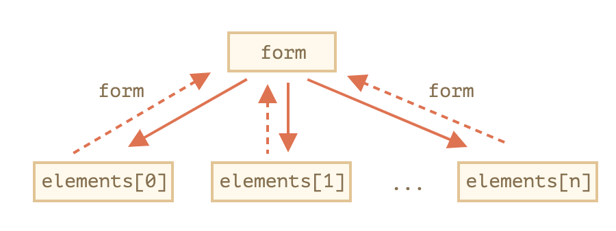
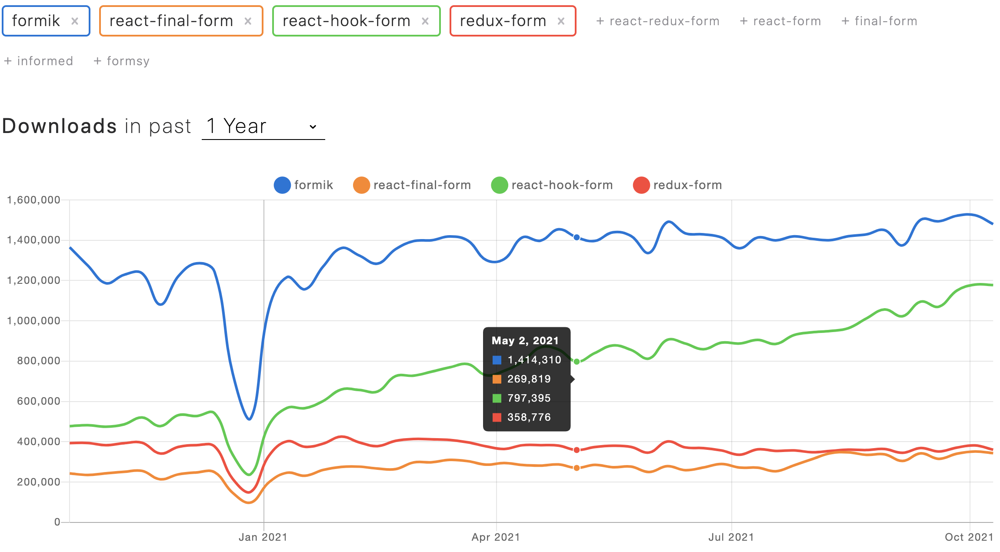

# React-hook-form

> 말그대로 react에서 form을 hook으로 사용할 수 있는 라이브러리이다.

## 특징

- uncontrolled component & controlled component
  - _상태를 가지는 element: input, select, textarea 등 element의 상태(state)를 누가 관리하느냐?_
    - _컴포넌트가 관리 -> Controlled_
    - _컴포넌트가 관리하지 않고 엘리먼트의 참조만 소유 **->** Uncontrolled_
    - [_https://velog.io/@loopy/React-Controlled-Component와-Uncontrolled-Component_](https://velog.io/@loopy/React-Controlled-Component%EC%99%80-Uncontrolled-Component)
- Formik 만큼 쉬운 API
- re-render 최소화 (state로 관리하지 않는다.)
- Isolate Component Re-Rendering
- Rendering 최소화
- 빠른 Mounting
- Input Change Subscriptions
- Typescript Support

## 사용해야 하는 이유

- html의 form안의 elements의 입력값을 javascript에서 전달 받기 쉽기 때문에 사용한다.
- react-hook-form은 반대로 javascript의 값을 html의 form으로 전달도 간편하게 해준다.



- form을 사용안할 경우

```jsx
this.refName = React.createRef();
this.addressName = React.createRef();
this.phoneName = React.createRef();
.
.
.

const handleSubmit = async () => {
	const submitData = {
		name: refName.current.value,
		address: addressName.current.value,
		phone: phoneName.current.value;
    .
		.
		.
  }

	await post('save/info', submitData}
}

이름: <input type="text" ref={this.refName}  />
주소: <input type="text" ref={this.addressName}  />
전화번호: <input type="text" ref={this.phoneName}  />
.
.
.

<button type="button" onClick={handleSubmit}></button>

```

## 다른 form 라이브러리는?

> 검색해보면 formilk, reat-fianl-form, redux-form정도가 나온다.

- **formik 은 이 라이브러리들 중 가장 무난**했지만, 공식 문서와 실제 타입 선언 파일이 일치하지 않는 문제가 있었습니다.
- react-final-form 은 실제 제품에 사용하지는 못했습니다. **final-form 자체의 사용 난이도가 formik 과 비교했을 때 높은 편**이였습니다.
- redux-form 은 성능은 가장 좋지 않고, 리덕스를 사용해야 하는 단점이 있지만, **반대로 리덕스를 사용할 때 비동기 미들웨어에서 편리하게 폼을 제어할 수 있는 API**가 있습니다



formik이 가장 높아서 좀더 찾아보니 위에 공식문서 문제이외에 성능 적인 문제가 있다.

- 복잡한 Form에는 어울리지 않는다
  - 제공되는 useFormikContext API는 특정 state만 watch를 할 수 없고 전체를 업데이트를 합니다.
  - 불필요한 re-render가 발생하여 performance 저하 발생

# 실습

[git주소](https://www.notion.so/557e8ae7af78422c890ca4e792928608)

[1.basic](https://github.com/yangSangHoon/react-hook-form-scaffoling/commit/0eb4e4eda746a9f9f6c3509628c9f75f5002858c)

[2.validation&error](https://github.com/yangSangHoon/react-hook-form-scaffoling/commit/9008eaa8f9b402594dcb9637161965cffca3aa89)

[3.elements component화](https://github.com/yangSangHoon/react-hook-form-scaffoling/commit/71435e6496c45fe113bb8a49f2f1d278902809fe)

[4.외부 UI라이브러리](https://github.com/yangSangHoon/react-hook-form-scaffoling/commit/50577308277f826019c22cfaa80c559f7370da2f)

[5.set default values](https://github.com/yangSangHoon/react-hook-form-scaffoling/commit/16ba02e69dc89686cc89915601ee388d9a9adeb4)

[6.getValue](https://github.com/yangSangHoon/react-hook-form-scaffoling/commit/48f27c5afc0ed75936c1597696936a84c2c0fac0)

[7.FormProvider](https://github.com/yangSangHoon/react-hook-form-scaffoling/commit/15b303dcdd1636c839895e00ec295a1fbfad5c25)

[8.배열 데이타 다루기](https://github.com/yangSangHoon/react-hook-form-scaffoling/commit/52e1ef2ea9d290b0f80a60a8804f37a22c1a372a)

# 공식문서

문서가 잘 갖추어져 있다

[https://react-hook-form.com/api/useform](https://react-hook-form.com/api/useform)
