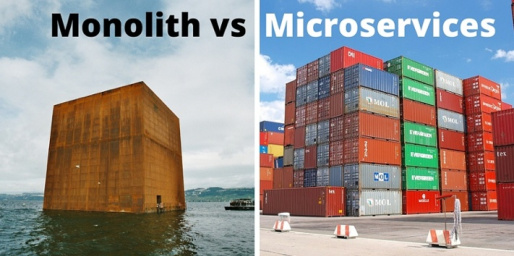

# yarn workspace

## 배경

## 모놀리틱 vs 마이크로서비스


### 모놀리틱 (Monolithic)

#### 장점
- 공통되는 코드를 자유롭게 공유
- 사용하는 라이브러리의 버전을 손쉽게 통일
- 비용 없이 새로운 서비스 구축
- 서비스 관리 비용 절감

#### 단점
- 오래걸리는 빌드시간
- 하나의 서비스 변경사항이 다른 서비스까지 영향을 미칠 수 있음
- 서비스별 배포를 할 수 없음
- 서비스별 정책을 가져가기 어려움 (캐싱)
- 다양한 라이브러리를 사용하기 어려움
<br /><br />


### 마이크로서비스(Microservice)
#### 장점
- 독립적 자율적으로 움직일 수 있고, 개발 속도가 빨라짐
- 하나의 서비스 변경 사항으로 다른 서비스에 영향을 미치지 않음
- 서비스에 맞는 언어와 프레임워크 각각 선택 가능

#### 단점
- 일반 개발보다 복잡함
   - 독립적인 서비스이기 때문에 각 모듈간의 인터페이스를 신중하게 처리 
   - 서비스중 하나가 응답하지 않게 될 경우에 대한 방어코드도 작성
- 테스트가 어려움
- 성숙한 모니터링 시스템
- 어떻게 나눌것인가에 모호함 발생

<br /><br />

### 개인적인 의견

Amazon, Netflix도 처음에 모놀리틱 서비스로 시작함.
Netflix는 2008부터 MSA전환을 시작하여 완전히 MSA로 전환하는데 7년이 걸림.
개발조직 환경에 따라 적절히 선택해야함.

#### 현재의 Amazon, Netflix 서비스 구조


<br /><br /><br /><br />


## [멀티리포 vs 모노리포](https://tech.buzzvil.com/handbook/multirepo-vs-monorepo/)
요걸로 설명을 대체


<br /><br /><br /><br />

## Yarn Workspace 빠르게 훝어보기


### workspace란?
 > Yarn 1.0부터 기본적으로 사용 가능한 패키지 아키텍처를 설정하는 새로운 방법입니다. yarn install한 번만 실행 하면 모든 패키지를 한 번에 설치할 수 있는 방식으로 여러 패키지를 설정할 수 있습니다.<br />
 
?? (이해 못함..)


### 사용법
root 디렉토리에서
```
yarn -v
yarn init -y
```


package.json
```
{
  "private": true,
  "workspaces": ["packages/*"]
}
```
Note: `private: true` 필수!

<br /><br />


이 파일을 만든 후 `packages` 폴더 하위에 두 개의 새 하위 폴더를 만듭니다.<br />
 `common`, `server` 각각에 package.json다음 내용으로 다른 파일을 만듭니다 .
```
mkdir packages
mkdir ./packages/common
mkdir ./packages/server
```

*packages/common/package.json:*

```
{
  "name": "common",
  "version": "1.0.0",
  "main": "index.js",
  "dependencies": {
    "cross-env": "7.0.3"
  },
  "license": "MIT"
}
```


*packages/server/package.json:*

```
{
  "name": "server",
  "version": "1.0.0",
  "main": "index.js",
  "dependencies": {
    "lodash": "^4.17.21"
  },
  "license": "MIT"
}
```