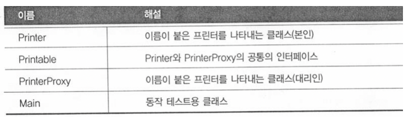
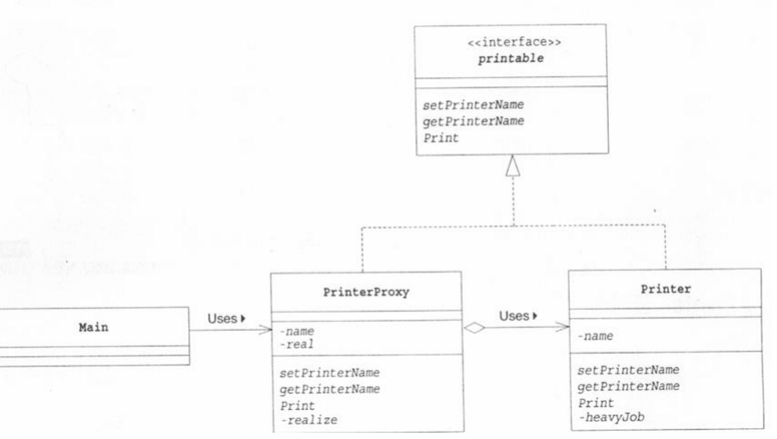

# Software design pattern

>프로그램을 개발할 때 예전과 같은 작업을 반복하고 있다는 느낌이 들 때가 있다.  
>경험이 쌓일수록 이러한 자신만의 '패턴'이 머리 속에 축적되고, 그 '패턴'을 다음 개발에 적용할 수 있게 된다.
>
>Erich Gamma, Richard Helm, Ralph Johnson, John Vlissides 4명은 개발자의 '경험'이나 '내적인 축적'을
>**디자인 패턴** 이라는 형태로 정리 했다.
>이 4명을 the Gang of Four 또는 GoF라고 부른다.
>GoF는 자주 사용되는 23개의 디자인 패턴에 '이름'을 붙이고 '카탈로그'로 정리해서 '오브젝트(객체) 지향에 있어서
>재이용을 위한 디자인 패턴' 이라는 책을 서술했다.
>
>많은 모듈이 상호 관련되어 동작할 때 인터페이스가 중요하는건 모두 알고 있다.  
>특히 많은 개발자가 공동으로 작업할 경우에는 인간의 인터페이스가 중요하다.  
>그 인터페이스의 기본이 되는 것은 '언어' 이다.  
>특히 코드에 대한 상세한 논의가 아니라 프로그램의 커다란 구조에 대해서 논의할 경우에는 언어나 도식이 중요하다.  
>어떤 개발자가 주장하고 있는 개선안은 나의 개선안과 같은가, 다른가?  
>큰 틀에서는 같지만 세부적인 차이점은 없는가? 무한한 시간과 인내력이 있다면 논의를 반복해서 의문에 대한 답을 얻을 수 있을지도 모른다.
>그러나 디자인 패턴의 용어를 빌리면, 보다 용이하게 서로의 아이디어를 비교하고 논의할 수 있다.  


디자인 패턴은 개발자들에게 유익하고 풍부한 어휘를 부여하고 상호간의 의사 소통을 쉽게 해 준다.  
디자인 패턴은 우리가 매일 쓰고 있는 프로그램을 새로운 시점에서 다시 생각하고, 재사용을 쉽게 하고, 기능확장이 쉬운 소프트웨어를 만들기 위한 유익한 기법이다.

## Curriculum : GoF가 정리한 23개의 디자인 패턴
>**Part 1 디자인 패턴과 친해지기**  
>Chapter 01 Iterator - 순서대로 지정해서 처리하기  
>Chapter 02 Adapter - 바꿔서 재이용하기  
>
>**Part 2 하위 클래스에게 위임하기**  
>Chapter 03 Template Method - 하위 클래스에서 구체적으로 처리하기  
>Chapter 04 Factory Method - 하위 클래스에서 인스턴스 만들기    
>
>**Part 3 인스턴스 만들기**  
>Chapter 05 Singleton - 인스턴스를 한 개만 만들기  
>Chapter 06 Prototype - 복사해서 인스턴스 만들기  
>Chapter 07 Builder - 복잡한 인스턴스 조립하기  
>Chapter 08 Abstarct Factory - 관련 부품을 조합해서 제품 만들기  
>
>**Part 4 분리해서 생각하기**  
>Chapter 09 Bridge - 기능 계층과 구현 계층 분리하기  
>Chapter 10 Strategy - 알고리즘을 모두 바꾸기  
>
>**Part 5 동일시하기**  
>Chapter 11 Composite - 그릇과 내용물을 동일시하기  
>Chapter 12 Decorator - 장식과 내용물을 동일시하기  
>
>**Part 6 구조를 돌아다니기**  
>Chapter 13 Visitor - 데이터 구조를 돌아다니면서 처리하기  
>Chapter 14 Chain of Responsibility - 책임 떠넘기기  
>
>**Part 7 단순화하기**  
>Chapter 15 Facade - 단순한 창구  
>Chapter 16 Mediator - 중개인을 통해서 처리하기  
>
>**Part 8 상태를 관리하기**  
>Chapter 17 Observer - 상태의 변화를 알려주기  
>Chapter 18 Memento - 상태를 저장하기  
>Chapter 19 State - 상태를 클래스로 표현하기  
>
>**Part 9 낭비 없애기**  
>Chapter 20 Flyweight - 동일한 것을 공유해서 낭비 없애기  
>Chapter 21 Proxy - 필요해지면 만들기  
>
>**Part 10 클래스로 표현하기**  
>Chapter 22 Command - 명령을 클래스로 하기  
>Chapter 23 Interpreter - 문법규칙을 클래스로 표현하기  

 
```shell
npm init -y

-- 타입스크립트를 추가
npm install typescript --save-dev
-- node.d.ts를 추가 
npm install @types/node --save-dev

-- tsconfig.json
npx tsc --init --rootDir src --outDir lib --esModuleInterop --resolveJsonModule --lib es6,dom --module commonjs

npm install ts-node --save-dev

npm install nodemon --save-dev    

```

## Part 9 낭비 없애기
### Chapter 21 Proxy - 필요해지면 만들기
proxy는 대리인 이라는 의미이다.
본인을 대신해서 일을 처리하는 사람


화면에 문자열을 표시하는 프로그램


Printable 인터페이스  
- PrinterProxy와 Printer 클래스를 동일시하기 위한 인터페이스

Printer 클래스  
- ‘본인’을 나타내는 클래스  
- 생성자: heavyJob (5초가 걸리는 상대적으로 오래 걸리는 일) 을 호출함  
- setPrinterName( ) / getPrinterName( )
- print( )
  - 프린터 이름과 문자열을 화면에 출력함
- heavyJob( )
  - [setTimeout(1000) 후 ‘.’을 찍는 일]을 5번 실행함.

PrinterProxy 클래스
- Printer 클래스의 ‘대리인’을 나타내는 클래스
- name 필드: 대리인의 이름을 저장함
- real 필드: ‘본인’에 대한 참조를 저장함
- setPrintername( ): real이 null 이 아니면, 즉, 본인 객체가 이미 생성되어 있으면, 그 객체에도 이름을 설정한다.
- print( )
  - realize( ) 호출 후, ‘본인’ 객체의 print( ) 메소드를 호출한다 => 위임
- realize( )
  - 실제 일을 하는 ‘본인’ 객체가 생성되지 않았으면 생성한다.
- setPrintername( )과 realize( ) 는 synchronized 로 선언됨


```typescript
export interface Printable {
  setPrinterName(name: String): void;
  getPrinterName(): String;
  print(string: String): void;
}

export class PrinterProxy implements Printable {
  private name: String;
  private real: Printer = null;

  constructor(name: String) {
    this.name = name;
  }

  getPrinterName() {
    return this.name;
  }

  print(string: String) {
    this.realize();
    this.real.print(string);
  }

  setPrinterName(name: String) {
    if (this.real != null) {
      this.real.setPrinterName(name);
    }
    this.name = name;
  }

  private realize() {
    if (this.real == null) {
      this.real = new Printer(this.name);
    }
  }
}

export class Printer implements Printable {
  private name: String;

  constructor(name: String) {
    this.name = name;
    this.heavyJob('Printer의 인스턴스 (' + name + ')을 생성 중');
  }

  getPrinterName() {
    return this.name;
  }

  print(string: String) {
    console.log('=== ' + this.name + ' ===');
    console.log(string);
  }

  setPrinterName(name: String) {
    this.name = name;
  }

  private async heavyJob(msg: String) {
    console.log(msg);
    for (let i: number = 0; i < 5; i++) {
      await new Promise((resolve, reject) => {
        setTimeout(() => {
          resolve(console.log("."));
        }, 1000);
      });
    }
    console.log('완료');
  }

}

```
#### 정리
Subject(주체)의 역할
- Proxy와 RealSubject를 동일시하기 위한 인터페이스(API)를 정한다.
- 예제에서는, Printable 인터페이스가 해당됨

Proxy(대리인)의 역할
- Client로부터의 요구를 가능한 한 자신이 처리함
- 혼자서 처리할 수 없으면 RealSubject 역할에게 위임한다.
- Proxy 역할은, RealSubject 역할이 정말로 필요해지면 그 때가서 RealSubject 역할을 생성한다.
- 예제에서는 PrinterProxy 클래스가 해당됨


대리인을 사용해서 스피드업
- Proxy 역할이 대리인이 되어서, 할 수 있는 일은 모두 처리한다.
- 실제로 무거운 처리(예: Printer 인스턴스 생성)는 필요할 때까지 지연시킨다.

대리와 위임
- 대리인이 처리할 수 있는 일은 대리인이 처리한다.  
- 대리인이 처리할 수 없을 때는 본인에게 위임한다.  

투명적이라는 것(transparent)
- 클라이언트(Main) 입장에서는, 실제로 호출하는 것이 PrinterProxy 객체인지, Printer 객체인지 상관하지 않는다.(투명하게 보인다)  

#### Hint
- HTTP Proxy
  - Proxy는 HTTP 서버(웹 서버)와 HTTP 클라이언트(웹 브라우저) 사이에 들어가, 웹 페이지의 캐싱 등을 실행하는 소프트웨어
    - 웹 브라우저 => Client 역할
    - HTTP Proxy => Proxy 역할
    - 웹 서버 => RealSubject 역할

비슷하지만 다르다 (자동차와 비교)
- Proxy (자동차) : 본인의 작업을 대리인에게 위임해서 본인에 대한 엑세스를 줄여 주는 것.
- Adapter (삼륜) : 서로 다른 오브젝트 사이를 이어주는 역할 (인터페이스 연결 - 투과적 동일)
- Decorator (오토바이) : 목적이 틀림. 새로인 기능을 추가하는 것.

프록시로 할수 주로 하는 일...
- 지연로딩
- 중계자 : 전/후처리 (리얼객체 전후로 템플릿은 구현레벨에서 프록시를 런타임에...)


