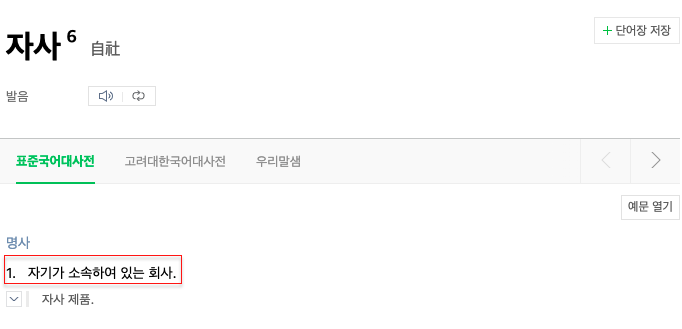

# 여러분들의 인증 시스템은 안녕 하신가요?

목차
1. cookie 기반 인증방식 vs http header 방식 인증방식
2. 

## OAuth
> OAuth 로고. 크리스 메시나가 설계함.
OAuth("Open Authorization")는 인터넷 사용자들이 비밀번호를 제공하지 않고 **👋 다른 웹사이트** 상의 자신들의 정보에 대해 웹사이트나 애플리케이션의 접근 권한을 부여할 수 있는 공통적인 수단으로서 사용되는, 접근 위임을 위한 개방형 표준이다.[1] 이 매커니즘은 여러 기업들에 의해 사용되는데, 이를테면 아마존,[2] 구글, 페이스북, 마이크로소프트, 트위터가 있으며 사용자들이 **👋 타사 애플리케이션이나 웹사이트의 계정에 관한 정보를 공유**할 수 있게 허용한다.
- 위키 피디아

> The OAuth 2.0 authorization framework enables a third-party
   application to obtain limited access to an HTTP service, either on
   behalf of a resource owner by orchestrating an approval interaction
   between the resource owner and the HTTP service, or by allowing the
   third-party application to obtain access on its own behalf.  This
   specification replaces and obsoletes the OAuth 1.0 protocol described
   in RFC 5849.

> OAuth 2.0 인증 프레임워크는 타사
   HTTP 서비스에 대한 제한된 액세스를 얻기 위한 애플리케이션
   승인 상호 작용을 조정하여 리소스 소유자를 대신하여
   리소스 소유자와 HTTP 서비스 간에 또는
   👋 타사 응용 프로그램이 자체적으로 액세스 권한을 얻습니다. 이것 사양은 설명된 OAuth 1.0 프로토콜을 대체하고 폐기합니다.
   RFC 5849 https://datatracker.ietf.org/doc/html/rfc6749

 

- 주목해야 할 단어 "타사"

### 👉 서로 다른 두집단이 정보와 리소스를 안전하고 신뢰 할 수 있는 방법으로 공유할수 있게 해주는 방법을 (== 프로토콜)

 
 

## OAuth 탄생과 사용
- 2000 ~ 2006: Google, Yahoo, AOL, Amazon 각각 인증방식을 제작하여 사용
- 2007년: OAuth 1.0 탄생
- 2008년: 보안문제 해결한 OAuth 1.0 revision A
- 2010년: OAuth 1.0 프로토콜 IETF 표준안 발표
- 2012년: OAuth 2.0 draft
...

 

OAuth1.0에서 `access_token`의 개념이 생겼다!

 

OAuth2.0 스펙문서에 보면 `access token`, `refresh token`의 개념 탑제 되었다.

OAuth 2.0에서 웹에서 많이 사용되는 Authorization code 방식이다.
복잡해 보이지만, 많이 사용하는 방식이다.

 

### OAuth 제공자
- facebook
- google
- apple
- amazon
- microsoft
- github
- naver
- kakao
- ... (생략) ...

 

## 이런 업체들도 🍊 자사 서비스에 동일한 방법으로 인증을 구현 했을까?

 

### reference
- 네이버 Oauth: https://d2.naver.com/helloworld/24942
- OAuth 2.0: https://datatracker.ietf.org/doc/html/rfc6749

