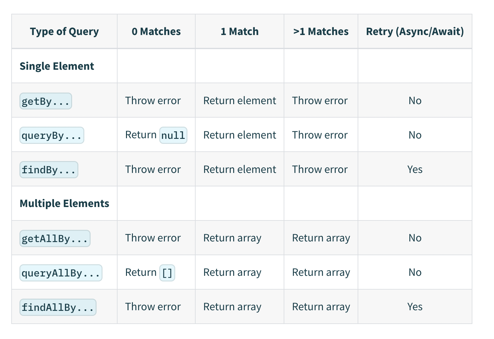

# 18장 TESTING REACT COMPONENTS

## 1. Tests Setup

### It's Tools

---

#### Jest   
> **jest option override**   
> way 1. eject 를 통해서 CRA를 구성하는 모든 설정을 추출 (Not Best)  
> way 2. 기본 제공 설정 활용 (설정 옵션 : https://create-react-app.dev/docs/running-tests#configuration)


### for what

---

#### component 테스트
> 유저 인터렉션 (O), 코드 implements (Condition And Structure) (X)  : 어떤 입력값과 액션을 통해서 어떤 결과가 나오는지...   
> Black Box Test   
> Way : E2E(implements -> interaction), How : Unit Test (Page -> Parts)

- 대상 폴더 : components, pages, routers
```javascript
"test:coverage": "npm test -- --coverage --watchAll=false",
...
"jest": {
    "collectCoverageFrom": [
        "./src/components/**/*.tsx",
        "./src/pages/**/*.tsx",
        "./src/routers/**/*.tsx"
    ]
```


## 2. App Tests

### write Test File

---

> Case 1. xxx.**spec**.tsx  
> Case 2. **tests**/xxx.tsx   
> 우리 강의에선 Case1 + Case2  

```typescript
import { render, waitFor } from "@testing-library/react";
import React from "react";
import { isLoggedInVar } from "../../apollo";
import { App } from "../app";

jest.mock("../../routers/logged-out-router", () => {
  return {
    LoggedOutRouter: () => <span>logged-out</span>,
  };
});

jest.mock("../../routers/logged-in-router", () => {
  return {
    LoggedInRouter: () => <span>logged-in</span>,
  };
});

describe("<App />", () => {
  it("renders LoggedOutRouter", () => {
    const { getByText } = render(<App />);
    getByText("logged-out");
  });
  it("renders LoggedInRouter", async () => {
    const { getByText, debug } = render(<App />);
    await waitFor(() => {
      isLoggedInVar(true);
    });
    getByText("logged-in");
  });
});
```
- **render** by @testing-library/react
- render function 에 우리가 테스트할 component 를 작성
- useMutation(or useQuery)등을 쓰려면 context에 client를 찾게 되어 있는데...(for apollo) mock(Logged in, Logged out) 으로 대체
- **isLoggedIn** 이 **true/false** 일 때 어떻게 보이는지 테스트
- interaction : isLoggedInVar (ReactiveVariable : https://www.apollographql.com/docs/react/local-state/reactive-variables/)
- isLoggedIn 같은 경우 React State updates 할 경우 act로 랩핑이 필요 (act는 유저가 한 행동이라고 생각...)
- **waitFor** 를 써서 state가 업데이트 될 동안 기다려 줌


> ### What render provide...
> https://testing-library.com/docs/react-testing-library/api#render  
> https://testing-library.com/docs/queries/about  
>
> - debug()
> app가 어떻게 생겼는지 출력해 줌 (Test point view)
> - getByText
> 요청한 텍스트가 있는지... 없다면 에러와 debug 메시지를 출력
> - waitFor
> state가 refresh하고 쓸 수 있도록 기다려 줌

  
## 3. Button Tests

```typescript
import { render } from "@testing-library/react";
import React from "react";
import { Button } from "../button";

describe("<Button />", () => {
  it("should render OK with props", () => {
    const { getByText } = render(
      <Button canClick={true} loading={false} actionText={"test"} />
    );
    getByText("test");
  });
  
  it("should display loading", () => {
    const { getByText, container } = render(
      <Button canClick={false} loading={true} actionText={"test"} />
    );
    getByText("Loading...");
    expect(container.firstChild).toHaveClass("pointer-events-none");
  });
});
```
- App Test와 큰 틀에서는 동일하고 props 기반으로 결과 확인
- rerender 를 통해서 component 의 props 를 기반으로 state 의 변화를 확인
- 테스트 관점은 implementation 을 테스트 하는게 아님 유저의 포인트 뷰를 기반으로 테스트 진행 (output)
- implementation 관점의 blackbox 테스트 (어떻게 구현되어 동작하는지 관점 보다 어떤 결과가 보이는지...)
- 결국 우리는 코드를 테스트 하는게 아니고 코드의 결과만 테스트 (user view point)
- container 는 children이 무엇을 가지고 있는지 체크
- VanillaJS api를 이용해서 element를 핸들링


## 4. FormError and Restaurant Tests

```typescript
import { getByRole, render } from "@testing-library/react";
import React from "react";
import { FormError } from "../form-error";

describe("<FormError />", () => {
  it("renders OK with props", () => {
    const { getByText } = render(<FormError errorMessage="test" />);
    getByText("test");
  });
});
```

```typescript
import { render } from "@testing-library/react";
import React from "react";
import { Restaurant } from "../restaurant";
import { BrowserRouter as Router } from "react-router-dom";

describe("<Restaurant />", () => {
  it("renders OK with props", () => {
    const restaurantProps = {
      id: "1",
      name: "name",
      categoryName: "categoryName",
      coverImg: "lala",
    };
    const { getByText, container } = render(
      <Router>
        <Restaurant {...restaurantProps} />
      </Router>
    );
    getByText(restaurantProps.name);
    getByText(restaurantProps.categoryName);
    expect(container.firstChild).toHaveAttribute(
      "href",
      `/restaurants/${restaurantProps.id}`
    );
  });
});
```

## 5. Testing Header and 404

```typescript
import { MockedProvider } from "@apollo/client/testing";
import { BrowserRouter as Router } from "react-router-dom";
import { render, waitFor } from "@testing-library/react";
import React from "react";
import { ME_QUERY } from "../../hooks/useMe";
import { Header } from "../header";

describe("<Header />", () => {
    
  it("renders verify banner", async () => {
    await waitFor(async () => {
      const { getByText } = render(
        <MockedProvider
          mocks={[
            {
              request: {
                query: ME_QUERY,
              },
              result: {
                data: {
                  me: {
                    id: 1,
                    email: "",
                    role: "",
                    verified: false,
                  },
                },
              },
            },
          ]}
        >
          <Router>
            <Header />
          </Router>
        </MockedProvider>
      );
      await new Promise((resolve) => setTimeout(resolve, 0));
      getByText("Please verify your email.");
    });
  });
  
  it("renders without verify banner", async () => {
    await waitFor(async () => {
      const { queryByText } = render(
        <MockedProvider
          mocks={[
            {
              request: {
                query: ME_QUERY,
              },
              result: {
                data: {
                  me: {
                    id: 1,
                    email: "",
                    role: "",
                    verified: true,
                  },
                },
              },
            },
          ]}
        >
          <Router>
            <Header />
          </Router>
        </MockedProvider>
      );
      await new Promise((resolve) => setTimeout(resolve, 0));
      expect(queryByText("Please verify your email.")).toBeNull();
    });
  });
});
```

- useMe query : apollo MockedProvider 를 이용하여 백엔드 목킹...
- hook 말고 request 를 mock
- response 를 위해 timeout 를 줘서 Promise 가 resolve 되도록 기다려야 함
- Promise 와 state 가 변경되어 rerender 되는 걸 처리하기 위해 **waitFor** 감싸 줌





> **Apollo Testing Tools**
> - MockedProvider (mocks : query, mutation, result)  
>  -> for Query
> - mock-apollo-client (more MockedProvider control by test. was called, loading state, alled with the expected variables)  
>  -> for Mutation


```typescript
import { render, waitFor } from "@testing-library/react";
import React from "react";
import { HelmetProvider } from "react-helmet-async";
import { NotFound } from "../404";
import { BrowserRouter as Router } from "react-router-dom";

describe("<NotFound />", () => {
  it("renders OK", async () => {
    render(
      <HelmetProvider>
        <Router>
          <NotFound />
        </Router>
      </HelmetProvider>
    );
    await waitFor(() => {
      expect(document.title).toBe("Not Found | Nuber Eats");
    });
  });
});
```

- Helmet를 통해서 document.title의 확인
- waitFor를 써서 Helmet의 처리 후 트리거


## 6. Login Tests

### apollo-client-test

---
- form에 있는 id, password가 정상적으로 입력 되어서 mutation 하는 부분을 apollo graphql이 제공하는 테스트 방법으로는 테스트 불가
- npm i mock-apollo-client --save-dev

```typescript
import { ApolloProvider } from "@apollo/client";
import { createMockClient, MockApolloClient } from "mock-apollo-client";
import { render, RenderResult, waitFor } from "@testing-library/react";
import React from "react";
import { Login, LOGIN_MUTATION } from "../login";
import { HelmetProvider } from "react-helmet-async";
import { BrowserRouter as Router } from "react-router-dom";
import userEvent from "@testing-library/user-event";

describe("<Login />", () => {
    let renderResult: RenderResult;
    let mockedClient: MockApolloClient;
    
    beforeEach(async () => {
        await waitFor(async () => {
            mockedClient = createMockClient();
            renderResult = render(
                <HelmetProvider>
                    <Router>
                        <ApolloProvider client={mockedClient}>
                    <Login />
                    </ApolloProvider>
                    </Router>
                    </HelmetProvider>
            );
        });
    });
    
    it("should render OK", async () => {
        await waitFor(() => {
            expect(document.title).toBe("Login | Nuber Eats");
        });
    });
```
- component를 실제 ApolloProvider로 감싸고 client를 mockClient를 제공   
  (전에는 provider 전체를 mocking 했다면 지금은 client만 mocking)

```typescript
    it("displays email validation errors", async () => {
        const { getByPlaceholderText, getByRole } = renderResult;
        const email = getByPlaceholderText(/email/i);
        await waitFor(() => {
            userEvent.type(email, "this@wont");
        });
        let errorMessage = getByRole("alert");
        expect(errorMessage).toHaveTextContent(/please enter a valid email/i);
        await waitFor(() => {
            userEvent.clear(email);
        });
        errorMessage = getByRole("alert");
        expect(errorMessage).toHaveTextContent(/email is required/i);
    });
    
    it("display password required errors", async () => {
        const { getByPlaceholderText, debug, getByRole } = renderResult;
        const email = getByPlaceholderText(/email/i);
        const submitBtn = getByRole("button");
        await waitFor(() => {
            userEvent.type(email, "this@wont.com");
            userEvent.click(submitBtn);
        });
        const errorMessage = getByRole("alert");
        expect(errorMessage).toHaveTextContent(/password is required/i);
    });

```
- useForm에 의해서 state가 변하므로 waitFor 처리
- login 과정을 trigger 함
- login error trigger 함
- userEvent를 통해서 유저의 인터렉션을 작성할 수 있음 (이벤트를 직접 트리거 할수도 있지만 이 방법이 유저 인터렉션에 그리고 이벤트 변경에 유연하게 대응)
- getByPlaceholderText를 통해서 target Object(input)에 userEvent를 통해서 잘못된 이메일 입력
- userEvent.click 을 통해서 submit button을 트리거 함.

```typescript
    it("submits form and calls mutation", async () => {
        const { getByPlaceholderText, debug, getByRole } = renderResult;
        const email = getByPlaceholderText(/email/i);
        const password = getByPlaceholderText(/password/i);
        const submitBtn = getByRole("button");
        const formData = {
            email: "real@test.com",
            password: "123",
        };
        const mockedMutationResponse = jest.fn().mockResolvedValue({
            data: {
                login: {
                    ok: true,
                    token: "XXX",
                    error: "mutation-error",
                },
            },
        });
        
        mockedClient.setRequestHandler(LOGIN_MUTATION, mockedMutationResponse);
        
        jest.spyOn(Storage.prototype, "setItem");
        
        await waitFor(() => {
            userEvent.type(email, formData.email);
            userEvent.type(password, formData.password);
            userEvent.click(submitBtn);
        });
        expect(mockedMutationResponse).toHaveBeenCalledTimes(1);
        expect(mockedMutationResponse).toHaveBeenCalledWith({
            loginInput: {
                email: formData.email,
                password: formData.password,
            },
        });
        const errorMessage = getByRole("alert");
        expect(errorMessage).toHaveTextContent(/mutation-error/i);
        expect(localStorage.setItem).toHaveBeenCalledWith("nuber-token", "XXX");
    });
});
```
- mockClient.setRequestHandler provider 로 가는 mutation, query를 가진 request를 가로챔
- localStorage 커버하기 위해 jest.spyOn을 통해서 setItem을 spy (implementation test - not coverage)

## 7. CreateAccount Tests

```typescript
import { ApolloProvider } from "@apollo/client";
import { createMockClient, MockApolloClient } from "mock-apollo-client";
import React from "react";
import { CreateAccount } from "../create-account";
import { render, waitFor, RenderResult } from "../../test-utils";

describe("<CreateAccount />", () => {
  let mockedClient: MockApolloClient;
  let renderResult: RenderResult;
  beforeEach(async () => {
    await waitFor(() => {
      mockedClient = createMockClient();
      renderResult = render(
        <ApolloProvider client={mockedClient}>
          <CreateAccount />
        </ApolloProvider>
      );
    });
  });
  it("renders OK", async () => {
    await waitFor(() =>
      expect(document.title).toBe("Create Account | Nuber Eats")
    );
  });
});
```
```typescript
import React from "react";
import { render } from "@testing-library/react";
import { HelmetProvider } from "react-helmet-async";
import { BrowserRouter as Router } from "react-router-dom";

const AllTheProviders: React.FC = ({ children }) => {
  return (
    <HelmetProvider>
      <Router>{children}</Router>
    </HelmetProvider>
  );
};

const customRender = (ui: React.ReactElement, options?: any) =>
  render(ui, { wrapper: AllTheProviders, ...options });

// re-export everything
export * from "@testing-library/react";

// override render method
export { customRender as render };

```
- 매번 반복되는 작업 없애기. customRender로 공통화
- ApolloProvider 는 MockedProvider 를 사용할 수도 있기 때문에 공통화 하지 않음


### requireActual 를 이용한 history의 특정 기능(메소드)만 목킹

---

```typescript
const mockPush = jest.fn();

jest.mock("react-router-dom", () => {
  const realModule = jest.requireActual("react-router-dom");
  return {
    ...realModule,
    useHistory: () => {
      return {
        push: mockPush,
      };
    },
  };
});


afterAll(() => {
    jest.clearAllMocks();
});
```
