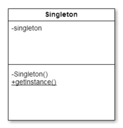
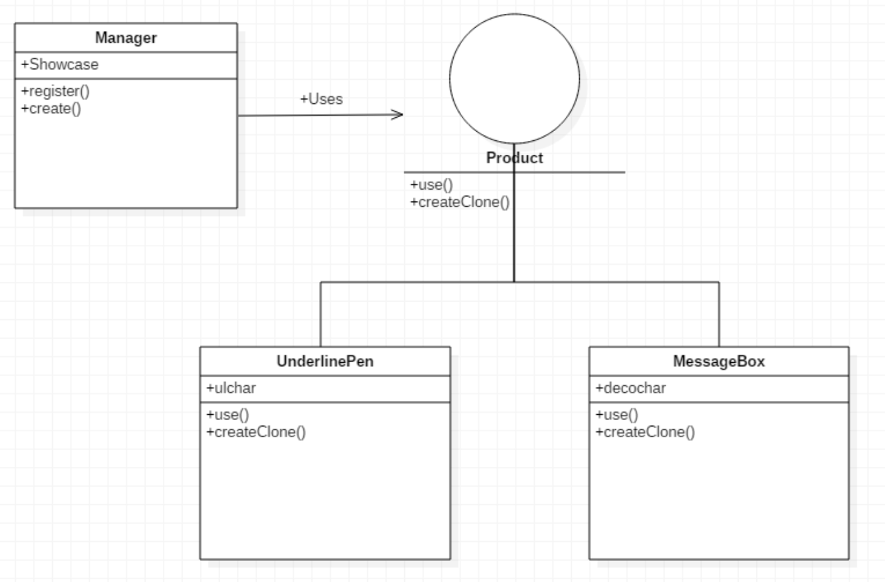
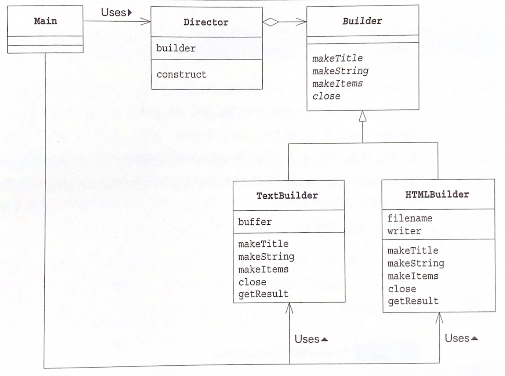
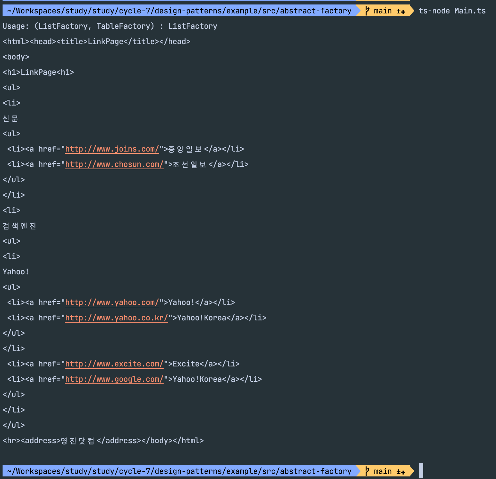

# Part 3 인스턴스 만들기

## **Chapter 05 Singleton - 인스턴스를 한 개만 만들기**

인스턴스가 한 개밖에 존재하지 않는 것을 보증하는 패턴을 Singleton 패턴이라고 한다.



### **정리**

싱글톤의 특징

- 생성자는 프라이빗 - 외부 new 금지
- 스태틱으로 내부 객체 생성
- 해당 메소드를 얻는 유일한 스태틱 메소드

Lazy init, Application Bootstrap

### **Hint**

전통적인 객체지향과 달리 자바스크립트의 모듈러 속성을 기반으로 한 싱글톤 방법 추천

## **Chapter 06 Prototype - 복사해서 인스턴스 만들기**

Prototype은 '원형'이나 '모범' 이라는 의미이다. 

원형이 되는 인스턴스, 모범이 되는 인스턴스를 기초로 새로운 인스턴스를 만드는 것이다.

new 라는 키워드로 인스턴스를 만들 경우에는 클래스 이름을 반드시 지정해야 한다. 

그러나 클래스 이름을 지정하지 않고 인스턴스를 생성 할 때도 있다. 

다음과 같은 경우에는 클래스로부터 인스턴스를 만드는 것이 아니라 인스턴스를 복사해서 새로운 인스턴스를 만든다.

```tsx
// new 클래스에 인스턴스 생성
const instance = new Object();

// object deep copy
const cloneInstance = object.clone();
```

1. **종류가 너무 많아 클래스로 정리되지 않는 경우** -> 첫 번째는 취급하는 오브젝트의 종류가 너무 많아서 각각을 별도의 클래스로 만들어 다수의 소스파일을 작성해야 하는 경우 이다.
2. **클래스로부터 인스턴스 생성이 어려운 경우** -> 두 번째는 생성하고 싶은 인스턴스가 복잡한 작업을 거쳐 만들어지기 때문에 클래스로부터 만들기가 매우 어려운 경우이다. (예: 그래픽 에디터 마우스 조작)
3. **Framework 와 생성할 인스턴스를 분리하고 싶은 경우** -> 인스턴스를 생성할 때의 Framework를 특정 클래스에 의존하지 않도록 만들고 싶은 경우이다. 이 경우는 클래스 이름을 지정해서 인스턴스를 만드는 것이 아니라 이미 '모형' 이 되는 인스턴스를 등록해 두고, 그 등록된 인스턴스를 복사해서 인스턴스를 생성한다.

인스턴스로부터 다른 인스턴스를 만드는 것이 복사기를 사용해서 서류를 복사하는 일과 비슷하다. 

원래의 서류를 어떻게 만들었는지 몰라도 복사기로 같은 종류의 서류를 몇 장이라도 만들 수 있다. 

클래스로부터 인스턴스를 생성하는 것이 아니라 인스턴스로부터 별도의 인스턴스를 만드는 것을 **Prototype 패턴** 이라고 한다.

> Prototype 어원 
’원형’ 이나 ‘모범’ 이라는 의미로, 원형이 되는 인스턴스, 모범이 되는 인스턴스를 기초로 새로운 인스턴스를 만드는 것
> 

### Example

문자열 테두리 선을 감싸거나 밑줄을 표시하는 프로그램 이다.

Product 인터페이스와 Manager 클래스는 createClone을 호출하지만 구체적으로 어느 클래스의 인스턴스를 복제하는지는 관여하지 않는다. Product 인터페이스를 구현하고 있는 클래스라면 그 인스턴스를 복제할 수 있다.

| 이름 | 해설 |
| --- | --- |
| Product | 추상 메소드 use와 createClone이 선언되어 있는 인터페이스 |
| Manager | createClone을 사용해서 인스턴스를 복제하는 클래스 |
| MessageBox | 문자열을 테두리로 표시하는 클래스. use와 createClone을 구현 |
| UnderlinePen | 문자열에 밑줄을 표시하는 클래스. use와 createClone을 구현 |
| Main | 동작 테스트용 클래스 |



- Main 클래스

```tsx
import Manager from './Manager';
import UnderlinePen from './UnderlinePen';
import MessageBox from './MessageBox';
import Product from './Product';

// 준비
const manager: Manager = new Manager();
const upen = new UnderlinePen('~');
const mbox = new MessageBox('*');
const sbox = new MessageBox('/');

manager.register('strong message', upen);
manager.register('waring box', mbox);
manager.register('slash box', sbox);

// 생성
const p1: Product = manager.create('strong message');
p1.use('Hello, world.');

const p2: Product = manager.create('waring box');
p2.use('Hello, world.');

const p3: Product = manager.create('slash box');
p3.use('Hello, world.');
```

- 결과

```tsx
"Hello, world."
~~~~~~~~~~~~~
*****************
* Hello, world. *
*****************
/////////////////
/ Hello, world. /
/////////////////
```

- Product 인터페이스

use는 사용하기로 하위 클래스의 구현에 맡겨져 있다.

createClone 메소드는 인스턴스를 복제하기 위한 것 이다.

```tsx
export default abstract class Product {
    abstract use(s: string): void;

    abstract createClone(): Product;

    protected clone(instance: Product): Product {
        return Object.create(instance);
    }

}
```

- Manager 클래스

Manager 클래스는 Prodect 인터페이스를 사용해서 인스턴스의 복제를 실행 한다.

register()에서 제품의 이름과 Product 인터페이스가 주어지면 그 한 쌍을 Map인 showcase에 등록다.

Product 인터페이스나 Manager 클래스의 소스에 **MessageBox 클래스나 UnderlinePen 클래스의 클래스 이름이 전혀 나오지 않는 점에 주의**! 

클래스 이름이 나오지 않는다는 것은 Product와 Manager는 그들의 클래스와는 **독립적으로 수정**할 수 있다는 것을 의미한다. 

소스 안에 클래스 이름을 쓰면 그 클래스와 밀접한 관계가 생긴다. 

이 인터페이스(Product)만이 Manager 클래스와 다른 클래스의 다리 역할을 한다.

```tsx
import Product from './Product';

export default class Manager {
    private showcase: Map<string, Product> = new Map()

    public register(name: string, proto: Product) {
        this.showcase.set(name, proto);
    }

    public create(protoName: string): Product {
        const p: Product = this.showcase.get(protoName) as Product;
        return p.createClone();
    }
}
```

- UnderlinePen 클래스

```tsx
import Product from './Product';

export default class UnderlinePen extends Product {
    private readonly ulchar: string;

    constructor(ulchar: string) {
        super();
        this.ulchar = ulchar;
    }

    use(s: string) {
        const length = s.length;
        let printString: string = '';

        console.log(`"${s}"`);

        for (let i = 0; i < length; i++)
            printString += this.ulchar;

        console.log(printString);
    }

    createClone(): Product {
        return this.clone(this);
    }

}
```

- MessageBox 클래스

```tsx
import Product from './Product';

export default class MessageBox extends Product {
    private readonly decoChar: string;

    constructor(decoChar: string) {
        super();
        this.decoChar = decoChar
    }

    use(s: string) {
        const length = s.length;
        let printString: string = '';

        for (let i = 0; i < length + 4; i++)
            printString += this.decoChar;

        console.log(printString);
        console.log(`${this.decoChar} ${s} ${this.decoChar}`);
        console.log(printString);
    }

    createClone(): Product {
        return this.clone(this);
    }

}
```

### **정리**

프로토타입 패턴은 자주 쓰이진 않지만 필요한 곳에선 아주 유용한 패턴이다.

대표적으로, 

- 클래스 생성이 복잡한 경우
예를 들어, 도형을 그리는 페인터가 있다고 가정하자. 
사용자는 크기, X-Y 위치 좌표,  도형색상, 도형의 형식(삼각, 사각, 원,..), 그외에도 다양한 설정을 동적으로 변화 시키면서 하나의 도형을 만들었다.
페인터 기능 중 하나로 지금 까지 만들었던 도형을 복사하여 색상만 변경하고자 한다. 
어떻게 할래?

- 종류가 너무 많아 한개의 클래스로 할 수 없는 경우
위의 예제처럼 원형을 두고 다양한 오브젝트를 다뤄야 할 경우 (프로토타입이 없다면 개별 대응 소스가 필요하다.
예를 들어, 내가 여러종류의 에디터를 제공하고 싶은데… 심플에디터, 프리미엄에디터, 댓글용에디터, 스레드에디터 
기본 모형을 두고 복사해서 설정들을 몇개 바꿔어서 제공하면 어떨까?
(예제만 보면 데코레이션 패턴과 유사한데 데코레이션은 정적이라 해당 하는 많은 클래스를 미리 만들어져야 하고, 프로토타입은 동적. 즉 런타임에서 결정 된다.)
- 프레임워크와 생성할 인스턴스를 분리하고 싶은 경우
컴포넌트를 조합하여 화면을 구성하는 CMS가 있다고 가정하자. 근데 컴포넌트의 종류는 백엔드(디비)에 저장해서 동적으로 로드 한다.
위의 예제와 같이 Manager 입장에서는 최상위 컴포넌트만 바라 보므로 빌드/배포 없이 하위에 어떤 컴포넌트가 존재 하더라도 DB에 저장 된 모든 컴포넌트를 조합해서 그려 낼 수 있다.
****

### **Hint**

주로 비슷한 형태의 프로젝트 구조를 만들어서 기반으로 사용하는 스케폴딩도 소스코르로 개념적으로 본다면 프로토타입 패턴이라고 볼수 있겠지.

## **Chapter 07 Builder - 복잡한 인스턴스 조립하기**

복잡한 구조물을 세울 때 한번에 완성시키기는 어렵다. 
우선 전체를 구성하고 있는 각 부분을 만들고 단계를 밟아 만들어 나간다. 
구조를 가진 인스턴스를 쌓아 올리는 것이 Builder 패턴이다.

### Example

예제로 Builder 패턴을 사용한 문서을 작성하는 프로그램을 만들어 본다.

여기에서 만들 문서는 다음과 같은 구조를 가지고 있다.

- 타이틀을 한 개 포함한다.
- 문자열을 몇 개 포함한다.
- 개별 항목을 몇 개 포함한다.

Builder 클래스에서는 문서를 구성하기 위한 메소드를 결정한다.

그리고, Director클래스가 그 메소드를 사용해서 구체적인 하나의 문서를 만든다.

| 이름 | 해설 |
| --- | --- |
| Builder | 문서를 구성하기 위한 메소드를 결정하는 추상 클래스 |
| Director | 한 개의 문서를 만드는 클래스 |
| TextBuilder | 일반 텍스트(보톤의 문자열)를 이용해서 문서를 만드는 클래스 |
| HTMLBuilder | HTML 파일을 이용해서 문서를 만드는 클래스 |
| Main | 동작 테스트용 클래스 |



- Main 클래스

TextBuilder와 HTMLBuilder는 Builder의 하위클래스이며, Director는 Builder의 메소드만을 사용하여 문서를 작성한다. Builder의 메소드만을 사용한다는 뜻은 Director는 실제로 동작하는것이 TextBuilder인지, HTMLBuilder인지 알 수 없다는 뜻. 즉 Builder는 문서를 구축하기 위해, 필요 충분한 메소드군을 선언할 필요가 있다.

```tsx
import TextBuilder from './TextBuilder';
import Director from './Director';
import HTMLBuilder from './HTMLBuilder';

import readline from 'readline';

const reader = readline.createInterface({
    input: process.stdin,
    output: process.stdout
})
reader.question('What kind of ? (plain, html) : ', input => {

    if (input === 'plain') {

        let textbuilder = new TextBuilder();

        let director = new Director(textbuilder);
        director.construct();
        
        console.log(textbuilder.getResult());

    } else if (input === 'html') {

        let htmlbuilder = new HTMLBuilder();

        let director = new Director(htmlbuilder);
        director.construct();

        console.log(htmlbuilder.getResult());

    } else
        console.log('Fuck...');

    reader.close();
});
```

- 결과


- Builder 클래스

문서를 만들 메소드들을 선언하고 있는 추상클래스

makeTitle, makeString, makeItems는 각각 타이틀, 문자열, 개별 항목을 문서 안에 구축하는 메소드, close메소드는 문서를 완성시키는 메소드이다.

```tsx
export default interface Builder {
    makeTitle(title: string);
    makeString(str: string);
    makeItems(items: Array<string>);
    close();
}
```

- Director 클래스

Builder 클래스로 선언되어 있는 메소드를 사용하여 문서를 생성

Director 클래스의 생성자는 Builder형이지만, 실제로 Builder 클래스의 인스턴스가 주어지지는 않는다.

Director 클래스에서 실제로 전달되는것은 Builder 클래스의 하위 클래스의 인스턴스이다. Builder 클래스의 하위 클래스 종류에 따라 Director 클래스가 만들 문서의 형식이 정해진다.

```tsx
import Builder from './Builder';

export default class Director{
    private builder: Builder;

    public constructor(builder: Builder) {
        this.builder = builder
    }

    public construct() {
        this.builder.makeTitle('Greeting');
        this.builder.makeString('아침과 낮에');
        this.builder.makeItems([
            '좋은 아침입니다.',
            '안녕하세요.'
        ]);
        this.builder.makeString('밤에');
        this.builder.makeItems([
            '안녕하세요',
            '안녕히 주무세요.',
            '안녕히 계세요.'
        ]);
        this.builder.close()
    }

}
```

- TextBuilder 클래스

Builder Class의 하위 Class

일반 텍스트를 사용하여 문서를 구축하고, String으로 반환

```tsx
import Builder from './Builder';

export default class TextBuilder implements Builder {
    private buffer: Array<string> = [];

    makeTitle(title: string) {
        this.buffer.push('===========================\n');
        this.buffer.push(`[ ${title} ]\n`);
        this.buffer.push('\n');
    }

    makeString(str: string) {
        this.buffer.push(`ㅁ ${str} ㅁ`);
        this.buffer.push('\n');
    }

    makeItems(items: Array<string>) {
        items.forEach(item => this.buffer.push(` - ${item} \n`));
        this.buffer.push('\n');
    }

    close() {
        this.buffer.push('===========================\n');
    }

    public getResult(): string {
        return this.buffer.join('')
    }

}
```

- HTMLBuilder 클래스

Builder Class의 하위 Class

HTML 파일로 문서를 구축

```tsx
import Builder from './Builder';

export default class HTMLBuilder implements Builder {
    private writer: Array<string> = [];

    makeTitle(title: string) {
        this.writer.push(`<html><head><title>${title}</title></head><body>`);
        this.writer.push(`<h1>${title}</h1>`);
    }

    makeString(str: string) {
        this.writer.push(`<p>${str}</p>`);
    }

    makeItems(items: Array<string>) {
        this.writer.push(`<ul>`);
        items.forEach(item => this.writer.push(`<li>${item}</li>`))
        this.writer.push(`</ul>`);
    }

    close() {
        this.writer.push(`</body></html>`);
    }

    public getResult(): string {
        return this.writer.join('');
    }
}
```

### **정리**

- Builder (건축자) = Builder 클래스
- ConcreteBuilder(구체적인 건축자) = TextBuilder 클래스 or HtmlBuilder 클래스
- Director(감독자) = Director 클래스
- Client(의뢰인) = Main 클래스

**누가 무엇을**

- Main Class는 Builder Class의 메소드를 모른다 (호출하지 않음)
- Main Class는 Director Class의 construct만 호출한다
- Director Class는 Builder Class를 알고있다
- Director Class는 실제로 이용하고 있는 클래스가 무엇인지 알 수 없다
    - HTMLBuilder인지 TextBuilder인지 알 수 없음
    - Director Class는 Builder Class의 메소드만 사용
    - Builder Class의 하위 클래스는 메소드를 구현
- Director Class가 Builder Class의 하위 클래스를 모르기 때문에, 교체할 수 있다
    - 모르기 때문에 교환이 가능하며, 교체가 가능하기 때문에 부품의 가치가 높다

### **Hint**

### 여행 예제로 더 알아보기

클라이언트 프로그램으로부터 팩토리 클래스로 많은 파라미터를 넘겨줄 때 타입, 순서 등에 대한 관리가 어려워져 에러가 발생할 확률이 높아진다.

```tsx
new TourPlan("여행 계획", LocalDate.of(2021,12, 24), 3, 4, "호텔", 
	Collections.singletonList(new DetailPlan(1, "체크인")));
```

경우에 따라 필요 없는 파라미터들에 대해서 팩토리 클래스에 일일이 null 값을 넘겨줘야 한다.

```tsx
new TourPlan("여행 계획", LocalDate.of(2021,12, 24), null, null, null,
	Collections.singletonList(new DetailPlan(1, "놀고 돌아오기")));
```

생성해야 하는 sub class가 무거워지고 복잡해짐에 따라 팩토리 클래스 또한 복잡해진다.

### Builder Class

```tsx
export default interface TourPlanBuilder {
    nightsAndDays(nights: number, days: number): TourPlanBuilder;
    title(title: string): TourPlanBuilder;
    startDate(localDate: Date): TourPlanBuilder;
    whereToStay(whereToStay: string): TourPlanBuilder;
    addPlan(day: number, plan: string): TourPlanBuilder;
    getPlan(): TourPlan;
}
```

### Concrete Builder

```tsx
export default class DefaultTourBuilder implements TourPlanBuilder {
    private title: string;
    private nights: number;
    private days: number;
    private startDate: Date;
    private whereToStay: string;
    private plans: Array<DetailPlan>;

    @Override
    public TourPlanBuilder nightsAndDays(nights: number, days: number) {
        this.nights = nights;
        this.days = days;
        return this;
	}
    @Override
    public TourPlanBuilder title(title: string) {
        this.title = title;
        return this;
    }
    @Override
    public TourPlanBuilder startDate(startDate: Date) {
        this.startDate = startDate;
        return this;
    }
    @Override
    public TourPlanBuilder whereToStay(whereToStay: string) {
        this.whereToStay = whereToStay;
        return this;
    }
    @Override
    public TourPlanBuilder addPlan(day: number, plan: string) {
        if (this.plans == null)
            this.plans = new Array();

        this.plans.add(new DetailPlan(day, plan));
        return this;
    }
    @Override
    public getPlan(): TourPlan {
        return new TourPlan(title, startDate, days, nights, whereToStay, plans);
    }
}
```

### Director Class

```tsx
export default class TourDirector {
    private tourPlanBuilder: TourPlanBuilder;

    public TourDirector(tourPlanBuilder: TourPlanBuilder) {
        this.tourPlanBuilder = tourPlanBuilder;
    }

    public cancunTrip(): TourPlan {
        return tourPlanBuilder.title("칸쿤 여행")
                .nightsAndDays(2, 3)
                .startDate(LocalDate.of(2020, 12, 9))
                .whereToStay("리조트")
                .addPlan(0, "체크인하고 짐 풀기")
                .addPlan(0, "저녁 식사")
                .getPlan();
    }

    public longBeachTrip(): TourPlan {
        return tourPlanBuilder.title("롱비치")
                .startDate(LocalDate.of(2021, 7, 15))
                .getPlan();
    }
}
```

### Main Class

```tsx
const defaultbuilder: DefaultTourBuilder = new DefaultTourBuilder();
const director: TourDirector = new TourDirector(defaultbuilder);
const tourPlan: TourPlan = director.cancunTrip();
```

예외적으로 2가지 상황에서는 빌더를 구현해야될지 고려하면 좋다.

1. 객체의 생성을 라이브러리로 위임하는 경우
    - 엔티티(Entity) 객체나 도메인(Domain) 객체로부터 DTO를 생성하는 경우라면 직접 빌더를 만들고 하는 작업이 번거로우므로 MapStruct나 Model Mapper와 같은 라이브러리를 통해 생성을 위임할 수 있다.
2. 변수의 개수가 2개 이하이며, 변경 가능성이 없는 경우
    - 또한 변수가 늘어날 가능성이 거의 없으며, 변수의 개수가 2개 이하인 경우에는 정적 팩토리 메소드를 사용하는 것이 더 좋을 수도 있다.
    - 빌더의 남용은 오히려 코드를 비대하게 만들 수 있으므로 변수의 개수와 변경 가능성 등을 중점적으로 보고 빌더 패턴을 적용할지 판단하면 된다.

## **Chapter 08 Abstarct Factory - 관련 부품을 조합해서 제품 만들기**

추상적인 공장에서는 추상적인 부품을 조합해서 추상적인 제품을 만든다.

'추상적이다' 라는 단어는 '구체적으로 어떻게 구현되어 있는지에 대해서는 생각하지 않고, 인터페이스(API)만을 생각'하는 것이라 의미이다.

즉, 부품의 구체적인 구현에는 주목하지 않고 인터페이스(API)에 주목합니다. 그리고 인터페이스(API)만을 사용해서 부품을 조립하고 제품으로 완성합니다.

### Example

계층구조를 가진 Link 페이지를 HTML파일로 만들기

| 이름 | 해설 |
| --- | --- |
| factory |  |
| Factory | 추상적인 공장을 나타내는 클래스입니다. Link, Tray, Page를 만든다. |
| Item | Link와 Tray를 통일적으로 취급하기 위한 클래스 |
| Link | (추상적인 부품) HTML과 Link를 나타내는 클래스 |
| Tray | (추상적인 부품) Link나 Tray를 모은 클래스 |
| Page | (추상적인 제품) HTML의 Page를 나타내는 클래스 |
| listfactory |  |
| ListFactory | 구체적인 공장을 나타내는 클래스입니다. ListLink, ListTray, ListPage를 만든다. |
| ListLink | (구체적인 부품) HTML과 Link를 나타내는 클래스 |
| ListTray | (구체적인 부품) Link나 Tray를 모은 클래스 |
| ListPage | (구체적인 제품) HTML의 Page를 나타내는 클래스 |


- 공장을 사용해서 부품을 조립하고 제품 만들기 (사용자)

```tsx
import readline from 'readline';
import {getFactory} from './FactoryUtils';
import Link from './Link';
import Tray from './Tray';
import Page from './Page';
import Factory from './Factory';

const reader = readline.createInterface({
    input: process.stdin,
    output: process.stdout
});

reader.question('Usage: (ListFactory, TableFactory) : ', input => {
    const factory: Factory = getFactory(input);

    const joins: Link = factory.createLink("중앙일보", "http://www.joins.com/");
    const chosun: Link = factory.createLink("조선일보", "http://www.chosun.com/");

    const us_yahoo: Link = factory.createLink("Yahoo!", "http://www.yahoo.com/");
    const kr_yahoo: Link = factory.createLink("Yahoo!Korea", "http://www.yahoo.co.kr/");
    const excite: Link = factory.createLink("Excite", "http://www.excite.com/");
    const google: Link = factory.createLink("Yahoo!Korea", "http://www.google.com/");

    const traynews: Tray = factory.createTray("신문");
    traynews.add(joins);
    traynews.add(chosun);

    const trayyahoo: Tray = factory.createTray("Yahoo!");
    trayyahoo.add(us_yahoo);
    trayyahoo.add(kr_yahoo);

    const traysearch: Tray = factory.createTray("검색엔진");
    traysearch.add(trayyahoo);
    traysearch.add(excite);
    traysearch.add(google);

    const page: Page = factory.createPage("LinkPage", "영진닷컴");
    page.add(traynews);
    page.add(traysearch);
    page.output();

    reader.close();
});
```

메인 클래스에서는 추상적인 공장을 사용해 추상적인 부품을 제조하고 추상적인 제품을 조립

메인 크래스에서는 구체적인 부품, 제품, 공장을 전혀 이용하지 않는다.

구체적인 공장의 클래스 이름은 커맨드 라인에서 지정

- 결과



- 추상적인 부품 - Item 클래스

```tsx
export default abstract class Item {
    protected caption: string;

    protected constructor(caption: string) {
        this.caption = caption
    }

    public abstract makeHTML(): string;
}
```

Item 클래스는 Link와 Tray의 상위클래스

Link와 Tray를 동일시하기 위한 클래스

caption 필드는 이 항목의 목차를 표시

makeHTML은 추상 메소드로 하위 클래스에서 구현

- 추상적인 부품 - Link 클래스

```tsx
import Item from './Item';

export default abstract class Link extends Item {
    protected url: string;

    protected constructor(caption: string, url: string) {
        super(caption);
        this.url = url;
    }
}
```

List 클래스는 HTML의 하이퍼링크를 추상적으로 표현한 클래스

url 필드는 링크되는 곳의 URL을 저장

상위 클래스의 추상 메소드(makeHTML)가 구현되어 있지 않으므로 Link클래스도 추상 클래스

- 추상적인 부품 - Tray 클래스

```tsx
import Item from './Item';

export default abstract class Tray extends Item {
    protected tray: Array<Item> = [];

    protected constructor(caption: string) {
        super(caption);
    }

    public add(item: Item): void {
        this.tray.push(item);
    }
}
```

Tray 클래스는 복수의 Link나 Tray를 모아서 합친 것을 표시한 클래스

add 메소드를 사용해 Link와 Tray (item)를 모은다.

따라서 Link와 Tray의 상위 클래스인 Item을 인수로 갖는다.

상위 클래스인 추상 메소드(makeHTML)가 구현되어 있지 않으므로 Tray클래스도 추상 클래스

- 추상적인 제품 - Page 클래스

```tsx
import Item from './Item';

export default abstract class Page {
    protected title: string;
    protected author: string;
    protected content: Array<Item> = [];

    protected constructor(title: string, author: string) {
        this.title = title;
        this.author = author;
    }

    public add(item: Item): void {
        this.content.push(item);
    }

    public output(): void {
        // 파일로 만들려고 했으나 console로 출력
        console.log(this.makeHTML());
    }

    public abstract makeHTML(): string;
}
```

Page 클래스는 HTML 페이지 전체를 추상적으로 표현한 클래스

Link나 Tray가 추상적인 부품이라면 Page클래스는 추상적인 제품

페이지에서 add 메소드를 사용하여 Item(Link 혹은 Tray)을 추가

output 메소드에서는 makHTML의 메소드를 사용하여 자신의 HTML의 내용을 파일에 기술

- 추상적인 공장 - Factory 클래스

```tsx
export default abstract class Factory {

    public abstract createLink(caption: string, url: string);

    public abstract createTray(caption: string);

    public abstract createPage(title: string, author: string);
}
```

getFactory 안에서 Class의 forName 메소드를 사용하여 해당 클래스를 동적으로 읽는다. 이를 newInstance 메소드를 이용해 인스턴스를 하나 작성해준다.

getFactory 메소드의 안에서는 구체적인 공장의 인스턴스를 만들지만 반환값은 추상적인 공장이다.

createLink, createTray, createPage 메소드는 추상적인 공장에서 부품 혹은 제품을 작성할 때 이용하는 추상 메소드

- FactoryUtils

```tsx
import {factories} from './FactoryName';
import Factory from './Factory';

export const getFactory = (className: string): Factory => {
    if (factories[className] === undefined || factories[className] === null) {
        console.log(`클래스 ${className}이 발견되지 않았습니다.`);
        throw new Error(`Class type of \'${className}\' is not in the factories`);
    }

    return new factories[className]();
}
```

- 구체적인 공장 - ListFactory 클래스

```tsx
import Factory from './Factory';
import ListLink from './ListLink';
import ListTray from './ListTray';
import ListPage from './ListPage';

export default class ListFactory extends Factory {
    createLink(caption: string, url: string) {
        return new ListLink(caption, url);
    }

    createTray(caption: string) {
        return new ListTray(caption);
    }

    createPage(title: string, author: string) {
        return new ListPage(title, author)
    }

}
```

ListFactory 클래스에서는 Factory 클래스의 추상 메소드인 createLink, createTray, createPage를 구현

- 구체적인 부품 - ListLink 클래스

```tsx
import Link from './Link';

export default class ListLink extends Link {
    constructor(caption: string, url: string) {
        super(caption, url);
    }

    public makeHTML() {
        return ` <li><a href="${this.url}">${this.caption}</a></li>\n`;
    }
}
```

ListLink 클래스는 Link 클래스의 하위 클래스

따라서 상위 클래스에서 추상 메소드였던 makeHTML을 해당 클래스에서 작성

- 구체적인 부품 - ListTray 클래스

```tsx
import Tray from './Tray';

export default class ListTray extends Tray {
    constructor(caption: string) {
        super(caption);
    }

    public makeHTML(): string {
        const buffer: Array<string> = [];

        buffer.push('<li>\n');
        buffer.push(this.caption + '\n');
        buffer.push('<ul>\n');

        for (const it of this.tray)
            buffer.push(it.makeHTML());

        buffer.push('</ul>\n');
        buffer.push('</li>\n');

        return buffer.join('');

    }
}
```

makeHTML에서 차례대로 tray array 원소들을 makeHTML 해준다.

원소들은 모두 Item 형이므로 변수 item의 내용이 실제로 무엇인지 조사할 필요가 없다.

- 구체적인 제품 - ListPage 클래스

```tsx
import Page from './Page';

export default class ListPage extends Page {
    constructor(title: string, author: string) {
        super(title, author);
    }

    public makeHTML(): string {
        const buffer: Array<string> = [];

        buffer.push(`<html><head><title>${this.title}</title></head>\n`);
        buffer.push('<body>\n');
        buffer.push(`<h1>${this.title}<\h1>\n`);
        buffer.push('<ul>\n');

        for (const it of this.content)
            buffer.push(it.makeHTML());

        buffer.push('</ul>\n');
        buffer.push(`<hr><address>${this.author}</address>`);
        buffer.push('</body></html>\n');

        return buffer.join('');
    }
}
```

Listpage는 Page클래스의 하위 클래스

makeHTML에서 while문 안에 item.makeHTML 메소드를 호출함으로써 ListLink와 ListTray의 makeHTML 메소드가 실행

### 과제

추가적인 Table공장 추가해 보기

- 구체적인 공장 - TableFactory 클래스

```tsx
export default class TableFactory extends Factory {

    public createLink(caption: string, url: string): Link {
        return new TableLink(caption, url);
    }

    public createTray(caption: string): Tray {
        return new TableTray(caption);
    }

    public createPage(title: string, author: string): Page {
        return new TablePage(title, author);
    }
}
```

- 구체적인 부품 - TableLink 클래스

```tsx
export default class TableLink extends Link {
    constructor(caption: string, url: string) {
        super(caption, url);
    }

    public makeHTML(): string {
        return `<td><a href="${this.url}">${this.caption}</a></td>\n";
    }
}
```

- 구체적인 부품 - TableTray 클래스

```tsx
export default class TableTray extends Tray {
    constructor(caption: string) {
        super(caption);
    }

    public makeHTML(): string {
        const buffer: Array<string> = [];

        buffer.push('<td>');
        buffer.push('<table width=\"100%\" border=\"1\"><tr>');
        buffer.push(`<td bgcolor=\"#cccccc\" align=\"center\" colspan="${this.tray.size()}"><b>${this.caption}</b></td>`);
        buffer.push('</tr>\n');
        buffer.push('<tr>\n');

        for (const it of this.tray)
            buffer.push(it.makeHTML());

        buffer.push('<\tr><\table>');
        buffer.push('</td>');

        return buffer.join('');
    }
}
```

- 구체적인 제품 - TablePage 클래스

위와 거의 유사하므로 생략…

### **정리**

~ factory 패키지 : 추상적인 공장, 제품, 부품을 포함한 패키지

~ main 패키지 : Main 클래스를 포함한 패키지

~ listfactory 패키지 : 구체적인 공장, 제품, 부품을 포함한 패키지

- 구체적인 공장을 추가하는 것은 간단
    - 여기서 간단의 의미는 어떤 클래스와 메서드를 만들지 확실하다는 뜻
    - A라는 공장클래스에 버그를 수정해도 Main이나 다른 공장에 영향을 주지 않는다.
- 부품을 새로 추가하는 것은 곤란
    - 새로운 부품을 추가하게 되면 모든 공장에 추가해야하는 문제가 발생한다.

### **Hint**

구조가 확실히 정해져있고 파생되는 내용이 다르면서 여러가지일 경우에 사용하면 좋을 것 같다.

“추상팩토리 패턴은 어떤 완성품을 만들기위한 각각의 요소들의 설계를 만들어 조립하는 패턴이다. (CAD 같은…)