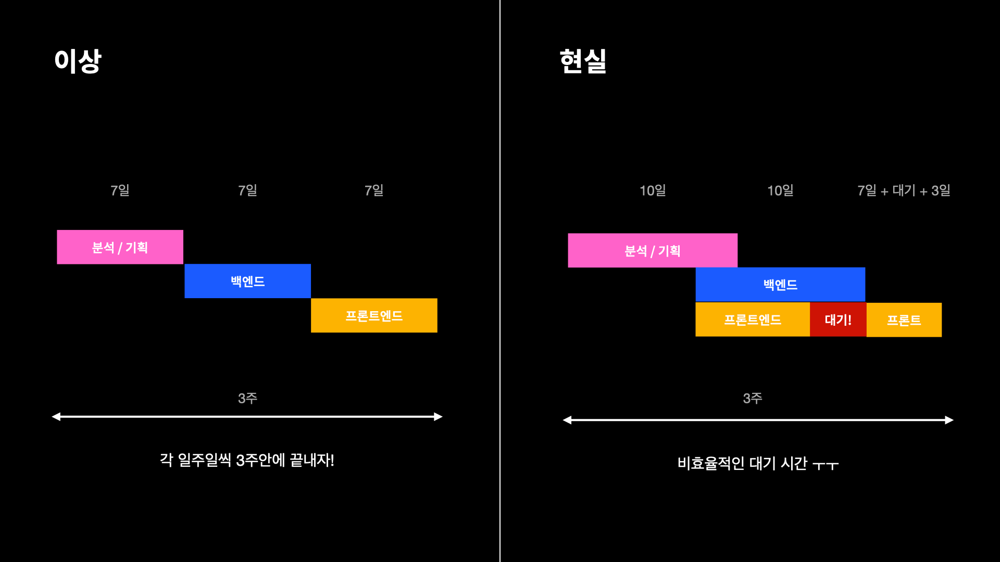
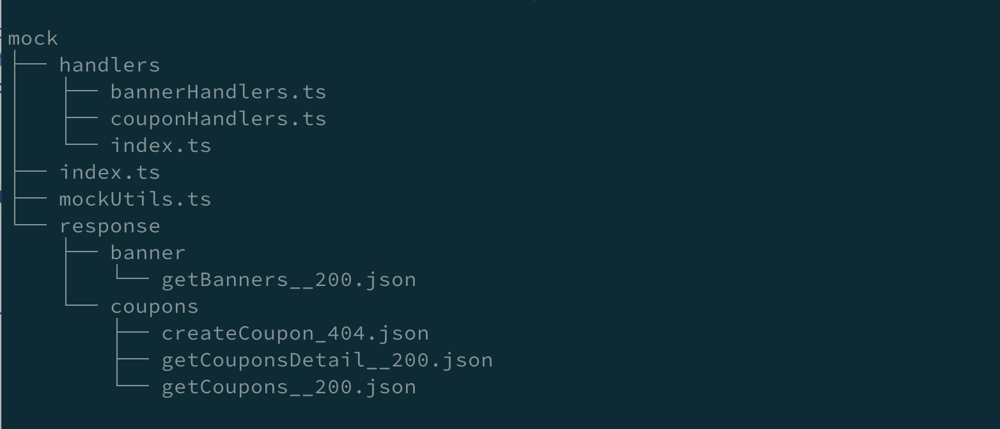

MSW

# FE 개발의 불편함

현업에서 프론트 개발을 하면서 겪게되는 불편함 중 하나가 백엔드 개발에 의존한다는 것이다.



# Mocking의 필요성

모킹(Mocking)이란? Mock(모의 데이터)을 만들어서 활용하는 방식으로 아래와 같은 장점이 있다.

* 프로젝트 구축 기간 단축
  * 백엔드 개발이 완료될 때까지 기다릴 필요없이 프론트엔드 개발을 병렬로 진행하므로써 구축 기간 단축시킨다.
* 운영 상황에 대한 유동적인 대응
  * 엣지 케이스에 대한 정책 변경 등 실 서비스에서 테스트 및 개발이 불가능하거나 세팅이 어려운 경우, 모킹 데이터를 저장해 놓고 있다가 활용할 수 있다.
  * 일반적인 상황이 아닌 서버의 404, 500에러 등 예외적인 응답 코드에 대한 테스트 및 개발을 좀 더 손 쉽게 할 수 있다.

# 일반적인 Mocking 방식

일반적으로 아래와 같은 방법은로 Mocking을 진행

* 어플리케이션 내부 로직에 직업 Mocking 하기
* 네이티브 모듈 (http, https, XMLHttpRequest) 바꿔치기
* Mocking 서버 만들기

# MSW(Mock Service Worker)란?

[MSW(Mock Service Worker)](https://mswjs.io/docs/)는 Service Worker를 이용해 서버를 향한 실제 네트워크 요청을 가로채서(intercept) 모의 응답 (Mocked response)를 보내주는 API Mocking 라이브러리이다.

실제 API를 사용하는 것처럼 네트워크 수준에서 Mocking이 가능하다.

# MSW 작동 방식


1. 실제 요청 발생
2. 브라우저에서 발생하는 실제 요청을 service worker에서 가로채고 복사한다.
3. msw에서 요청과 일치하는 응답값을 생성한다.
4. Service Worker는 msw에 전달한 요청에 대한 목킹 response를 제공 받고 브라우저에 전달한다.

# MSW를 활용한 개발 방식


# MSW 설치 및 구성


## msw 라이브러리 설치

````
$ npm i -D msw
````

## 서비스 워커 코드 생성

```
$ npx msw init public/ --save
```

## 요청 핸들러 작성

/src/mocks/handler.ts

```typescript
import { rest } from "msw";

const todos = ["먹기", "자기", "놀기"];

export const handlers = [
    // 할일 목록
    rest.get("/todos", (req, res, ctx) => {
        return res(ctx.status(200), ctx.json(todos));
    }),

    // 할일 추가
    rest.post("/todos", async (req, res, ctx) => {
        todos.push(await req.text());
        return res(ctx.status(201));
    }),

    // 할일 삭제
    rest.delete("/todos/:idx", async (req, res, ctx) => {
        const {idx} = req.params;

        todos.splice(Number(idx), 1);

        return res(ctx.status(200));
    })
];
```

## 서비스 워커 생성

/src/mocks/browser.ts

```typescript
import {setupWorker} from "msw";
import {handlers} from "./handlers";

export const worker = setupWorker(...handlers);
```

## 서비스 워커 삽입

/src/index.ts

```typescript
import React from 'react';
import ReactDOM from 'react-dom/client';
import App from './App';
import {worker} from "./mocks/browser";

if (process.env.NODE_ENV === 'development') {
    worker.start().then();
}

const root = ReactDOM.createRoot(
  document.getElementById('root') as HTMLElement
);

root.render(
  <React.StrictMode>
    <App />
  </React.StrictMode>
);
```

## 서비스 워커 테스트

### 브라우저 콘솔 출력

```
[MSW] Mocking enabled.
```

### 콘솔에 fake 응답이 출력되는지 확인

```typescript
fetch("/todos")
  .then((response) => response.json())
  .then((data) => console.log(data));
```

# Jest 연동

### 테스트 서버 설정

/src/mocks/server.ts

```typescript
import { setupServer } from "msw/node";
import { handlers } from "./handlers";

export const server = setupServer(...handlers);
```

### 테스트 코드 작성

/src/App.test.tsx

```typescript
import React from 'react';
import {render, screen} from '@testing-library/react';
import App from './App';
import userEvent from "@testing-library/user-event";
import {act} from "react-dom/test-utils";

test("renders todos", async () => {
    render(<App/>);

    const listitems = await screen.findAllByRole("listitem");
    expect(listitems).toHaveLength(3);

    // eslint-disable-next-line testing-library/no-unnecessary-act
    act(() => {
        userEvent.type(screen.getByRole("textbox"), "공부하기");
        userEvent.click(screen.getByRole("button"));
    })


    expect(await screen.findByText("공부하기")).toBeInTheDocument();
});

```

# 우형의 MSW 사용 예제

## 기본 폴더 구조



## 요청 핸들러 생성

* 어떤 요청을 모킹할지 결정하고 어떤 응답을 줄지 명시하는 handler들이 존재하는 디렉토리
* API의 url, 각 url에 대한 응답값들을 명시한다.
* 각 API의 http Status에 따른 응답값을 미리 작성해 놓고, 필요한 상황을 쉽게 재현할 수 있다.

import { rest } from 'msw';
//JSON 목 데이터
import createCoupon_404 from '../response/coupons/createCoupon_404.json';
 
const createCoupon = (status: 200 | 404) => {
  // getResponse는 status값을 기준으로 뒤의 객체에 해당 status값이 있으면 해당 값을 없으면 error를 반환하는 유틸함수
  const response = getResponse(status, {
    200: {},
    404: createCoupon_404,
  });
 
  return rest.post(
    `${endPoint}/api/coupon-member/v2/coupons/issue/couponbox`,
    (_, res, ctx) => {
      if (!status) {
        return res.networkError('Failed to connect');
      }
   
      return res(ctx.status(status), ctx.json(response));
    }
  );
};
 
export default [createCoupon(404),getCoupons(200), getCouponDetail(200)];

# 참고

[https://mswjs.io/docs/](https://mswjs.io/docs/)

[MSW(Mock Service Worker)로 더욱 생산적인 FE 개발하기](https://velog.io/@khy226/msw%EB%A1%9C-%EB%AA%A8%EC%9D%98-%EC%84%9C%EB%B2%84-%EB%A7%8C%EB%93%A4%EA%B8%B0)

[MSW를 활용하는 Front-End 통합테스트](https://fe-developers.kakaoent.com/2022/220825-msw-integration-testing/)

[MSW 모킹 코드 재사용하기 feat. Storybook, Jest](https://fe-developers.kakaoent.com/2022/220317-integrate-msw-storybook-jest/)

[Mocking 라이브러리를 도입해야하는 이유](https://seungahhong.github.io/blog/2022/07/2022-07-25-msw/)
