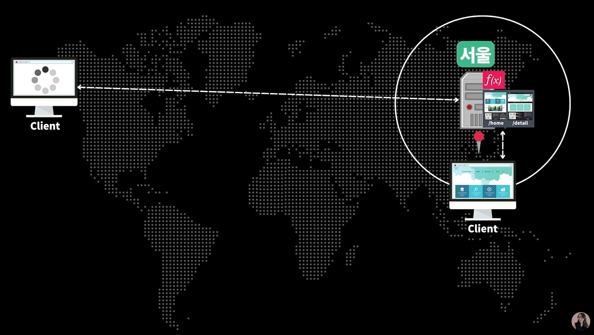
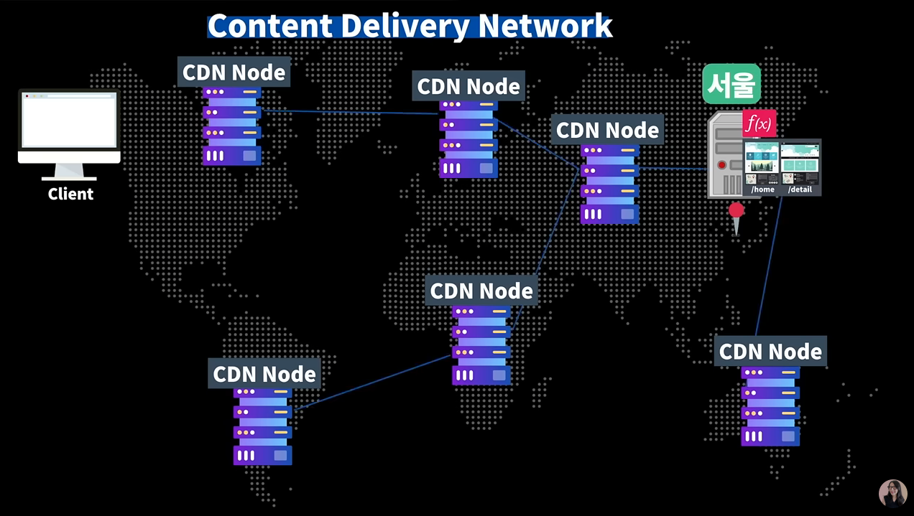
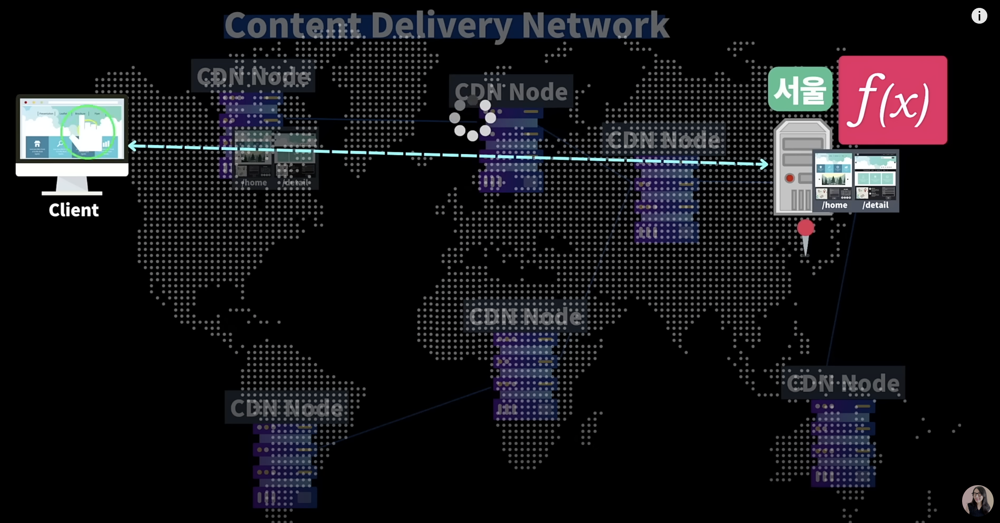
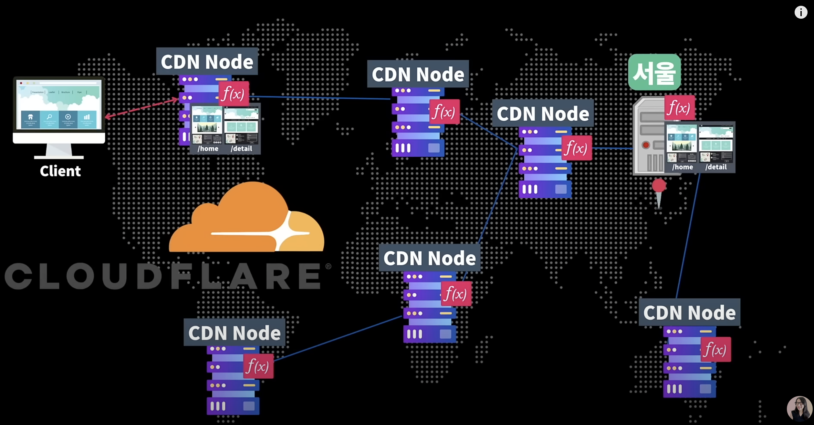
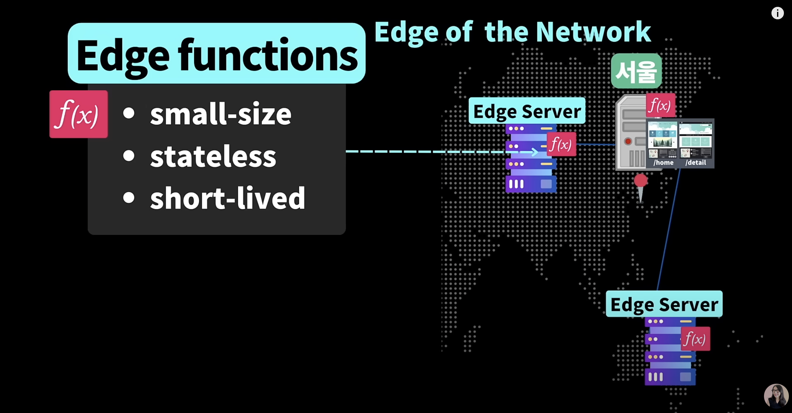
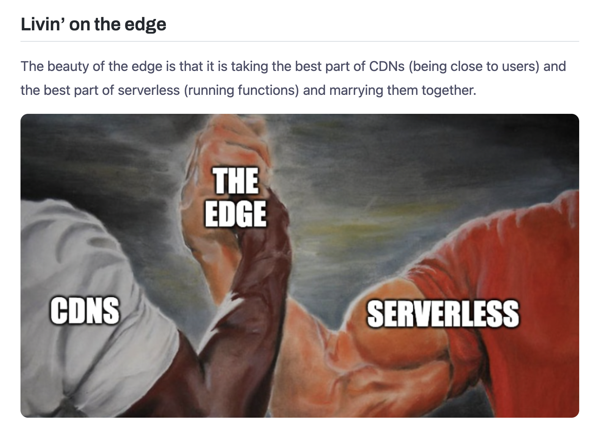

# Vercel 인프라로 프론트엔드 운영해보기 (Feat. Serverless와 Edge)

## 실습순서
- CRA로 SPA 프로젝트 생성해서, Vercel에 배포 해보기
- Branch 생성해서 새로운 버전 만들어보기
- PR 생성해서 (feature --> main)
- comment 사용해보기
- vercel edge middleware로 crwaler, bot 대응하기.

## Vercel 설정 둘러보기
- settings
   - General
   - Domain
   - Integration
   - Git
   - Functions
   - Cron Jobs
   - Environment variables
   - Deployment protection

## Serverless란?
클라우드상에 있는 서버에서 소스코드를 동작하게 하는 개발 모듈
더 이상 개발자가 서버를 직접 구축하고 관리할 필요가 없음.
서버는 여전히 존재하지만, 더이상 우리가 머리아프게 생각해야 하는 것이 아니라,
클라우드에서 알아서 관리해줌. 

## 기존에 어떤 문제가?
개발자가 직접 서버를 관리
- SSR: AWS EC2, Elastic Beanstalk, ECS, Fargate, Docker, k8s
   - CPU, RAM 사용 / 트래픽
   - 소프트웨어 관리
   - 서버 모니터링
   - 스케일링 (확장)
   - 항상 운영 해야 함 ($비용)
- CSR: AWS Cloudfront, S3

## Serverless 특징
"serverless" computing (FaaS Function as a Service)

### 장점
- ~~CPU, RAM 사용 / 트래픽~~ 
- ~~소프트웨어 관리~~
- ~~서버 모니터링~~
- ~~스케일링 (확장)~~ --> 확장 쉬움
- ~~항상 운영 해야 함~~ --> 사용한 만큼 비용 측정

### 단점
- Cold Start: 처음 시작하는데 시간이 걸림
   - AWS 왈: Cold Start 비율 1%도 안됨! 걱정마삼. 캐싱 전략으로 극복할수도..!
- 리소스의 한계
   - 메모리의 한계: (128MB ~ 10,240MB)
   - timeout: 900sec

## 기존 Next.js에서 불가능 했던 것들
https://nextjs.org/docs/advanced-features/middleware

## edge-middleware
https://vercel.com/docs/concepts/functions/edge-middleware

## vercel limits
https://vercel.com/docs/concepts/limits/overview

---
# Edge?

## [The future is at the edge (미래는 Edge에 있다)](https://vercel.com/blog/introducing-the-edge-runtime#the-future-is-at-the-edge)

- 서울에 있는 서버에 배포했다고 하면, 우리나라 사용자라면 첫페이지 로딩이 빠름.
- 유럽에 있는 사용자가 접속했을때, 현저히 느려짐. (물리적 거리)

  

- 물리적 거리 문제점을 극복하고자 CDN이 도입.
- 하지만, CDN은 정적인 파일에 대해서만 캐싱이 가능했음.
   - 정적인 HTML, image, javascript, css, font

  

- 다이나믹한 데이터 처리는, 결국 한국에 있는 서버로 요청을 보내야 했음.

  

- 이러한 문제를 해결하고자, CDN Provider들이 새로운 솔루션 만듬
- "우리 CDN에서는 당신의 코드가 실행 될 수 있다" 하면서 정적인 파일뿐 아니라, 동적인 코드로 실행됨.
   - **사용자 가장 가까운 곳에서 다이나믹한 코드가 실행됨.**

  

- Edge function, Edge middleware
- 사용자 가까이에서 동작하는 function, middleware

## Edge의 장점
- 사용자와 가까운 곳에서 코드 실행
- 실 서버까지 왕복 통신 하지 않음
- 일정하고 짧은 반응 시간

  

## CDN 장점 + Serverless 장점 = Edge
https://deno.com/blog/the-future-of-web-is-on-the-edge

## Edge의 단점
- [serverless보다 더 엄격한 제한사항](https://vercel.com/docs/concepts/functions/edge-middleware/limitations)
- [최소한의 런타임 환경 (limited set of Web APIs)](https://vercel.com/docs/concepts/functions/edge-middleware/limitations#many-node.js-apis-are-not-available)
   - 특정 라이브러리 사용 못함 (`axios`)

## 왜 Edge에 주목해야 하는가?
- Rendering on the Edge (Next.js sveltekit, Remix, Nuxt3)
- 웹개발 전반적으로 "edge"를 도입하는 추세가 강해짐
- Next.js에서는 runtime 환경을 설정할 수 있음.
   - [page별](https://nextjs.org/docs/advanced-features/react-18/switchable-runtime)
   - [API route별](https://nextjs.org/docs/advanced-features/react-18/switchable-runtime)