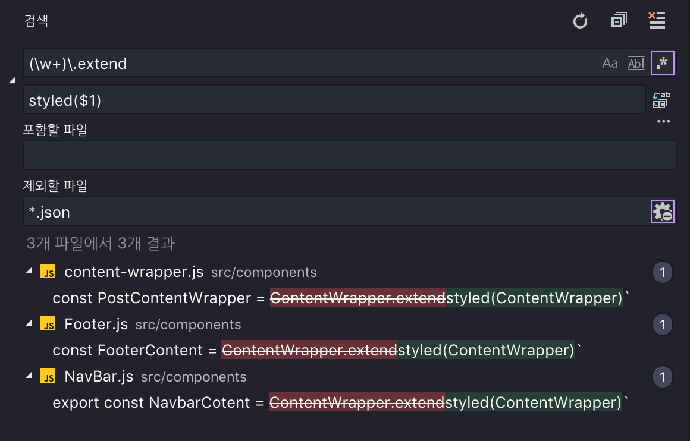

# 정규식 - 누알정누알못

누구나 아는 정규식, 그러나 누구도 제대로 모르는 정규식

**정규식(Regular Expression)**은 문자열에서 특정 내용을 찾거나 대체 또는 발췌하는데 사용된다.

반복문과 조건문을 사용해야 할것같은 복잡한 코드도 정규표현식을 이용하면 매우 간단하게 표현할 수 있으며 주로 다음과 같은 상황에서 굉장히 유용하게 사용된다.

- 각각 다른 포맷으로 저장된 엄청나게 많은 전화번호 데이터를 추출해야 할 때
- 사용자가 입력한 이메일, 휴대폰 번호, IP 주소 등이 올바른지 검증하고 싶을 때
- 코드에서 특정 변수의 이름을 치환하고 싶지만, 해당 변수의 이름을 포함하고 있는 함수는 제외하고 싶을 때
- 특정 조건과 위치에 따라서 문자열에 포함된 공백이나 특수문자를 제거하고 싶을 때

그러나 정규표현식은 주석이나 공백을 허용하지 않고 여러가지 기호를 혼합하여 사용하기 때문에 **가독성이 좋지 않다는 문제**가 있다는 단점이 있다.

# 정규 표현식(Regular Expression)

## 정규식 구성

정규식 구성 코드는 다음과 같다.

슬래쉬 문자 두개 사이로 정규식 기호가 들어가는 형태이다. 뒤의 ~~i~~ 는 정규식 플래그이다.

```jsx
/regexr/i
```

```jsx
// 리터럴 방식
const regex = /abc/;

// 생성자 방식
const regex = new RegExp("abc");
const regex = new RegExp(/abc/); // 이렇게 해도 됨
```

## 정규식 메서드

| 메서드 | 의미 |
| --- | --- |
| ("문자열").match(/정규표현식/플래그) | "문자열"에서 "정규표현식"에 매칭되는 항목들을 배열로 반환 |
| ("문자열").replace(/정규표현식/, "대체문자열") | "정규표현식"에 매칭되는 항목을 "대체문자열"로 변환 |
| ("문자열").split(정규표현식) | "문자열"을 "정규표현식"에 매칭되는 항목으로 쪼개어 배열로 반환 |
| (정규표현식).test("문자열") | "문자열"이 "정규표현식"과 매칭되면 true, 아니면 false반환 |
| (정규표현식).exec("문자열") | match메서드와 유사(단, 무조건 첫번째 매칭 결과만 반환) |

```jsx
// 정규표현식을 담은 변수
const regex = /apple/; // apple 이라는 단어가 있는지 필터링

// "문자열"이 "정규표현식"과 매칭되면 true, 아니면 false반환
regex.test("Hello banana and apple hahahaha"); // true

// "문자열"에서 "정규표현식"에 매칭되는 항목들을 배열로 반환
const txt = "Hello banana and apple hahahaha";
txt.match(regex); // ['apple']

// "정규표현식"에 매칭되는 항목을 "대체문자열"로 변환
txt.replace(regex, "watermelon"); // 'Hello banana and watermelon hahahaha'
```

## 정규식 플래그

정규식 플래그는 정규식을 생성할 때 고급 검색을 위한 전역 옵션을 설정할 수 있도록 지원하는 기능이다.

```jsx
// flags 에 플래그 문자열이 들어간다.
cosnt flags = 'i';
const regex = new RegExp('abapplec', flags);

// 리터럴로 슬래쉬 문자뒤에 바로 표현이 가능
const regex1 = /apple/i;
const regex2 = /apple/gm;
```

| Flag | Meaning | Description |
| --- | --- | --- |
| i | Ignore Case | 대소문자를 구별하지 않고 검색한다. |
| g | Global | 문자열 내의 모든 패턴을 검색한다. |
| m | Multi Line | 문자열의 행이 바뀌더라도 검색을 계속한다. |
| s | ​ | .​(모든 문자 정규식)이 개행 문자 \n도 포함하도록 |
| u | unicode | 유니코드 전체를 지원 |
| y | sticky | 문자 내 특정 위치에서 검색을 진행하는 ‘sticky’ 모드를 활성화 |

### g : 전역 검색

- 전역 검색 플래그가 없는 경우에는 최초 검색 결과 한번만 반환하는 반면,
- 전역 검색 플래그가 있는 경우에는 모든 검색 결과를 배열로 반환

```jsx
// `a`가 두 개 포함된 문자열
const str = "abcabc";

// `g` 플래그 없이는 최초에 발견된 문자만 반환
str.match(/a/); // ["a", index: 0, input: "abcabc", groups: undefined]

// `g` 플래그가 있으면 모든 결과가 배열로 반환
str.match(/a/g); // (2) ["a", "a"]
```

### ****m : 줄바꿈 검색****

- 여러 줄의 문자열에서 필터링 해야 될때 사용된다.
- 뒤에서 배울 입력 시작(^) 앵커나 입력 종료($) 앵커는 전체 문자열이 아닌 **각 줄 별로 대응**되게 만들어졌기 때문에, 만일 여러줄을 검색해야 한다면 m 플래그를 사용한다고 보면 된다

```jsx
// 줄바꿈이 포함된 3줄 문자열
const str = "Hello World and\nPower Hello?\nPower Overwhelming!!";
/*
Hello World and
Power Hello?
Power Overwhelming!!
*/

// Hello 단어로 시작하는지 검사 (^ 문자는 문장 시작점을 의미)
str.match(/^Hello/); // ["Hello"]
// → 첫번째 줄은 잘 찾음

// Power 단어로 시작하는지 검사 (^ 문자는 문장 시작점을 의미)
str.match(/^Power/); // null
// → 그러나 그 다음 줄은 검색되지 아니함

// 따라서 m 플래그를 통해 개행되는 다음 줄도 검색되게 설정
str.match(/^Power/m); // ['Power']

// 세번째 줄도 검색되게 하고싶으면 g 플래그와 혼합 사용
str.match(/^Power/gm); // ['Power', 'Power']
```

### ****i : 대소문자 구분 없음****

- 정규식은 기본적으로 대소문자를 구분 (Case sensitive)
- 대신 i 플래그를 통해 대소문자 구분 하지 않을수 있다.

```jsx
const str = "abcABC";

// 대소문자 a 검색
str.match(/a/gi); // (2) ["a", "A"]
```

# 정규식 기호모음

## 정규식 특정 문자 숫자 매칭 패턴

| 패턴 | 의미 |
| --- | --- |
| a-zA-Z | 영어알파벳(-으로 범위 지정) |
| ㄱ-ㅎ가-힣 | 한글 문자(-으로 범위 지정) |
| 0-9 | 숫자(-으로 범위 지정) |
| . | 모든 문자열(숫자, 한글, 영어, 특수기호, 공백 모두)단, 줄바꿈 X |
| \d | 숫자 |
| \D | 숫자가 아닌 것 |
| \w | 밑줄 문자를 포함한 영숫자 문자에 대응[A-Za-z0-9_] 와 동일 |
| \W | \w 가 아닌 것 |
| \s | space 공백 |
| \S | space 공백이 아닌 것 |
| \특수기호 | 특수기호 \* \^ \& \! \? ...등 |
| \b | 63개 문자(영문 대소문자 52개 + 숫자 10개 + _(underscore))가 아닌 나머지 문자에 일치하는 경계(boundary) |
| \B | 63개 문자에 일치하는 경계 |
| \x | 16진수 문자에 일치/\x61/는 a에 일치 |
| \0 | 8진수 문자에 일치/\141/은 a에 일치 |
| \u | 유니코드(Unicode) 문자에 일치/\u0061/는 a에 일치 |
| \c | 제어(Control) 문자에 일치 |
| \f | 폼 피드(FF, U+000C) 문자에 일치 |
| \n | 줄 바꿈(LF, U+000A) 문자에 일치 |
| \r | 캐리지 리턴(CR, U+000D) 문자에 일치 |
| \t | 탭 (U+0009) 문자에 일치 |

## 정규식 검색 기준 패턴

| 기호 | 의미 |
| --- | --- |
| | | OR a|b |
| [] | 괄호안의 문자들 중 하나. or 처리 묶음 보면 된다.
/abc/ : "abc"를 포함하는
/[abc]/ : "a" 또는 "b" 또는 "c" 를 포함하는[다-바] : 다 or 라 or 마 or 바 |
| [^문자] | 괄호안의 문자를 제외한 것[^lgEn] "l" "g" "E" "N" 4개 문자를 제외
※ 대괄호 안에서 쓰면 제외의 뜻, 대괄호 밖에서 쓰면 시작점 뜻 |
| ^문자열 | 특정 문자열로 시작 (시작점)/^www/ |
| 문자열$ | 특정 문자열로 끝남 (종착점)/com$/ |

## 정규식 갯수 반복 패턴

| 기호 | 의미 |
| --- | --- |
| ? | 없거나 or 최대 한개만/apple?/ |
| * | 없거나 or 있거나 (여러개)/apple*/ |
| + | 최소 한개 or 여러개/apple+/ |
| *? | 없거나, 있거나 and 없거나, 최대한개 : 없음{0}와 동일 |
| +? | 최소한개, 있거나 and 없거나, 최대한개 : 한개{1}와 동일 |
| {n} | n개 |
| {Min,} | 최소 Min개 이상 |
| {Min, Max} | 최소 Min개 이상, 최대 Max개 이하{3,5}? == {3}와 동일 |

## 정규식 그룹 패턴

| 기호 | 의미 |
| --- | --- |
| () | 그룹화 및 캡쳐 |
| (?: 패턴) | 그룹화 (캡쳐 X) |
| (?=) | 앞쪽 일치(Lookahead),/ab(?=c)/ |
| (?!) | 부정 앞쪽 일치(Negative Lookahead),/ab(?!c)/ |
| (?<=) | 뒤쪽 일치(Lookbehind),/(?<=ab)c/ |
| (?<!) | 부정 뒤쪽 일치(Negative Lookbehind),/(?<!ab)c/ |

정규식 그룹 패턴 부분은 꽤나 난이도 있는 정규표현식에 속한다.

### 정규식 그룹화

```jsx
'kokokoko'.match(/ko+/); // "ko"
'kooookoooo'.match(/ko+/); // "koooo"
```

코드를 보면 알수 있듯이, 표현식 **ko+**는 **"o"**만 **+** 를 적용시킨다. ("k" 는 적용안시킴)

그 결과로 **"koooo"**가 반환되었다.

```jsx
'kokokoko'.match(/(ko)+/); // "kokokoko", "ko"
'kooookoooo'.match(/(ko)+/); // "ko", "ko"
```

하지만 표현식 **(ko)+**는 **"k"**와 **"o"**를 묶었기(그룹화) 때문에 **"ko" 자체를** 1회 이상 연속으로 반복되는 문자로 검색하게 된다.

따라서 결과가 **"kokokoko"**가 반환되었다.

그런데 마지막으로 패턴 ()를 사용한 정규식들의 결과를 잘 보면 일치한 결과가 **2**개가 나온다.

일부러 한번만 검색되라고, **플래그 g를 사용하지 않았는데** 말이다.

### 정규식 캡처 기능

패턴 그룹화 **()**는 괄호 안에 있는 표현식을 캡처하여 사용한다.

캡처는 일종의 복사본을 생성하는 개념이라고 보면 된다. (복사라는 단어는 이해를 돕기 위해서만 사용하며, 실제 개념과는 다르다)

```jsx
'kokokoko'.match(/(ko)+/); // "kokokoko", "ko"
```

정규식의 캡처 원리를 알아보자면, 패턴 **()**안에 있는 **"ko"**를 그룹화하여 캡처(복사)한다.

우선 캡처된 표현식은 당장 사용되지 않으며, 그룹화된 **"ko"**를 패턴 **+**로 1회 이상 연속으로 반복되는 문자로 검색한다. 그렇게 캡처 외 표현식이 모두 작동하고 난 뒤에 **복사했던(캡처된) 표현식 "ko"가 검색**되는 것이다.

즉, 위의 검색 순서를 정리하자면 다음과 같게 된다.

1. 그룹화된 **"ko"**를 패턴 **+**로 1회 이상 연속으로 반복하여 검색하여 **"kokokoko"**를 반환하고

2. 캡처된 **"ko"**로 검색하여 **"ko"**를 추가 반환

```jsx
'123abc'.match(/(\d+)(\w)/); // "123a", "123", "a"
/*
1. 패턴 ()안의 표현식을 순서대로 캡처. \d+, \w
2. 캡처 후 남은 표현식으로 검색.
3. 패턴 \d로 숫자를 검색하되 패턴 +로 1개 이상 연속되는 숫자를 검색 → "123"
4. 다음 패턴 \w는 문자를 검색하니 "a"가 일치 
5. 최종적으로 "123a"가 반환.

6. 첫 번째 캡처한 표현식 \d+로 숫자를 재검색하되 패턴 +로 1개 이상 연속되는 숫자를 검색
7. "123"가 일치하여 반환

8. 나머지 캡처한 표현식 \w로 문자를 검색하니 "a"가 일치하여 반환
*/
```

활용) styled-components V3 → V4 업그레이드

```jsx
// v3
const ExtendedComponent = Component.extend`
 color: green;
`

// v4
const ExtendedComponent = styled(Component)`
 color: green;
```



### 캡처하지 않는 그룹화 (?:)

위에서 살펴봤듯이 뜻하지않은 정규식 그룹화 캡쳐 기능 때문에 쓸데없는 결과값을 얻는 것이 싫다면, 괄호 안에 **?:** 문자를 씀으로써 캡쳐를 비활성화 할 수 있다.

따라서 표현식 캡처를 하지 않기 때문에 **"k"**와 **"o"**를 그룹화한 **"ko"**만으로 검색되게 된다.

```jsx
// 그룹화 + 캡처
'kokokoko'.match(/(ko)+/); // "kokokoko", "ko"

// 그룹화만
'kokokoko'.match(/(?:ko)+/); // "kokokoko"

// 캡쳐링과 논-캠쳐링 그룹 비교
'javascript'.replace(/(java)(script)/, `$2-$1`) // script-java
'javascript'.replace(/(java)(?:script)/, `$2-$1`) // "$2-java"
```

결국 괄호로 둘러싸지 않은 것과 같은데, 왜 굳이 non-capturing 그룹이라는 패턴을 지원할까?

non-capturing 문법이 있는 이유는 그룹이 다른 역할로도 사용되기 때문이다. 예를 들어 앞서 서브도메인을 추출한 예제에서, http 프로토콜이 포함된 것과 포함되지 않은 문자열을 모두 매칭시키면서 서브도메인만 캡쳐링 그룹에 포함하고 싶을 때가 있을 것이다.

```jsx
/(?:https?:\/\/)?(\w+)\.github.com/.exec('rhostem.github.com')
// ["rhostem.github.com", "rhostem", index: 0, ...]

/(?:https?:\/\/)?(\w+)\.github.com/.exec('https://rhostem.github.com')
// ["https://rhostem.github.com", "rhostem", index: 0, ...]
```

http 프로토콜 패턴 부분을 그룹으로 만들고, 바로 다음에 조건부 매칭을 의미하는 `?` 기호를 붙여서 프로토콜에 해당하는 문자열 전체가 조건부 패턴이 되었다. 하지만 매칭 결과 배열에는 포함하고 싶지 않기 때문에 `?:` 기호를 사용해서 non-capturing 그룹으로 지정했다. non-capturing 그룹을 사용하지 않았다면 아래처럼 프로토콜 영역도 결과에 포함된다.

```jsx
["https://rhostem.github.com", "https://", "rhostem", index: 0, ...]
```

non-capturing 그룹 덕분에 항상 결과 배열의 2번째 아이템이 서브도메인이 될 것이므로, 다음과 같은 함수를 작성해서 서브도메인을 추출할 수 있게 된다.

```jsx
const getSubDomain = (url = '') => {
  const matches = /(?:https?:\/\/)?(\w+)\.github.com/.exec(url)
  return matches && matches[1] // 첫 번째 캡쳐링 그룹
}
```

# 정규표현식 연습

## 정규식 문자 연습하기

> 그래픽 카드 a급 제품 재고량은 10개 입니다. 011-8821-1000 로 연락 주시길 바랍니다. Thank you ~1
> 

[샘플 문자열]

실습은 여기로 : [https://regexr.com/](https://regexr.com/)

- /다/ : ‘다’를 ‘하나’만 찾는다.
- /다/g : ‘다’를 모두 찾는다.
- /그래픽 카드/ : ‘그래픽 카드’를 찾는다.
- /[a0드]/g : “드”, “a”, 0중에 하나라도 포함된 것을 모두 찾는다.
- /[0-9]/g : ‘숫자 0~9’를 모두 찾는다.
- **/[^0-9]/g : '숫자0~9'가 아닌 것을 모두 찾는다.**
- **/[a-zA-Z]/g : '영어알파벳 대문자/소문자'를 모두 찾는다.**
- **/[^가-힣\w\s]/g : 한글, 영문, 숫자, 공백을 제외한 '특수 문자'만 찾는다**

## 정규식 기호 개별 연습하기

- 기본적으로 문자 있는 그대로 입력하여 선택이 가능
- 정규식은 띄어쓰기까지 구분
- 정규식은 영어 대소문자 구분

```jsx
/I am test./g

I am test.
Iamtest.
i am Test.
```

• **^(캐럿)** : ^ 뒤에 나오는 문자로 시작되는 소스

```jsx
/^I/g

I am a student.
Iamastudent
```

• **$** : $ 앞에 나오는 문자로 끝나는 소스

```jsx
/student.$/g

I am a student.
Iamastudent
```

• **\(백슬래쉬)** : 이스캐이핑 → ^, $ 처럼 특수한 기능을 가진 문자를 일반 문자로

```jsx
This is $24$
/\$/g
/\$24\$/g

```

• **.(점)** : 문자, 공백, 특수문자 등의 모든 텍스트 .(점)의 개수로 여러단위 선택 가능

```jsx
this is $24$
/./g
/...../g
/\$..\$$/g

```

• **[] (Square Braket)** : 안에 들어가는 문자 단위 하나하나 (or)

```jsx
abcdefghijklmopqrstuvwzyz. ABCDEFGHIJKLMNOPQRSTUVWXYZ.
/[aie][fjl]/g

```

• [1-9] / [a-z] / [A-z] 와 같이 범위 설정이 가능

```jsx
abcdefghijklmopqrstuvwzyz. ABCDEFGHIJKLMNOPQRSTUVWXYZ. 123456789
/[1-9]/g
/[a-z]/g
/[A-z]/g
```

• **[^x-z]** 와 같이 ^(캐럿)을 붙여서 부정(제외)의 뜻

```jsx
abcdefghijklmopqrstuvwzyz. ABCDEFGHIJKLMNOPQRSTUVWXYZ. 123456789

/[^a-i^A-I^1-5. ]/g
```

• **(문자|문자|문자)** : () 안에 들어간 문자를 선택 |(파이프라인)을 이용해 나눌 수 있다.

```jsx
Sunday Monday Tuesday Wednesday Thursday Friday Saturday
/(Mon|Tues|Wednes)day/g

```

• ***** : * 앞에 입력된 문자가 있거나 없을 경우

```jsx
Sunday Monday Tuesday Wednesday Thursday Friday Saturday
/(Mon)*day/g
```

• **+** : +앞에 입력된 문자가 하나에서 여러개 (최소 하나)

```jsx
Sunday Monday Tuesday Wednesday Thursday Friday Saturday
/(Mon)+day/g
```

• **?** : ?앞에 입력된 문자가 없거나 하나인 경우 (최대 하나)

```jsx
Sunday Monday Tuesday Wednesday Thursday Friday Saturday
/(Mon)?day/g
```

• 수량자에 ?를 붙여주어 수량자의 최소 숫자로 고정이 가능하다. (*? - 0개, +? - 1개)

```jsx
Sing song when I'm walking home
/s.*/g
/s.*?/g
/s.+?/g

```

• **Greedy** : 해당하는 모든 텍스트를 선택

```jsx
<div>Sing song when I'm walking home</div><div>Jump up to the top, LeBron</div>
/<div>.+</div>/
```

• **Non-Greedy (Lazy)** : 해당하는 부분의 텍스트를 선택

```jsx
<div>Sing song when I'm walking home</div><div>Jump up to the top, LeBron</div>
/<div>.+?</div>/
```

- **{}** : 숫자로 단위를 표현하여 선택
    - {n, m} 앞에 입력된 문자가 n개 이상 m개 미만
    - {n,} 뒤의 인자를 비워두면 n개 이상을 의미

```jsx
Sing song when I'm walking home
Jump up to the top, LeBron
Ding dong, call me on my phone

/[a-z]{3,}/g
/[al]{1,2}/g
/.{3}/g

```

• **\w** : 모든 문자 [A-z0-9] 와 _(언더바) 까지 포함

```jsx
Sing song when I'm walking home
Jump up to the top, LeBron
Ding dong, call me on my phone

/\w/g
```

• **\W** : 대문자 W는 w와 정반대의 의미

```jsx
Sing song when I'm walking home
Jump up to the top, LeBron
Ding dong, call me on my phone

/\W/g
```

• **\d** : 숫자를 의미 (\D는 반대의 의미)

```jsx
Sing song when I'm walking home
Jump up to the top, LeBron
Ding dong, call me on my phone
1234567

/\d/g
```

• \**b(바운더리)** : 단어의 단위로 선택 (\B는 반대의 의미)

```jsx
cat concat

/\bcat/g
/\Bcat/g
/cat\b/g
```

• **전/후방 탐색 (?=g)** : 특정 문자 앞까지만 조회 (모든 문자열 3개를 선택할 건데 g앞에 붙은 것만 조회)

```jsx
Sing song when I'm walking home
/\w{3}(?=g)/g
```

# 정규표현식 연습 - 심화 과정

심화 과정에 들기 전에 지금 위에서 본 문법을 보면서 하나도 어려운게 없는데 정규식이 어려워 보이는 이유는 체계적으로 배우지 않아서 그렇다.

우리는 계산기를 만들면서 심화 과정을 학습해 본다.

## Caculator Logic

```jsx
-2 * -3 + 0.4 / -0.2
```

사칙연산 규칙에 따라서 */이 먼저 연산되고 나머지 연산되어 값이 4가 나오게 한다.

### Processing

1. trim 
⇒ -2*-3+0.4/-0.2

2. Replace - to +-
⇒ +-2*+-3+0.4/+-0.2

3. */ group
⇒ (+-2*+-3),(+0.4/+-0.2)

이제 그룹 하나씩 정복하기

1. split
⇒ +-2, *, +-3
2. remove +
⇒ +-2 → -2, +-3 → -3
3. calc & replace +-
⇒ -2 * -3 = 6

다음 그룹…
4. split
⇒ +0.4, / , +-0.2
5. remove +
⇒ +0.4 → 0.4 , +-0.2 → -0.2
6. calc
⇒ 0.4 / -0.2 = -2
7. 계산된 그룹값의 sum
6, -2

### Let’s Programing

- trim

```jsx
const trimRegEx = /[^.\d-+*/]/g

// val 문자열에서 정규식에 일치하는 모든 애들을 빈문자로 변경
const trim = (v: String): String => v.replace(trimRegEx, "")

const calc = () => {
    let val = "-2 * -3 + 0.4 / -0.2"
    console.log(trim(val))
}

calc()
```

black list 또는 deny list로 프로그램을 짜면 안된다.

처음부터 accept list로 짜야 하고, 이미 deny list로 되어 있다면 어떻게든 accept list로 바꿔야 한다.

잠깐 도는것 같지만 많이 케이스가 들어오면 실패 할 수 밖에 없다.

공백 제거에 대한 정규식을 accept list로 정의 한다.

[풀이]

[…] : 이 안에 들어있는거 중에 하나야

[^…] : 이 안에 들어있지 않은거야 (부정)

\d : 0, 1, 2, 3, 4, 5, 6, 7, 8, 9  숫자 표현

.0123456789-+*/ 를 가 아닌 모든 문자

해당 문자가 아닌 애들이 다 정규식에 일치하게 된다. 그 애들을 다 날려 버리면 된다.

- - to +-

```jsx
const repMtoPM = (v: String): String => v.replace(/-/g, "+-")
```

- 그룹 생성

```jsx
const groupMD = /((?:\+|\+-)?[.\d]+)([*/])((?:\+|\+-)?[.\d]+)/g

// ((?:\+|\+-)?[.\d]+)
// ([*/])
// ((?:\+|\+-)?[.\d]+)

(?:\+|\+-) : 비캡처 그룹이고 + 이거나 +-인 하나의 문자열을 찾는다.
? : 앞에꺼가 하나만 있거나 없거나
[.\d]+ : .과 숫자는 적어도 하나는 나와야 해 (소수점)

전체를 해석해 보면
(첫번째 그룹) 앞에 기호가 +또는 +- 이거나 아니면 없던지, 기호가 끝났으면 숫자가 하나이상 나와야 함
(두번째 그룹) 이게 있으면서 그 가운데는 */가 있고
(세번째 그룹) 첫번째 그룹과 똑 같은게 나와야 해

위에 정규식에 해당 되는 값들...
(+-1, +1, 1)(*,/)(+-1, +1, 1)
```

(…) : capture group 정규식을 돌리고 나면 안에 내용이 메모리에 잡힌다. 값을 인식해서 얻을 수 있음 그래서 캡처라고 함. 

그러나 어떨때는 그룹만 짓고 캡처는 하고 싶지 않다.

(?:…) : non-capture group 그룹은 지었지만 캡처는 하지 않는다. 

(..|..) : alternative

? : zero or one = {0, 1}

+ : one or unlimited = {1,}

정리하자면

정규식은 기본 3연산( 접합, 선택, 반복) 으로 되어 있다. 

정규식은 문자열 하나를 얻는건데 

A-C처럼 여러개를 하나로 얻으려고 할때 **접합**

A*처럼 여러개를 얻을걸 **반복**

A|B 를 이용해서 A 또는 B를 **선택**

이 3개로 연산이 일어난다.

( ) 는 괄호안에 있는 식을 하나의 문자열로 간주 한다. 

괄호는 추가적인 연산이고 기본적으로는 3연산으로 문자열 하나를 얻는게 정규식이다.

- index.ts

```jsx
import {calc} from "./calc";

console.log(calc("-2 * -3 + 0.4 / -0.2"));
```

- calc.ts

```jsx
const trimRegEx = /[^.\d-+*/]/g

const trim = (v: String): String => v.replace(trimRegEx, "")

const repMtoPM = (v: String): String => v.replace(/-/g, "+-")

const groupMD = /((?:\+|\+-)?[.\d]+)([*/])((?:\+|\+-)?[.\d]+)/gim

export const calc = (val: String) => {
    const trimVal = trim(val)

    const repMtoPMVal = repMtoPM(trimVal)

    let captures: RegExpExecArray | null
    let resultArray: Array<Number> = []
    // @ts-ignore
    while ((captures = groupMD.exec(repMtoPMVal)) !== null) {
        const [_, left, op, right] = captures

        const leftValue = parseFloat(left.replace("+", ""))
        const rightValue = parseFloat(right.replace("+", ""))

        let result = 0;
        switch (op) {
            case "*": {
                result = leftValue * rightValue
                break
            }
            case "/": {
                result = leftValue / rightValue
                break
            }
            default: {
                throw new Error(`invalid operator ${op}`)
            }
        }

        resultArray.push(result)
    }

    return resultArray.reduce((previousValue, currentValue) => previousValue + currentValue, 0.0)
}
```

## try it

### Caculator Logic Plus

```jsx
-2 * (-3 + 0.4) / -0.2
```

## Appendix.

Bun Runtime (with Typescript)

```jsx
bun init

bun add -d bun-types

bun add -d bun-types@canary
```

tsconfig.json

```jsx
{
  "compilerOptions": {
    // add Bun type definitions
    "types": [
      "bun-types"
    ],
    // enable latest features
    "lib": [
      "esnext"
    ],
    "module": "esnext",
    "target": "esnext",
    // if TS 5.x+
    "moduleResolution": "bundler",
    "noEmit": true,
    "allowImportingTsExtensions": true,
    "moduleDetection": "force",
    "jsx": "react-jsx",
    // support JSX
    "allowJs": true,
    // allow importing `.js` from `.ts`
    "esModuleInterop": true,
    // allow default imports for CommonJS modules

    // best practices
    "strict": true,
    "forceConsistentCasingInFileNames": true,
    "skipLibCheck": true,
    "include": [
      "src/*.ts"
    ]
  }
}
```

package.json

```jsx
...
"scripts": {
    "clean": "rm -rf dist && echo 'Done.'",
    "start": "bun src/index.ts"
  }
...
```

[https://regexlib.com/](https://regexlib.com/)